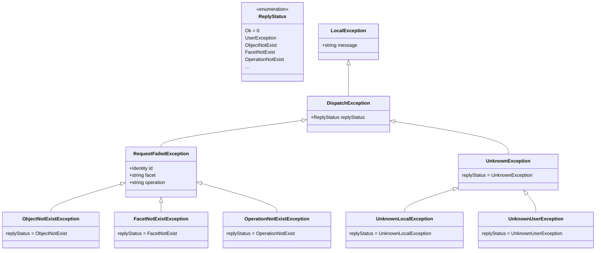

The entries below contain brief descriptions of the changes in each release, in no particular order. Some of the
entries reflect significant new additions, while others represent minor corrections. Although this list is not a
comprehensive report of every change we made in a release, it does provide details on the changes we feel Ice users
might need to be aware of.

We recommend that you use the release notes as a guide for migrating your applications to this release, and the manual
for complete details on a particular aspect of Ice.

# Changes in Ice 3.8.0

These are the changes since the Ice 3.7.10 release in [CHANGELOG-3.7.md](./CHANGELOG-3.7.md).

## General Changes

- Replaced ACM and connection timeouts by idle, inactivity, connect, and close timeouts.
  - Idle timeout\
  Once a connection is established, this connection is considered healthy as long as it does not wait for more than idle
  timeout to read a byte. If a connection waits for more than idle timeout to read a byte, it's deemed idle and aborted
  by the idle check.
  Idle is never a good state. To prevent connections from becoming idle, Ice ensures there is regular write activity on
  established connections: if there is no write on a connection for idle timeout / 2, Ice sends a heartbeat on this
  connection. A heartbeat is a one-way, unacknowledged, ValidateConnection message. The default idle timeout is
  60 seconds. You can change this value with the configuration property `Ice.Connection.Client.IdleTimeout` (for client
  connections) or `Ice.Connection.Server.IdleTimeout` (for server connections). The unit for this timeout is seconds.
   You can also override this value for a specific object adapter with the configuration property
  `AdapterName.Connection.IdleTimeout`. We recommend keeping things simple: use the same value (typically the default)
  for all your Ice applications. In particular, the idle timeout is not negotiated during connection establishment and
  an idle timeout mismatch may result in untimely connection aborts.
    - **Interop with Ice 3.7 and earlier releases**\
    If your Ice 3.8 application connects to an older Ice server or accepts a connection from an older Ice client, you
    need to change the configuration of your older Ice application to send regular heartbeats. Otherwise, your Ice 3.8
    application can deem the connection idle (after idle timeout) and abort this connection. With Ice 3.7 and Ice 3.6,
    you can set the property `Ice.ACM.Heartbeat` to 3, and make sure the `Ice.ACM.Timeout` property matches your idle
    timeout (the default for the ACM timeout is 60 seconds, just like the default idle timeout). If you are unable to
    change the configuration of your older Ice application, you can switch off the idle check on the Ice 3.8 side
    by setting `Ice.Connection.Client.EnableIdleCheck` or `Ice.Connection.Server.EnableIdleCheck` to 0. You can also
    switch off the idle check for just a specific object adapter by setting `AdapterName.Connection.EnableIdleCheck` to
    0.
    - **Interop with IceRPC**\
    IceRPC uses the same idle timeout and idle check mechanism for connections that use the `ice` protocol.
  - Inactivity timeout\
  A connection is considered inactive when there is no application-level activity on this connection:
  there is no outstanding invocation (we're not waiting for a response for a request we've sent), there is no
  outstanding dispatch, and no request or response is being sent or received. Sending or receiving a heartbeat (see
  above) does not count as application-level activity. When a connection remains inactive for more than the inactivity
  timeout, this connection is closed gracefully. Inactive is a good state: the connection is healthy but unused, so we
  shut it down to reclaim resources. The default inactivity timeout is 300 seconds. You can change this default by
  setting `Ice.Connection.Client.InactivityTimeout` (for client connections) or
  `Ice.Connection.Server.InactivityTimeout` (for server connections). The unit for this timeout is seconds. You
  can also override this value for a specific object adapter with the configuration property
  `AdapterName.Connection.InactivityTimeout`.\
  Note: make sure your inactivity timeout is greater than your idle timeout, as the implementation of the inactivity
  timeout relies on a smaller idle timeout value. If you disable your idle timeout by setting it to 0 or very large
  value (not something we recommend), you will effectively disable your inactivity timeout as well.
  - Connect timeout\
  A connection establishment fails if it takes more than connect timeout to complete. The default connect timeout is 10
  seconds. You can change this value by setting `Ice.Connection.Client.ConnectTimeout` (for client connections) or
  `Ice.Connection.Server.ConnectTimeout` (for server connections). The unit for this timeout is seconds. You can also
  override this value for a specific object adapter with the configuration property
  `AdapterName.Connection.ConnectTimeout`.
  - Close timeout\
  A graceful connection closure transitions to connection abort if it takes more than close timeout to complete. The
  default close timeout is 10 seconds. You can change this value by setting `Ice.Connection.Client.CloseTimeout` (for
  client connections) or `Ice.Connection.Server.CloseTimeout` (for server connections). The unit for this timeout is
  seconds, as usual. You can also override this value for a specific object adapter with the configuration
  property `AdapterName.Connection.CloseTimeout`.

- Add new properties for flow control.
  - Max dispatches\
  The maximum number of concurrent dispatches for each connection is now 100. You can change this value by setting
  `Ice.Connection.Client.MaxDispatches` (for client connections) or `Ice.Connection.Server.MaxDispatches` (for server
  connections). You can also override this value for a specific object adapter with the configuration
  property `AdapterName.Connection.MaxDispatches`.
  When the limit is reached, Ice stops reading from the connection, which applies back pressure on the peer.
  - Max connections\
   The property _adapter_.MaxConnections limits the number of incoming connections accepted by an object adapter. The
   default is 0, which means no limit.

- Simplify proxy creation.
  You can now create a typed proxy directly from a communicator and a string in all languages. For example:

  ```cpp
  // C++
  GreeterPrx greeter{communicator, "greeter:tcp -h localhost -p 4061"};
  ```

  ```csharp
  // C#
  var greeter = GreeterPrxHelper.createProxy(communicator, "greeter:tcp -h localhost -p 4061");
  ```

  ```java
  // Java
  var greeter = GreeterPrx.createProxy(communicator, "greeter:tcp -h localhost -p 4061");
  ```

   ```js
  // JavaScript
  const greeter = new GreeterPrx(communicator, "greeter:tcp -h localhost -p 4061");
  ```

  ```matlab
  % MATLAB
  greeter = GreeterPrx(communicator, 'greeter:tcp -h localhost -p 4061');
  ```

  ```php
  // PHP
  $greeter = GreeterPrxHelper::createProxy($communicator, 'greeter:tcp -h localhost -p 4061');
  ```

  ```python
  # Python
  greeter = GreeterPrx(communicator, "greeter:tcp -h localhost -p 4061")
  ```

  ```ruby
  # Ruby
  greeter = GreeterPrx.new(communicator, "greeter:tcp -h localhost -p 4061")
  ```

  ```swift
  // Swift
  let greeter = try makeProxy(
    communicator: communicator,
    proxyString: "greeter:tcp -h localhost -p 4061",
    type: GreeterPrx.self)
  ```

  ```ts
  // TypeScript
  const greeter = new GreeterPrx(communicator, "greeter:tcp -h localhost -p 4061");
  ```

  The existing `stringToProxy` operation on `Communicator` remains available. However, the new syntax is now the
  preferred way to create a proxy from a string.

- Add new dispatcher API in C++, C#, Java and Swift.
  - Replaced dispatch interceptors by middleware. See new forwarder and middleware demos.
  - Changed the name of the Ice 3.7 dispatcher API: it's now called executor.

- Add `setDefaultObjectAdapter` operation on Communicator to simplify the creation of bidir connections. See the updated
  Ice/bidir demo.

- Rework the published endpoints of object adapters
  - The published endpoints of an object adapter are the endpoint(s) included in the proxies returned by the `add` and
`createProxy` operations on an object adapter. For indirect object adapters, the published endpoints are the endpoints
registered with the Ice Locator (typically the IceGrid registry).
  - Improved the algorithm for computing the default published endpoints.
  - Add new _adapter_.PublishedHost property, used to compute the default published endpoints.
  - Removed the `refreshPublishedEndpoints` operation on `ObjectAdapter`.

- The local exceptions that can be marshaled now have a common base class (`DispatchException`), and are no longer
  limited to 6 exceptions. The reply status of a dispatch exception can have any value between 2 and 255. A dispatch
  exception with reply status >= 5 is marshaled as its reply status (one byte) followed by its message (a Slice-encoded
  string).



- Consolidate and refactor the exceptions derived from LocalException.
  | Local exception in Ice 3.7          | Replacement                | Notes    |
  |-------------------------------------|----------------------------| ---------|
  | BadMagicException                   | ProtocolException (base)   |          |
  | CFNetworkException                  | SocketException (base)     |          |
  | CloneNotImplementedException        | std::logic_error           | C++ only |
  | CompressionException                | ProtocolException (base)   |          |
  | ConnectionManuallyClosedException   | ConnectionAbortedException, ConnectionClosedException   | |
  | ConnectionNotValidatedException     | ProtocolException (base)   |          |
  | EncapsulationException              | MarshalException (base)    |          |
  | EndpointParseException              | ParseException             |          |
  | EndpointSelectionTypeParseException | ParseException             |          |
  | IllegalIdentityException            | ArgumentException (C#), std::invalid_argument (C++), IllegalArgumentException (Java)     | |
  | IllegalMessageSizeException         | MarshalException           |          |
  | IllegalServantException             | ArgumentNullException (C#), std::invalid_argument (C++), IllegalArgumentException (Java) | |
  | IdentityParseException              | ParseException             |          |
  | MemoryLimitException                | MarshalException (base)    |          |
  | NoValueFactoryException             | MarshalException (base)    |          |
  | ProxyParseException                 | ParseException             |          |
  | ProxyUnmarshalException             | MarshalException (base)    |          |
  | StringConversionException           | MarshalException (base)    |          |
  | UnexpectedObjectException           | MarshalException (base)    |          |
  | UnknownMessageException             | ProtocolException (base)   |          |
  | UnknownReplyStatusException         | None: all values are now valid | |
  | UnmarshalOutOfBoundsException       | MarshalException (base)    |          |
  | UnsupportedEncodingException        | MarshalException           |          |
  | UnsupportedProtocolException        | MarshalException, FeatureNotSupportedException | |
  | VersionMismatchException            | InitializationException    |          |
  | VersionParseException               | ParseException             |          |

  base = was existing base class

  New local exceptions:\
  ConnectionAbortedException, ConnectionClosedException, ParseException

- Refactored the unmarshaling of Slice-defined classes and exceptions.
  When Ice unmarshals a Slice-defined class or exception, it first needs to locate and create an instance of the mapped
  C++/C#/Java (...) class, using the default parameter-less constructor of the mapped class. The new abstraction for
  this process is the Slice loader. Its API varies slightly from language to language, for example:

  ```cpp
  // C++
  class SliceLoader
  {
  public:
        [[nodiscard]] virtual ValuePtr newClassInstance(std::string_view typeId) const;
        [[nodiscard]] virtual std::exception_ptr newExceptionInstance(std::string_view typeId) const;
  };
  ```

  ```java
  // Java
  @FunctionalInterface
  public interface SliceLoader {
      java.lang.Object newInstance(String typeId);
  }
  ```

  ```typescript
  // TypeScript
  interface SliceLoader {
      newInstance(typeId: string): Ice.Value | Ice.UserException | null;
  }
  ```

  ```matlab
  % MATLAB
  classdef (Abstract) SliceLoader < handle
      methods(Abstract)
          r = newInstance(obj, typeId)
      end
  end
  ```

  You can implement `SliceLoader` and install your own custom Slice loader on a communicator by setting the
  `sliceLoader` field in `InitializationData`. This custom Slice loader is always in addition to an internal Slice
  loader that Ice uses when you don't set a custom Slice loader or when your Slice loader returns null. This new
  `InitializationData` field replaces the `ValueFactory` and `ValueFactoryManager` provided in previous Ice releases.

  In most languages, generated classes for Slice classes and exceptions register themselves at startup with a default
  Slice loader implemented by Ice, and you don't need to do anything to help Ice locate these generated classes.
  However, in Java and MATLAB, there is no such registration at startup, and you need to help Ice locate these generated
  classes when:
  - you remap either the class name or an enclosing module using the java:identifier, java:package, or
    matlab:identifier metadata; or
  - you assign a compact ID to your class

  You help Ice locate these classes by installing a Slice loader in `InitializationData`, just like when you provide a
  custom Slice loader. Ice for Java and Ice for MATLAB provide implementations of `SliceLoader` for this purpose. For
  example, you can use the `ClassSliceLoader` implementation to create a Slice loader for one or more generated classes
  (typically classes with remapped names or compact IDs).

  Limitation: in Python, Ruby, and PHP, a custom Slice loader can only create class instances. The creation of custom
  user exceptions is currently ignored.

- The plug-ins provided by Ice now have fixed names: IceIAP, IceBT, IceUDP, IceWS, IceDiscovery, IceLocatorDiscovery.
This fixed name is the only name you can use when loading/configuring such a plug-in with the Ice.Plugin.name property.

## Slice Language Changes

- Removed local Slice. `local` is no longer a Slice keyword.

- Removed the `["preserve-slice"]` metadata. Slice classes marshaled in the sliced format are now always preserved.

- Exceptions are now always marshaled in the sliced format and no longer support preservation of unknown slices.

- Slice classes can no longer define operations or implement interfaces, and `implements` is no longer a Slice keyword.
This feature has been deprecated since Ice 3.7.

- Slice classes no longer represent remote Ice objects; the syntax `MyClass*` (a proxy to a class) is now invalid.

- An interface can no longer be used as a type. This feature, known as "interface by value", has been deprecated since
Ice 3.7. You can still define proxies with the usual syntax, `Greeter*`, where `Greeter` represents an interface.

- The type of an optional field or parameter can no longer be a class or contain a class.

- `:` is now an alias for the `extends` keyword.

- Removed Slice checksums.

## Slice Tools

- Add new `ice2slice` compiler that converts Slice files in the `.ice` format (used by Ice) into Slice files in the
`.slice` format (used by IceRPC).

## IceSSL Changes

- IceSSL is no longer a plug-in.

- Removed `IceSSL.SchannelStrongCrypto`. Strong crypto is now enabled by default.

## C++ Changes

- There is now a single C++ mapping, based on the C++11 mapping provided by Ice 3.7. This new C++ mapping requires a
C++ compiler with support for C++17 or higher.

- Generated proxy classes are now concrete classes with public constructors.

- Nullable proxies are represented using `std::optional`.

- All functions that create proxies, including `Communicator::stringToProxy`, `ObjectAdapter::add`,
  `Connection::createProxy` and more, are now template functions that allow you to choose the type of the returned
  proxy. The default proxy type is `Ice::ObjectPrx` for backwards compatibility. We recommend you always specify the
  desired proxy type explicitly. For example:

  ```cpp
  // widget is a std::optional<WidgetPrx>
  auto widget = communicator->propertyToProxy<WidgetPrx>("MyWidget");
  ```

- The C++ structs, classes, exception classes, and enumerations generated by the Slice compiler can now be printed using
`operator<<(ostream&, const T&)`. For structs, classes, and exceptions, this operator prints the type name and all the
field names and values; see the [Slice/print] test for examples.
  - You can also implement your own custom printing by applying metadata `["cpp:custom-print"]` to your Slice type.

- When unmarshaling an array of short, int, long, float, or double, you can now choose to use unaligned unmarshaling by
defining ICE_UNALIGNED when building your application. This optimization requires the non-default array mapping for
Slice sequences, enabled by the `cpp:array` metadata directive, and a compatible little endian platform. In Ice 3.7 and
earlier releases, this unaligned unmarshaling was turned on automatically on x86 and x64 CPUs, and turned off on all
other CPUs.

- Replaced the `Ice::registerPluginFactory` mechanism (with `Ice::registerIceUDP`, `Ice::registerIceDiscovery`, etc.)
by plug-in factories on InitializationData. The corresponding plug-ins are created during communicator initialization.
See `InitializationData::pluginFactories`.

- Removed StringConverterPlugin and ThreadHookPlugin.

## C# Changes

- The thread pools created by Ice no longer set a synchronization context. As a result, the continuation from an async
invocation made from an Ice thread pool thread executes in a .NET thread pool thread; previously, this continuation
was executed in a thread managed by the same Ice thread pool unless you specified `.ConfigureAwait(false)`.

- The `cs:attribute` Slice metadata is now limited to enums, enumerators, fields, and constants.

- Replaced the `Ice.Util.registerPluginFactory` mechanism by plug-in factories on InitializationData. The corresponding
plug-ins are created during communicator initialization. See `InitializationData.pluginFactories`.

- Slice structs are now mapped to record structs or record classes.

- Updated Ice.Communicator to implement IAsyncDisposable. The preferred way to create and dispose of a communicator is
  now:

  ```cs
  await using Ice.Communicator communicator = Ice.Util.initialize(ref args);
  ```

- Removed ThreadHookPlugin.

- Removed support for serializable objects (the `cs:serializable` metadata directive).

## Java Changes

- Removed the Java-Compat mapping.

- Add plug-in factories to InitializationData. The corresponding plug-ins are created during communicator
initialization. See `InitializationData.pluginFactories`.

- Removed the `com.zeroc.Ice.Exception` base class. The common base class for all Ice exceptions is now
  `java.lang.Exception`.

- Removed the `Ice.ThreadInterruptSafe` property. You no longer need to set a property to use Ice for Java with
  interrupts.

- Removed ThreadHookPlugin.

- Reworked IceMX to avoid creating split packages.

## JavaScript Changes

## MATLAB Changes

- The default value for property `Ice.ProgramName` is now `matlab-client`. It used to be the first element in the args
  cell given to `Ice.initialize`.

## Objective-C Changes

- The Objective-C mapping was removed.

## PHP Changes

- Removed the flattened mapping deprecated in 3.7.

## Python Changes

## Ruby Changes

## Swift Changes

## Glacier2 Changes

- Removed buffered mode. As a result, Glacier2 has now a single mode, the previous "unbuffered" mode.

- Removed support for request overrides (the `_ovrd` request context).

- Removed support for creating batches of requests (`Glacier2.Client.AlwaysBatch` and `Glacier2.Server.AlwayBatch`).

- Removed Glacier2 helper classes.

## IceGrid Changes

- Removed deprecated server and application distributions in IceGrid. These distributions relied on the IcePatch2
service.

## IcePatch2 Changes

- The IcePatch2 service was removed.

[Slice/print]: cpp/test/Slice/print
