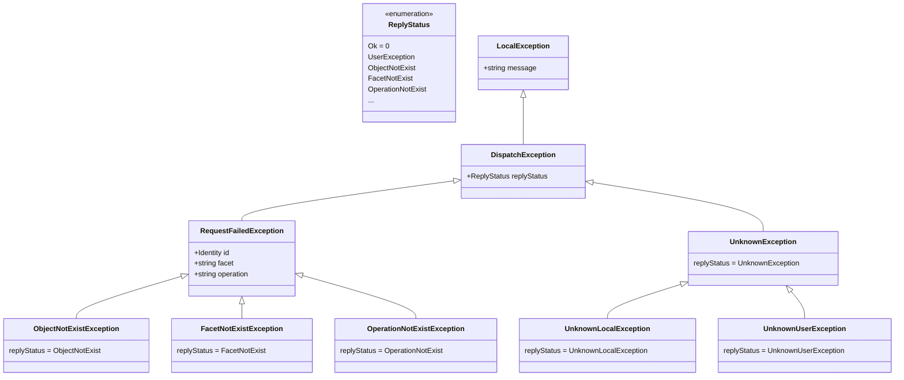

# Ice 3.8 Changelog <!-- omit in toc -->

The entries below contain brief descriptions of the changes in each release, in no particular order. Some of the
entries reflect significant new additions, while others represent minor corrections. Although this list is not a
comprehensive report of every change we made in a release, it does provide details on the changes we feel Ice users
might need to be aware of.

- [Changes in Ice 3.8.0](#changes-in-ice-380)
  - [General Changes](#general-changes)
  - [Packaging Changes](#packaging-changes)
  - [Slice Language Changes](#slice-language-changes)
  - [IceSSL Changes](#icessl-changes)
    - [Integration with Platform SSL Engines](#integration-with-platform-ssl-engines)
    - [Removed Support for OpenSSL on Windows](#removed-support-for-openssl-on-windows)
    - [Removed IceSSL APIs](#removed-icessl-apis)
    - [Updated IceSSL Properties](#updated-icessl-properties)
    - [Removed IceSSL Properties](#removed-icessl-properties)
  - [C++ Changes](#c-changes)
  - [C# Changes](#c-changes-1)
  - [Java Changes](#java-changes)
  - [JavaScript Changes](#javascript-changes)
  - [MATLAB Changes](#matlab-changes)
  - [Objective-C Changes](#objective-c-changes)
  - [PHP Changes](#php-changes)
  - [Python Changes](#python-changes)
  - [Ruby Changes](#ruby-changes)
  - [Swift Changes](#swift-changes)
  - [Ice Service Changes](#ice-service-changes)
    - [DataStorm](#datastorm)
    - [Glacier2](#glacier2)
    - [IceGrid](#icegrid)
    - [IcePatch2](#icepatch2)
    - [IceStorm](#icestorm)

## Changes in Ice 3.8.0

These are the changes since the Ice 3.7.10 release in [CHANGELOG-3.7.md](./CHANGELOG-3.7.md).

### General Changes

- Replaced ACM and connection timeouts by idle, inactivity, connect, and close timeouts.
  - Idle timeout\
  Once a connection is established, this connection is considered healthy as long as it does not wait for more than idle
  timeout to read a byte. If a connection waits for more than idle timeout to read a byte, it is considered idle and
  aborted by the idle check mechanism.
  Idle is never a good state. To prevent connections from becoming idle, Ice ensures there is regular write activity on
  established connections: if there is no write on a connection for idle timeout / 2, Ice sends a heartbeat on this
  connection. A heartbeat is a one-way, unacknowledged, ValidateConnection message. The default idle timeout is
  60 seconds. You can change this value with the configuration property `Ice.Connection.Client.IdleTimeout` (for client
  connections) or `Ice.Connection.Server.IdleTimeout` (for server connections). The unit for this timeout is seconds.
  You can also override this value for a specific object adapter with the configuration property
  `AdapterName.Connection.IdleTimeout`. We recommend keeping things simple: use the same value (typically the default)
  for all your Ice applications. In particular, the idle timeout is not negotiated during connection establishment and
  an idle timeout mismatch may result in untimely connection aborts.
    - **Interop with Ice 3.7 and earlier releases**\
    If your Ice 3.8 application connects to an older Ice server or accepts a connection from an older Ice client, you
    need to change the configuration of your older Ice application to send regular heartbeats. Otherwise, your Ice 3.8
    application can consider the connection idle (after idle timeout) and abort this connection. With Ice 3.7 and Ice
    3.6, you can set the property `Ice.ACM.Heartbeat` to 3, and make sure the `Ice.ACM.Timeout` property matches your
    idle timeout (the default for the ACM timeout is 60 seconds, just like the default idle timeout). If you are unable
    to change the configuration of your older Ice application, you can switch off the idle check on the Ice 3.8 side
    by setting `Ice.Connection.Client.EnableIdleCheck` or `Ice.Connection.Server.EnableIdleCheck` to 0. You can also
    switch off the idle check for just a specific object adapter by setting `AdapterName.Connection.EnableIdleCheck`
    to 0.
    - **Interop with IceRPC**\
    [IceRPC] uses the same idle timeout and idle check mechanism for connections that use the `ice` protocol.
  - Inactivity timeout\
  A connection is considered inactive when there is no application-level activity on this connection:
  there is no outstanding invocation (we're not waiting for a response for a request we've sent), there is no
  outstanding dispatch, and no request or response is being sent or received. Sending or receiving a heartbeat (see
  above) does not count as application-level activity. When a connection remains inactive for more than the inactivity
  timeout, this connection is closed gracefully. Inactive is a good state: the connection is healthy but unused, so we
  shut it down to reclaim resources. The default inactivity timeout is 300 seconds. You can change this default by
  setting `Ice.Connection.Client.InactivityTimeout` (for client connections) or
  `Ice.Connection.Server.InactivityTimeout` (for server connections). The unit for this timeout is seconds. You
  can also override this value for a specific object adapter with the configuration property
  `AdapterName.Connection.InactivityTimeout`. You can also disable the inactivity timeout/check on a connection
  programmatically by calling `disableInactivityCheck` on the connection. This disables the inactivity check only on
  your end of the connection.\
  Make sure your inactivity timeout is greater than your idle timeout, as the implementation of the inactivity
  timeout relies on a smaller idle timeout value. If you disable your idle timeout by setting it to 0 or very large
  value (not something we recommend), you will effectively disable your inactivity timeout as well.
  - Connect timeout\
  A connection establishment fails if it takes more than connect timeout to complete. The default connect timeout is 10
  seconds. You can change this value by setting `Ice.Connection.Client.ConnectTimeout` (for client connections) or
  `Ice.Connection.Server.ConnectTimeout` (for server connections). The unit for this timeout is seconds. You can also
  override this value for a specific object adapter with the configuration property
  `AdapterName.Connection.ConnectTimeout`.
  - Close timeout\
  A graceful connection closure transitions to connection abort if it takes more than close timeout to complete. The
  default close timeout is 10 seconds. You can change this value by setting `Ice.Connection.Client.CloseTimeout` (for
  client connections) or `Ice.Connection.Server.CloseTimeout` (for server connections). The unit for this timeout is
  seconds, as usual. You can also override this value for a specific object adapter with the configuration
  property `AdapterName.Connection.CloseTimeout`.

- Removed all properties and APIs related to the old endpoint/connection timeouts: `Ice.Default.Timeout`,
  `Ice.Override.Timeout`, `Ice.Override.ConnectTimeout`, `Ice.Override.CloseTimeout`, `ice_timeout`, etc.
  The default timeout assigned to new `tcp`, `ssl`, `ws`, `wss`, etc. endpoints is now always 60,000 ms. This timeout
  has no effect on Ice 3.8 applications but it can have an effect on older Ice applications that receive proxies with
  such endpoints.

- Removed the `setHeartbeatCallback` operation on `Connection`.

- Add new properties for flow control.
  - Max dispatches\
  The maximum number of concurrent dispatches for each connection is now 100. You can change this value by setting
  `Ice.Connection.Client.MaxDispatches` (for client connections) or `Ice.Connection.Server.MaxDispatches` (for server
  connections). You can also override this value for a specific object adapter with the configuration
  property `AdapterName.Connection.MaxDispatches`.
  When the limit is reached, Ice stops reading from the connection, which applies back pressure on the peer.
  Ice for JavaScript doesn't implement max dispatches because the WebSocket APIs doesn't provide a mechanism to stop
  reading and apply back pressure.
  - Max connections\
  The property _adapter_.MaxConnections limits the number of incoming connections accepted by an object adapter. The
  default is 0, which means no limit.

- Simplify proxy creation.
  You can now create a typed proxy directly from a communicator and a string in all languages. For example:

  ```cpp
  // C++
  GreeterPrx greeter{communicator, "greeter:tcp -h localhost -p 4061"};
  ```

  ```csharp
  // C#
  var greeter = GreeterPrxHelper.createProxy(communicator, "greeter:tcp -h localhost -p 4061");
  ```

  ```java
  // Java
  var greeter = GreeterPrx.createProxy(communicator, "greeter:tcp -h localhost -p 4061");
  ```

   ```js
  // JavaScript
  const greeter = new GreeterPrx(communicator, "greeter:tcp -h localhost -p 4061");
  ```

  ```matlab
  % MATLAB
  greeter = GreeterPrx(communicator, 'greeter:tcp -h localhost -p 4061');
  ```

  ```php
  // PHP
  $greeter = GreeterPrxHelper::createProxy($communicator, 'greeter:tcp -h localhost -p 4061');
  ```

  ```python
  # Python
  greeter = GreeterPrx(communicator, "greeter:tcp -h localhost -p 4061")
  ```

  ```ruby
  # Ruby
  greeter = GreeterPrx.new(communicator, "greeter:tcp -h localhost -p 4061")
  ```

  ```swift
  // Swift
  let greeter = try makeProxy(
    communicator: communicator,
    proxyString: "greeter:tcp -h localhost -p 4061",
    type: GreeterPrx.self)
  ```

  ```ts
  // TypeScript
  const greeter = new GreeterPrx(communicator, "greeter:tcp -h localhost -p 4061");
  ```

  The existing `stringToProxy` operation on `Communicator` remains available. However, the new syntax is now the
  preferred way to create a proxy from a string.

- Reduced the number of `initialize` functions that create a `Communicator`. You can now pass either an
  `InitializationData` to `initialize`, or a command-line argument vector. If you were using another overload, you
  should update your code to construct an `InitializationData`.

- Add new dispatcher API in C++, C#, Java, JavaScript, and Swift.
  - Replaced dispatch interceptors by middleware. See the new forwarder and middleware demos.
  - Changed the name of the Ice 3.7 dispatcher API: it's now called executor.

- Add new property `Ice.Warn.Executor`: when 1 (the default), the communicator logs a warning when a custom executor
  throws an exception.

- Add `setDefaultObjectAdapter` operation on Communicator to simplify the creation of bidir connections. See the updated
  Ice/bidir demo.

- Rework the published endpoints of object adapters
  - The published endpoints of an object adapter are the endpoint(s) included in the proxies returned by the `add` and
    `createProxy` operations on an object adapter. For indirect object adapters, the published endpoints are the
    endpoints registered with the Ice Locator (typically the IceGrid registry).
  - Improved the algorithm for computing the default published endpoints.
  - Add new _adapter_.PublishedHost property, used to compute the default published endpoints.
  - Removed the `refreshPublishedEndpoints` operation on `ObjectAdapter`.

- Removed the `secure` proxy option, the `PreferSecure` proxy property, and all associated properties
  (`Ice.Default.PreferSecure`, `Ice.Override.Secure`) and proxy methods (`ice_secure`, `ice_preferSecure`, etc.).
  `secure` and `PreferSecure` were about handling proxies with both tcp and ssl endpoints (or ws and wss endpoints).
  You should not create such "client-decides-on-security" proxies, and Ice no longer provides special support for these
  proxies. If you still use such proxies (even though you shouldn't), the communicator no longer prefers secure or
  non-secure endpoints when establishing a connection for such a proxy: all endpoints are treated the same.

- The default value for `Ice.ClassGraphDepthMax` is now `10`. In Ice 3.7, the default was `0`, which meant the class
  graph depth was unlimited.

- Refactored the unmarshaling of Slice-defined classes and exceptions.
  When Ice unmarshals a Slice-defined class or exception, it first needs to locate and create an instance of the mapped
  C++/C#/Java (...) class, using the default parameter-less constructor of the mapped class. The new abstraction for
  this process is the Slice loader. Its API varies slightly from language to language, for example:

  ```cpp
  // C++
  class SliceLoader
  {
  public:
        [[nodiscard]] virtual ValuePtr newClassInstance(std::string_view typeId) const;
        [[nodiscard]] virtual std::exception_ptr newExceptionInstance(std::string_view typeId) const;
  };
  ```

  ```java
  // Java
  @FunctionalInterface
  public interface SliceLoader {
      java.lang.Object newInstance(String typeId);
  }
  ```

  ```typescript
  // TypeScript
  interface SliceLoader {
      newInstance(typeId: string): Ice.Value | Ice.UserException | null;
  }
  ```

  ```matlab
  % MATLAB
  classdef (Abstract) SliceLoader < handle
      methods(Abstract)
          r = newInstance(obj, typeId)
      end
  end
  ```

  You can implement `SliceLoader` and install your own custom Slice loader on a communicator by setting the
  `sliceLoader` field in `InitializationData`. This custom Slice loader is always in addition to an internal Slice
  loader that Ice uses when you don't set a custom Slice loader or when your Slice loader returns null. This new
  `InitializationData` field replaces the `ValueFactory` and `ValueFactoryManager` provided in previous Ice releases.

  In most languages, generated classes for Slice classes and exceptions register themselves at startup with a default
  Slice loader implemented by Ice, and you don't need to do anything to help Ice locate these generated classes.
  However, in Java and MATLAB, there is no such registration at startup, and you need to help Ice locate these generated
  classes when:
  - you remap either the class name or an enclosing module using the `java:identifier`, `java:package`, or
    `matlab:identifier` metadata; or
  - you assign a compact ID to your class

  You help Ice locate these classes by installing a Slice loader in `InitializationData`, just like when you provide a
  custom Slice loader. Ice for Java and Ice for MATLAB provide implementations of `SliceLoader` for this purpose. For
  example, you can use the `ClassSliceLoader` implementation to create a Slice loader for one or more generated classes
  (typically classes with remapped names or compact IDs).

  In Java, MATLAB and Swift, the communicator caches "not found" Slice loader resolutions. This cache can be configured
  using `Ice.SliceLoader.NotFoundCacheSize` and `Ice.Warn.SliceLoader`.

  Limitations:
  - in Python and Ruby, a custom Slice loader can only create class instances. The creation of custom user exceptions is
    currently ignored.
  - there is no custom Slice loader in PHP.

- The local exceptions that can be marshaled now have a common base class (`DispatchException`), and are no longer
  limited to 6 exceptions. The reply status of a dispatch exception can have any value between 2 and 255. A dispatch
  exception with reply status >= 5 is marshaled as its reply status (one byte) followed by its message (a Slice-encoded
  string).



- Consolidate and refactor the exceptions derived from LocalException.

  | Local exception in Ice 3.7          | Replacement                                                                              | Notes    |
  | ----------------------------------- | ---------------------------------------------------------------------------------------- | -------- |
  | BadMagicException                   | ProtocolException (base)                                                                 |          |
  | CFNetworkException                  | SocketException (base)                                                                   |          |
  | CloneNotImplementedException        | std::logic_error                                                                         | C++ only |
  | CompressionException                | ProtocolException (base)                                                                 |          |
  | ConnectionManuallyClosedException   | ConnectionAbortedException, ConnectionClosedException                                    |          |
  | ConnectionNotValidatedException     | ProtocolException (base)                                                                 |          |
  | EncapsulationException              | MarshalException (base)                                                                  |          |
  | EndpointParseException              | ParseException                                                                           |          |
  | EndpointSelectionTypeParseException | ParseException                                                                           |          |
  | IllegalIdentityException            | ArgumentException (C#), std::invalid_argument (C++), IllegalArgumentException (Java)     |          |
  | IllegalMessageSizeException         | MarshalException                                                                         |          |
  | IllegalServantException             | ArgumentNullException (C#), std::invalid_argument (C++), IllegalArgumentException (Java) |          |
  | IdentityParseException              | ParseException                                                                           |          |
  | MemoryLimitException                | MarshalException (base)                                                                  |          |
  | NoValueFactoryException             | MarshalException (base)                                                                  |          |
  | ProxyParseException                 | ParseException                                                                           |          |
  | ProxyUnmarshalException             | MarshalException (base)                                                                  |          |
  | StringConversionException           | MarshalException (base)                                                                  |          |
  | UnexpectedObjectException           | MarshalException (base)                                                                  |          |
  | UnknownMessageException             | ProtocolException (base)                                                                 |          |
  | UnknownReplyStatusException         | None: all values are now valid                                                           |          |
  | UnmarshalOutOfBoundsException       | MarshalException (base)                                                                  |          |
  | UnsupportedEncodingException        | MarshalException                                                                         |          |
  | UnsupportedProtocolException        | MarshalException, FeatureNotSupportedException                                           |          |
  | VersionMismatchException            | InitializationException                                                                  |          |
  | VersionParseException               | ParseException                                                                           |          |

  base = was existing base class

  New local exceptions:\
  ConnectionAbortedException, ConnectionClosedException, ParseException

- The plug-ins provided by Ice now have fixed names: IceIAP, IceBT, IceUDP, IceWS, IceDiscovery, IceLocatorDiscovery.
  This fixed name is the only name you can use when loading/configuring such a plug-in with the Ice.Plugin.name
  property.

- Added a new always-enabled logger middleware in all languages with dispatch support. This middleware logs dispatches
  using the configured logger based on the value of `Ice.Trace.Dispatch` and `Ice.Warn.Dispatch`.

- Removed support for setting per-language plug-in entry points. In Ice 3.7 and earlier, it was possible to specify
  plug-in entry points on a per-language basis using the `Ice.Plugin.<name>.<lang>` syntax. This feature was rarely used
  and discouraged, as configuration files should not be shared across language mappings.

- Removed the `stringToIdentity` method from the Communicator class. This method was deprecated in Ice 3.7.

- The collocation optimization check no longer takes datagram endpoints into account. As a result, a call to a proxy
  with only UDP endpoints is never collocation-optimized. This change is particularly useful for multicast UDP
  endpoints (and by extension proxies), since multiple object adapters often listen on the same multicast address/port
  combination.

- Add new `ice2slice` compiler that converts Slice files in the `.ice` format (used by Ice) into Slice files in the
  `.slice` format (used by IceRPC).

- Removed Slice checksums.

- Removed the `slice2html` compiler, which was previously used to convert Slice doc-comments to HTML. You can use
  Doxygen to generate an API reference for your Slice files.

- Removed the `--impl` and `-E` options from the Slice compilers.

- Added stricter property validation. Ice now throws an exception during communicator initialization when an unknown
  Ice property is set.

- Added `getIceProperty`, `getIcePropertyAsInt`, and `getIcePropertyAsList` methods to `Properties`. These methods
  return the value of an Ice property, or the default value if the property is not set.

### Packaging Changes

- The Windows MSI installer is now built using the WiX Toolset. The WiX project files are included in the packaging/msi
  directory.

- The RPM packaging files, previously distributed in the ice-packaging repository, are now included in the packaging/rpm
  directory.

- The DEB packaging files, previously distributed in the ice-packaging repository, are now included in the packaging/deb
  directory.

- The monolithic `zeroc.ice.net` package has been replaced with modular NuGet packages:

  | Package                   | Description                                                                                             |
  | ------------------------- | ------------------------------------------------------------------------------------------------------- |
  | iceboxnet                 | The IceBox server for .NET, packaged as a dotnet tool.                                                  |
  | ZeroC.Glacier2            | The Glacier2 assembly, used by Glacier2 client applications.                                            |
  | ZeroC.Ice                 | The main Ice assembly.                                                                                  |
  | ZeroC.Ice.Slice.Tools     | The Slice compiler (slice2cs) and MSBuild integration. Replaces the `zeroc.icebuilder.msbuild` package. |
  | ZeroC.IceBox              | The IceBox assembly.                                                                                    |
  | ZeroC.IceDiscovery        | The IceDiscovery plug-in.                                                                               |
  | ZeroC.IceGrid             | The IceGrid assembly, used by IceGrid client applications.                                              |
  | ZeroC.IceLocatorDiscovery | The IceLocatorDiscovery plug-in.                                                                        |
  | ZeroC.IceStorm            | The IceStorm assembly, used by publishers and subscribers for IceStorm.                                 |

  ZeroC.Ice.Slice.Tools contains `slice2cs` binaries for Linux, macOS and Windows. As a result, `slice2cs` is no
  longer distributed in any other package.

- The C++ NuGet package has been renamed to `ZeroC.Ice.Cpp`. This package replaces the `zeroc.ice.vXXX` packages from
  Ice 3.7. It includes the Slice tools for C++ and no longer requires the `zeroc.icebuilder.msbuild` package.
  Additionally, it provides CMake support files in the cmake directory.

- The `ice` NPM package has been converted into a scoped package named `@zeroc/ice` and also includes the `slice2js`
  Slice compiler for Linux, macOS and Windows.

### Slice Language Changes

- Removed local Slice. `local` is no longer a Slice keyword.

- The type of an optional field or parameter can no longer be a class or contain a class.

- Added new metadata for customizing the mapped names of Slice definitions in each language.
  This metadata is of the form: `["<lang>:identifier:<identifier>"]`, where `<lang>` can be any of the standard language
  prefixes, and that definition's identifier will be `<identifier>` in the specified language.

  For example:

  ```slice
  ["cs:identifier:MyNamespace"]
  ["java:identifier:com.example.mypackage"]
  module MyModule {}
  ```

  The argument is used as a drop-in replacement for the Slice identifier, with no additional processing.
  For the above example, `slice2cs` will generate `namespace MyNamespace {}` and `slice2java` will generate
  `package com.example.mypackage;`. All other compilers will map the module using its Slice-provided identifier,
  as usual.

  This metadata can be applied to any Slice definition with an identifier, and is available for all languages.

  Note that this only affects the _mapped_ name of Slice definitions.
  It has no effect on Slice type IDs, or a definition's on-the-wire representation.

- Deprecated the `cs:namespace`, `java:package`, and `swift:module` metadata. Removed the `python:package` metadata.
  `<lang>:identifier` metadata is now the preferred way to change how Slice modules are mapped.

- Removed automatic escaping of Slice identifiers. Previously, the Slice compilers had a list of each language's
  keywords and reserved identifiers, and would automatically escape conflicting identifiers during code-generation.
  Now that this has been removed, conflicting identifiers should be fixed using `<lang>:identifier` metadata.

- Added a shorthand syntax for defining nested modules. For example, the following two definitions are equivalent:

  ```slice
  module Foo { module Bar { module Baz { /*...*/ } } }

  module Foo::Bar::Baz { /*...*/ }
  ```

  Metadata cannot be applied to modules using this syntax, since it's ambiguous which module it would apply to.

- Added support for triple-slash doc-comments, in addition to the already supported JavaDoc comment syntax.
  For example, the following two definitions are equivalent:

  ```slice
  /// Sends a request.
  /// @param message the message.
  /// @return a response code.
  int sendRequest(string message);

  /**
   * Sends a request.
   * @param message the message.
   * @return a response code.
   */
  int sendRequest(string message);
  ```

- Added support for 2 new doc-comment tags: `@remark` and `@p`
  `@remark` can be used to provide additional (often non-critical) information in a doc-comment:

  ```slice
  /// Provides access to a radar scanner.
  /// @remark For sonar, use {@link SonarScan} instead.
  class RadarScan {}
  ```

  `@p` can only be used on operations, and provides a way to reference parameters in its doc-comment.
  This is different than `@param`. `@param` is used to describe a parameter, not reference one. For example:

  ```slice
  /// @param start The start.
  /// @param end The end. Must be greater than @p start.
  int getDuration(int start, int end);
  ```

- Added support for Markdown style code-spans in doc-comments:

  ```slice
  /// This is `true`, and can be used as a default value: `bool b = Yes;`
  const bool Yes = true;
  ```

  You can use any number of backticks to mark the beginning/end of the code-span, but they must match in number.
  This is useful if the code-span itself will contain backticks:

  ```slice
  /// This code-span ``contains a ` character`` just fine.
  ```

  Outside of code-spans, you can escape a backtick with a backslash to get a normal textual backtick character:

  ```slice
  /// This character \` doesn't start a code-span and will appear like a normal backtick character.
  ```

- Lists of metadata can be split into separate brackets now, allowing for longer metadata to be placed on separate lines
  or for metadata to be grouped by functionality. For example, you can now write:

  ```slice
  ["deprecated:This operation should no longer be called"]
  ["marshaled-result"] ["format:sliced"]
  void myOperation(MyClass c);
  ```

  Previously, all metadata needed to be in a single comma-separated list (note that this syntax is still supported):

  ```slice
  ["deprecated:This operation should no longer be called", "marshaled-result", "format:sliced"]
  void myOperation(MyClass c);
  ```

- Metadata can now be applied to Slice enumerators.

- Added `["deprecated"]` as an alias for the `["deprecate"]` metadata.

- Removed the `["protected"]` metadata. This was primarily for classes with operations, which are no longer allowed.

- Removed the `["preserve-slice"]` metadata. Slice classes marshaled in the sliced format are now always preserved when
  unmarshaled.

- Exceptions are now always marshaled in the sliced format and no longer support preservation of unknown slices during
  unmarshaling.

- Slice classes can no longer define operations or implement interfaces, and `implements` is no longer a Slice keyword.
  This feature has been deprecated since Ice 3.7.

- Slice classes can no longer represent remote Ice objects; the syntax `MyClass*` (a proxy to a class) is now invalid.

- An interface can no longer be used as a type. This feature, known as "interface by value", has been deprecated since
  Ice 3.7. You can still define proxies with the usual syntax, `Greeter*`, where `Greeter` represents an interface.

- `:` is now an alias for the `extends` keyword.

- Sequences can no longer be used as dictionary key types.
  This feature has been deprecated since Ice 3.3.0.

### IceSSL Changes

The SSL transport is no longer a plug-in. It is now built into the main Ice library and always available.

#### Integration with Platform SSL Engines

Ice 3.8 introduces new IceSSL configuration APIs that allow you to configure the SSL transport using platform-native
SSL engine APIs. This provides significantly greater flexibility for advanced use cases.

- The SSL transport can now be fully configured programmatically, without relying on IceSSL properties.
- Separate configurations for outgoing and incoming SSL connections are supported.
- Per object adapter configuration is also possible.

> These APIs are platform-dependent. A good starting point is the `Ice/secure` demo for your target platform and
> language mapping.

#### Removed Support for OpenSSL on Windows

In Ice 3.7, IceSSL on Windows could be built with either Schannel or OpenSSL. In Ice 3.8, since IceSSL is now built-in,
it always uses the platform’s native SSL APIs. On Windows, this means **Schannel is always used**;
**OpenSSL is no longer supported** on Windows.

#### Removed IceSSL APIs

- **Certificate API**\
  The `IceSSL::Certificate` type and related APIs have been removed. Applications that require access to certificate
  data must now use platform-native certificate APIs.

- **Certificate Verifiers**\
  Custom certificate verifiers have been replaced with new configuration APIs that allow applications to install
  validation callbacks that directly use the underlying SSL engine APIs.

- **Password Callbacks**\
  Password callback support has been removed. Applications can now provide certificates and keys directly through the
  new configuration APIs.

#### Updated IceSSL Properties

- **IceSSL.CertFile**\
  This property no longer accepts multiple files. In Ice 3.7, IceSSL with OpenSSL or Schannel allowed specifying two
  files—one for RSA and one for DSA certificates. This uncommon use case is no longer supported. Applications requiring
  more flexibility should use the new configuration APIs, which support selecting certificates on a per-connection
  basis.

- **IceSSL.CheckCertName**\
  In Ice 3.7, this property controlled two unrelated features:
  (1) matching the target host name against the peer's certificate Subject Alternative Name or Common Name, and
  (2) enabling SNI (Server Name Indication).
  In Ice 3.8, **SNI is always enabled** for outgoing connections when the target endpoint uses a DNS name. The property
  now only controls certificate name matching.

- **IceSSL.Truststore**\
  The `IceSSL.Keystore` property is no longer used as a fallback for `IceSSL.Truststore`.

- **IceSSL.VerifyPeer**\
  Setting `IceSSL.VerifyPeer=0` no longer suppresses verification errors. In Ice 3.7, this was often used alongside
  the now-removed certificate verifier APIs. Applications requiring custom trust logic should use the new validation
  callbacks.

#### Removed IceSSL Properties

Several IceSSL properties have been removed in Ice 3.8, either because better alternatives are now available, they are
no longer useful, or they go against best practices:

- **IceSSL.CertVerifier**\
  Previously used to dynamically load custom certificate verifiers. This mechanism and the property have been removed.

- **IceSSL.Ciphers**\
  Used to configure the list of allowed SSL ciphers. Ice 3.8 now uses system-wide defaults by default. For advanced use
  cases, the new configuration APIs provide direct access to the underlying SSL engine.

- **IceSSL.DH.bits**, **IceSSL.DHParams**\
  Used to configure Diffie-Hellman parameters for DH cipher suites. Since DH-based ciphers are no longer recommended,
  these properties have been removed.

- **IceSSL.EntropyDaemon**\
  Relevant only for legacy OpenSSL versions that are no longer supported.

- **IceSSL.InitOpenSSL**\
  Controlled whether IceSSL performed global OpenSSL initialization. This is no longer needed with the OpenSSL versions
  supported in Ice 3.8.

- **IceSSL.Random**\
  Used to provide seed data to the SSL engine. Modern SSL platforms handle this internally, so the property is no longer
  necessary.

- **IceSSL.SchannelStrongCrypto**\
  Enabled the `SCH_USE_STRONG_CRYPTO` flag on Windows to disable weak cryptographic algorithms. This flag is now always
  enabled by default, making the property redundant.

- **IceSSL.PasswordCallback**, **IceSSL.PasswordRetryMax**\
  Supported dynamic password callbacks, which are no longer supported. These properties and their underlying mechanism
  have been removed.

- **IceSSL.Protocols**, **IceSSL.ProtocolVersionMax**, **IceSSL.ProtocolVersionMin**\
  Controlled which SSL/TLS protocol versions were allowed for connections. Ice 3.8 now uses the system defaults
  (typically TLS 1.2 and TLS 1.3). Applications needing precise control can either adjust system settings or use the
  new configuration APIs.

- **IceSSL.VerifyDepthMax**\
  Previously used to set the maximum certificate chain length. This feature was rarely used. Applications requiring this
  functionality should implement a custom certificate validation callback.

### C++ Changes

- There is now a single C++ mapping, based on the C++11 mapping provided by Ice 3.7. This new C++ mapping requires a
  C++ compiler with support for C++17 or higher.

- Generated proxy classes are now concrete classes with public constructors.

- Nullable proxies are represented using `std::optional`.

- Removed the IceUtil namespace. All remaining utility classes and functions, such as `CtrlCHandler` and
  `wstringToString`, are now in the Ice namespace.

- All functions that create proxies, including `Communicator::stringToProxy`, `ObjectAdapter::add`,
  `Connection::createProxy` and more, are now template functions that allow you to choose the type of the returned
  proxy. The default proxy type is `Ice::ObjectPrx` for backwards compatibility. We recommend you always specify the
  desired proxy type explicitly. For example:

  ```cpp
  // widget is a std::optional<WidgetPrx>
  auto widget = communicator->propertyToProxy<WidgetPrx>("MyWidget");
  ```

- The Slice compiler now always generates an async skeleton (with an Async prefix) in addition to the usual skeleton
  class. The async skeleton provides only async functions, just like if you added the `["amd"]` metadata directive on
  your Slice interface. You should consider using this async skeleton instead of applying `["amd"]` to your interface or
  to some of its operations.

- The C++ structs, classes, exception classes, and enumerations generated by the Slice compiler can now be printed using
`operator<<(ostream&, const T&)`. For structs, classes, and exceptions, this operator prints the type name and all the
field names and values; see the [Slice/print] test for examples.
  - You can also implement your own custom printing by applying metadata `["cpp:custom-print"]` to your Slice type.

- When unmarshaling an array of short, int, long, float, or double, you can now choose to use unaligned unmarshaling by
defining ICE_UNALIGNED when building your application. This optimization requires the non-default array mapping for
Slice sequences, enabled by the `cpp:array` metadata directive, and a compatible little endian platform. In Ice 3.7 and
earlier releases, this unaligned unmarshaling was turned on automatically on x86 and x64 CPUs, and turned off on all
other CPUs.

- Replaced the `Ice::registerPluginFactory` mechanism (with `Ice::registerIceUDP`, `Ice::registerIceDiscovery`, etc.)
by plug-in factories on InitializationData. The corresponding plug-ins are created during communicator initialization.
See `InitializationData::pluginFactories`.

- Removed StringConverterPlugin and ThreadHookPlugin.

- Removed the `--nowarn` option, which was used to suppress warnings in `icegridnode`, `glacier2router`,
  `icegridregistry`, and `icebox`.

- Added overloads for the `ice_invocationTimeout` and `ice_locatorCacheTimeout` proxy methods that accept
  `std::chrono::duration` values. The corresponding `ice_getInvocationTimeout` and `ice_getLocatorCacheTimeout` methods
  now return `std::chrono::milliseconds`.

- Removed support for using poll as a selector mechanism.

- The Ice runtime now calls std::abort when a selector internal error occurs.
  The underlying platform selectors — IOCP, kqueue, or epoll — can fail with internal errors that indicate fatal
  conditions such as application bugs or malfunctioning systems.
  There is no clean way to recover from these errors, and keeping malfunctioning systems running is of no help;
  aborting the application allows the replica management system to take over in a replicated setup.

### C# Changes

- Upgrade to .NET 8.0 / C# 12.

- Added full support for nullable types:
  - Both the Ice C# API and the code generated by the Slice compiler are `#nullable enable`.
  - Ice now uses the standard `?` notation for all nullable types.

- The thread pools created by Ice no longer set a synchronization context. As a result, the continuation from an async
invocation made from an Ice thread pool thread executes in a .NET thread pool thread; previously, this continuation
was executed in a thread managed by the same Ice thread pool unless you specified `.ConfigureAwait(false)`.

- The `cs:attribute` Slice metadata is now limited to enums, enumerators, fields, and constants. For other constructs,
  you can define custom attributes using a C# partial class, struct, or interface.

- Replaced the `Ice.Util.registerPluginFactory` mechanism by plug-in factories on InitializationData. The corresponding
plug-ins are created during communicator initialization. See `InitializationData.pluginFactories`.

- Slice structs are now mapped to record structs or record classes:
  - a Slice struct with only numeric, bool, enum, or record struct fields is mapped to a record struct.
  - a Slice struct with any other field type is mapped to a sealed record class.

- Updated Ice.Communicator to implement IAsyncDisposable. The preferred way to create and dispose of a communicator is
  now:

  ```cs
  await using Ice.Communicator communicator = Ice.Util.initialize(ref args);
  ```

- The preferred way to wait for communicator shutdown in an async context is now:

  ```cs
  await communicator.shutdownCompleted;
  ```

- The Logger interface is now disposable.

- Removed ThreadHookPlugin.

- Removed support for serializable objects (the `cs:serializable` metadata directive).

- Added overloads for the `ice_invocationTimeout` and `ice_locatorCacheTimeout` proxy methods that accept `TimeSpan`
  values. The corresponding `ice_getInvocationTimeout` and `ice_getLocatorCacheTimeout` methods now return a `TimeSpan`.

- Removed support for using `clr` as an alias for `cs` in metadata declarations.

- The Slice compiler now always generates async skeletons (with an Async prefix) in addition to the usual skeleton
  interface and class. The async skeletons provide only async methods, just like if you added the `["amd"]` metadata
  directive on your Slice interface. You should consider using these async skeletons instead of applying `["amd"]` to
  your interface or to some of its operations.

### Java Changes

- Upgrade to Java 17.

- Removed the Java-Compat mapping.

- Add plug-in factories to InitializationData. The corresponding plug-ins are created during communicator
initialization. See `InitializationData.pluginFactories`.

- Removed the `com.zeroc.Ice.Exception` base class. The common base class for all Ice exceptions is now
  `java.lang.Exception`.

- Removed the `Ice.ThreadInterruptSafe` property. You no longer need to set a property to use Ice for Java with
  interrupts.

- Removed ThreadHookPlugin.

- Reworked IceMX to avoid creating split packages.

- Added overloads for the `ice_invocationTimeout` and `ice_locatorCacheTimeout` proxy methods that accept
  `java.time.Duration` values. The corresponding `ice_getInvocationTimeout` and `ice_getLocatorCacheTimeout` methods
  now return a `java.time.Duration`.

- The Slice compiler now always generates an async skeleton (with an Async prefix) in addition to the usual skeleton
  interface. The async skeleton provides only async methods, just like if you added the `["amd"]` metadata directive
  on your Slice interface. You should consider using this async skeleton instead of applying `["amd"]` to your interface
  or to some of its operations.

- Added support for the `Ice.ClassGraphDepthMax` property, which controls the maximum depth allowed when unmarshaling a
  graph of Slice class instances.

- Added the `Ice.WS.MaxBufferedAmount` property, which controls the maximum number of bytes that can be queued
  by a WebSocket connection. Once the WebSocket `bufferedAmount` reaches this limit, sending additional data
  is delayed until it drops below the threshold.

- The Ice runtime terminates the Java Virtual Machine after receiving a selector internal error.
  This typically indicates an application bug or a malfunctioning system.
  The underlying platform selectors — IOCP, kqueue, or epoll — can fail with internal errors that represent fatal
  conditions.
  There is no clean way to recover from these errors, and keeping malfunctioning systems running is of no help;
  terminating the JVM allows the replica management system to take over in a replicated setup.

### JavaScript Changes

- Added support for `Symbol.asyncDispose` on `Ice.Communicator`. TypeScript applications can now use the communicator in
  `await using` expressions.

  ```ts
  await using communicator = Ice.initialize(process.argv);
  ```

- Ice for JavaScript now uses `console.assert`. You can configure your build to strip out these assertions in release
  builds.

- Fixed a bug where a reply could be processed before the corresponding request was marked as sent. This could break
  at-most-once semantics.

- Added support for `Ice.ClassGraphDepthMax` to control the maximum unmarshaling depth for graphs of Slice class
  instances.

- Removed support for the Internet Explorer browser.

- Slice modules are now always mapped to JavaScript ES6 modules. The `js:es6-module` metadata has been removed, as a
  single module mapping is now used by default.

- Slice `long` is now mapped to JavaScript `BigInt`. For input parameters, both `number` and `BigInt` are accepted.
  The `Ice.Long` class has been removed.

- Dictionaries with `long` keys now use the built-in `Map` type.
  Previously, `Ice.HashMap` was required because `Ice.Long` objects could not be used as keys in a `Map`.

- The WebSocket transport is now supported with Node.js 24 and higher. In Node.js 23 and earlier, WebSocket connections
  do not reliably report errors during connection establishment. We advise against using the WebSocket transport on
  these versions.

- The `js:module` file metadata directive can no longer be used to generate bundles with the Gulp Ice Builder. You must
  now use a standard JavaScript bundler instead. This metadata remains useful to indicate that your generated code is
  published as an npm package and to control how other generated code imports it.

### MATLAB Changes

- Upgrade to MATLAB 2024a.

- Added argument validation for generated proxy methods.
  - All argument types are now validated, except for parameters that correspond to optional Slice parameters.
  - A proxy or class argument to set to "null" must now be an empty array of the associated type, such as
    `GreeterPrx.empty`. `[]` is no longer a valid value for such arguments.

- Changed the mapping for `sequence<string>`. A `sequence<string>` now maps to a MATLAB string array. This new mapping
  remains highly compatible with the previous mapping (cell array of char).

- Changed the mapping for Slice dictionaries. A Slice dictionary now always maps to a MATLAB dictionary; the old
  `containers.Map` are no longer used.
  The dictionary key type is the mapped key type. The dictionary value type is as per the table below:

  | Slice type T mapped to MATLAB MT   | Value type of MATLAB dictionary | Mapping for `sequence<T>` |
  | ---------------------------------- | ------------------------------- | ------------------------- |
  | bool, numeric, struct, enum        | MT                              | array of MT               |
  | string                             | string (1)                      | array of string           |
  | sequence, dictionary, class, proxy | cell holding a MT               | cell array of MT          |

  (1) A single Slice string maps to a MATLAB char array, not to a MATLAB string.

- All fields are now mapped to typed MATLAB properties except optional fields and fields whose type is a class or uses
  a class.
  - In such properties, a null proxy is represented by an empty array of the proxy type, for example `GreeterPrx.empty`.
    Likewise, an empty sequence (array) is represented by an empty array of the correct type, such as `string.empty` or
    `int32.empty`.
  - `[]` is no longer a valid value for proxy and sequence properties: always use a typed array.

- Changed the default value for properties mapped from a Slice struct type. It's now an empty array of the mapped class;
  it was previously a new instance of the mapped class created with no argument.

- The default value for property `Ice.ProgramName` is now `matlab-client`. It used to be the first element in the args
  cell given to `Ice.initialize`.

- The `slice2matlab` function has been updated to accept multiple arguments, which are passed directly to the
  `slice2matlab` compiler. In Ice 3.7, all arguments had to be provided as a single string, which was less convenient.

### Objective-C Changes

- The Objective-C mapping was removed.

### PHP Changes

- Removed the flattened mapping deprecated in 3.7.

- Removed the `ice.hide_profiles` directive. This directive was intended to clear the `ice.profiles` setting after it
  was read by the Ice extension, preventing untrusted applications on the same web server from accessing it. However,
  it could be circumvented and thus provided only a false sense of security. The recommended and more secure approach
  is to use PHP-FPM, which supports separate PHP pools per application and avoids the need of sharing PHP settings
  between untrusted applications.

- Updated Ice\register to accept fractional minute values for the expires argument by using a double instead of an int.

- Removed support for Windows PHP builds.

- Removed support for PHP 5 builds.

- Removed the `ice_premarshal` and `ice_postunmarshal` "hooks" called during class marshaling and unmarshaling.
  `ice_postunmarshal` only makes sense if the application can register a custom Slice loader and Ice for PHP does not
  provide custom Slice loaders.

### Python Changes

- Upgrade to Python 3.12.

- Added `Ice.EventLoopAdapter` for async event loop integration. This adapter integrates Ice asynchronous methods with
  the event loop of your choice. With it:

  - Asynchronous proxy invocations return an awaitable that can be awaited directly in the chosen event loop.
    There is no longer a need to wrap the returned future to run in your event loop.

  - The same applies to other asynchronous methods in the Ice API: the returned awaitable always uses the event loop
    adapter to ensure it can be correctly awaited in the selected event loop.

  - Asynchronous dispatch methods can be implemented as async methods that run in that event loop.

  Ice includes a built-in adapter for Python’s asyncio, and the same mechanism can be extended to support other event
  loop systems.

- Added async context manager support to `Ice.Communicator`. You can now use the communicator in `async with`
  expressions.

  ```python
  async def main():
      async with Ice.initialize(
          sys.argv,
          eventLoop=asyncio.get_running_loop()) as communicator:
          ...

  if __name__ == "__main__":
      asyncio.run(main())
  ```

- Added a `checkedCastAsync` method to proxy objects to support asynchronous checked casts.

- Added a `Communicator.shutdownCompleted` method to asynchronously wait for communicator to shut down.

- Removed the copy parameter from the memory view factory. In Ice 3.8, the factory always receives a memory view over
  the input stream data, making the copy parameter unnecessary.

- Ice no longer uses `Ice.Unset` to represent unset optional parameters. Starting with Ice 3.8, `None` is used
  instead. The Ice.Unset global has been removed. Furthermore, there is no distinction between a non-set
  optional parameter and an optional parameter set to `None`.

- Removed the `Ice.generateUUID` helper method. You should use Python’s built-in uuid module instead.

- Added support for building pip packages directly from the Ice source distribution. In previous releases, the pip
  package was built from a separate tarball that included pre-generated source code.

- Enumerations now inherit from Python's `enum.Enum` type. The `Ice.EnumBase` class has been removed.

- The default value for struct, sequence, and dictionary Slice fields has been changed from `None` to a default
  initialized instance.

- Removed support for the `python:pkgdir` Slice metadata. Generated code is now always placed in the corresponding
  package directory relative to the specified output directory.

- The Slice for Python compiler (`slice2py`) and dynamic Slice-to-Python compilation using `Ice.loadSlice` no longer
  support the `--all` option, which previously allowed compiling files included by other Slice files. Instead, you must
  explicitly pass all required Slice files to `slice2py` or `Ice.loadSlice`.

- The `--prefix` option, which previously allowed users to specify a custom prefix for generated file names, has been
  removed from the Slice for Python compiler (`slice2py`). Generated file names are now always derived from the Slice
  definition name. If a name would conflict with a Python built-in keyword or module, it must be renamed using the new
  `python:identifier` metadata.

- The Slice for Python compiler now generates a separate Python module for each Slice definition. The module name is
  derived from the Slice definition name. For example, `enum MyEnum` in Slice module `Foo::Bar` results in the Python
  module `Foo.Bar.MyEnum`, generated in `Foo/Bar/MyEnum.py`.

  For classes and interfaces, an additional `_forward` module is generated to contain forward declarations for proxies
  and class meta-types. Application code does not need to import these files.

  Package index files are also generated for each module unless the `--build=modules` option is specified to generate
  only the module files.

- The Slice for Python compiler no longer edits existing package index files. Instead, it recreates them on each run.
  When generating package index files, all Slice files contributing to the package must be passed to the compiler to
  ensure that all definitions are included in the package exports.

- The `--no-package` and `--build-package` options have been replaced by the more comprehensive
  `--build=modules|package-index|all` option.

  - `--build=all` generates both the Python modules for each Slice definition and the package index files for each
    module.
  - `--build=modules` generates only the Python modules.
  - `--build=package-index` generates only the package index files.

- A new `--list=all|modules|package-index` option has been added to `slice2py` to list the generated files. In previous
  versions, the compiler generated a single Python module with a `_ice.py` extension per Slice file, making it easy to
  track outputs. In 3.8, each Slice definition is compiled into a separate module under its Python package path. The
  new `--list` option helps track the set of generated files.

- Removed support for the 'marshaled-result' metadata directive.

- Removed support for the `python:seq` metadata. Use `python:list` and `python:tuple` instead.

- Added type hints to the Ice package and generated code.

- Added additional (optional) argument to `python:memoryview` metadata directive which is used to specify a type hint.
  For example, `["python:memoryview:CustomFactory.myByteSeq:array.array"]` indicates that the factory function
  will return an `array.array`.

- The `Ice.loadSlice` function for dynamically loading Slice files at run time now accepts only a list of compiler
  arguments (strings). Previously, it accepted both a command string and an optional list of arguments (which served
  the same purpose). This has been simplified to require a single list of strings.

  ```python
  # Old syntax (no longer supported)
  Ice.loadSlice("-I. Foo.ice")
  Ice.loadSlice("-I.", ["Foo.ice"])
  Ice.loadSlice("", ["-I.", "Foo.ice"])

  # New syntax
  Ice.loadSlice(["-I.", "Foo.ice"])
  ```

- Removed the self-reference parameter from `InvocationFuture.add_sent_callback`. Registered callbacks no longer
  receive the `Ice.InvocationFuture` instance as their first parameter.

### Ruby Changes

- Updated the optional `Ice.initialize` block to only accept a single argument, the communicator. Previously, this
  optional block could accept one argument (the communicator), or two arguments (the communicator and the remaining
  command-line arguments).

- The `Ice.loadSlice` function for dynamically loading Slice files at runtime now accepts only a list of compiler
  arguments (strings). Previously, it accepted both a command string and an optional list of arguments (which served
  the same purpose). This has been simplified to require a single list of strings.

  ```ruby
  # Old syntax (no longer supported)
  Ice.loadSlice("-I. Foo.ice")
  Ice.loadSlice("-I.", ["Foo.ice"])
  Ice.loadSlice("", ["-I.", "Foo.ice"])

  # New syntax
  Ice.loadSlice(["-I.", "Foo.ice"])
  ```

### Swift Changes

- Upgrade to Swift 6.1.

- Removed support for Carthage. Ice for Swift now uses the Swift Package Manager (SwiftPM) for dependency management.

- Updated to use async/await and fully support Swift's Structured Concurrency model.

- Removed the dependency on `PromiseKit`. Functions which previously returned a `Promise` are now async functions.

- Functions in dispatch protocols generated from Slice interfaces are now always async. The `amd` metadata directive has
  no effect on the generated code.

- Servants must now conform to the `Sendable` protocol.

- Proxy methods generated from Slice interfaces are now always async. The `Async` suffixed functions have been
  removed.

- Simplified the server-side mapping by removing the generated Disp structs. You can now use the generated server-side
  protocols as servants / dispatchers, like in other language mappings.

- Added a SwiftPM plugin, `CompileSlice`, that lets you compile Slice files as part of SwiftPM and Xcode builds.

### Ice Service Changes

#### DataStorm

- The DataStorm publisher/subscriber framework has been integrated into the Ice distribution, and is no longer a
  separate product.

- Added `NodeOptions` struct to configure a new `Node` instance.

- Added support for running DataStorm callbacks using a custom executor. The custom executor can be set in
  `NodeOptions`.

- Added `DataStorm.Node.Name` property to configure the name of a DataStorm node. The node names must be unique within
  a DataStorm deployment.

- Fixed a bug in DataStorm that can result in unexpected samples received after a session was recovered after
  disconnection.

- Fixed a bug in filter initialization that can result in segmentation fault when using a key or a sample filter.

#### Glacier2

- Removed buffered mode. As a result, Glacier2 has now a single mode, the previous unbuffered mode.

- Removed support for request overrides (the `_ovrd` request context).

- Removed support for creating batches of requests (`Glacier2.Client.AlwaysBatch` and `Glacier2.Server.AlwayBatch`).

- Removed Glacier2 helper classes.

- Removed session timeouts configured using `Glacier2.SessionTimeout`. The Glacier2 router now relies on the common
  idle check described under [General Changes](#general-changes) for these connection-bound sessions.

#### IceGrid

- Removed deprecated server and application distributions in IceGrid. These distributions relied on the IcePatch2
service.

- Removed deprecated Freeze database environments (DbEnv).

- Removed client and admin-client session timeouts configured using `IceGrid.Registry.SessionTimeout`. IceGrid now
  relies on the common idle check described under [General Changes](#general-changes) for these connection-bound
  sessions.

- Interop/upgrade from 3.7
  - IceGrid registry and IceGrid node must all use version 3.8. For example, you can't use a 3.7 node with a 3.8
    registry.
  - IceGridGUI 3.7 cannot connect to an IceGrid registry 3.8, and we recommend using icegridadmin 3.8 with IceGrid
    registry 3.8.
  - If you've written your own IceGrid admin tool using Ice 3.7, it may or may not work with a 3.8 registry, depending
    on the APIs you're using. You should upgrade this tool to Ice 3.8.
  - The registry database schema remains the same as in Ice 3.7. As a result, you can start a 3.8 registry with a
    database created by a 3.7 registry, or vice-versa.

#### IcePatch2

- The IcePatch2 service was removed.

#### IceStorm

- The IceStorm configuration now uses the `IceStorm` prefix instead of the IceBox service name as prefix.

[IceRPC]: https://github.com/icerpc
[Slice/print]: cpp/test/Slice/print
