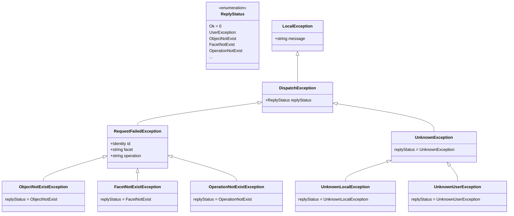

# Ice 3.8 Changelog <!-- omit in toc -->

The entries below contain brief descriptions of the changes in each release, in no particular order. Some of the
entries reflect significant new additions, while others represent minor corrections. Although this list is not a
comprehensive report of every change we made in a release, it does provide details on the changes we feel Ice users
might need to be aware of.

- [Changes in Ice 3.8.3](#changes-in-ice-383)
  - [General Changes](#general-changes)
  - [Slice Language Changes](#slice-language-changes)
  - [Slice Compiler Changes](#slice-compiler-changes)
  - [C++ Changes](#c-changes)
  - [C# Changes](#c-changes-1)
  - [Java Changes](#java-changes)
  - [JavaScript Changes](#javascript-changes)
  - [MATLAB Changes](#matlab-changes)
  - [PHP Changes](#php-changes)
  - [Python Changes](#python-changes)
  - [Ruby Changes](#ruby-changes)
  - [Swift Changes](#swift-changes)
  - [Ice Service Changes](#ice-service-changes)
    - [DataStorm](#datastorm)
    - [Glacier2](#glacier2)
    - [Ice Service installed as a Windows Service](#ice-service-installed-as-a-windows-service)
    - [IceGrid](#icegrid)
    - [IceStorm](#icestorm)
  - [Packaging Changes](#packaging-changes)
- [Changes in Ice 3.8.2](#changes-in-ice-382)
  - [General Changes](#general-changes-1)
  - [Slice Language Changes](#slice-language-changes-1)
  - [C++ Changes](#c-changes-2)
  - [C# Changes](#c-changes-3)
  - [Swift Changes](#swift-changes-1)
  - [Ice Service Changes](#ice-service-changes-1)
    - [IceGrid and Glacier2](#icegrid-and-glacier2)
    - [DataStorm](#datastorm-1)
- [Changes in Ice 3.8.1](#changes-in-ice-381)
  - [General Changes](#general-changes-2)
  - [IceSSL Changes](#icessl-changes)
  - [C++ Changes](#c-changes-4)
  - [JavaScript Changes](#javascript-changes-1)
  - [Python Changes](#python-changes-1)
  - [Swift Changes](#swift-changes-2)
  - [Ice Service Changes](#ice-service-changes-2)
    - [Glacier2](#glacier2-1)
    - [IceDiscovery](#icediscovery)
  - [Packaging Changes](#packaging-changes-1)
- [Changes in Ice 3.8.0](#changes-in-ice-380)
  - [General Changes](#general-changes-3)
  - [Packaging Changes](#packaging-changes-2)
  - [Slice Language Changes](#slice-language-changes-2)
  - [IceSSL Changes](#icessl-changes-1)
    - [Integration with Platform SSL Engines](#integration-with-platform-ssl-engines)
    - [Removed Support for OpenSSL on Windows](#removed-support-for-openssl-on-windows)
    - [Removed IceSSL APIs](#removed-icessl-apis)
    - [Updated IceSSL Properties](#updated-icessl-properties)
    - [Removed IceSSL Properties](#removed-icessl-properties)
  - [C++ Changes](#c-changes-5)
  - [C# Changes](#c-changes-6)
  - [Java Changes](#java-changes-1)
  - [JavaScript Changes](#javascript-changes-2)
  - [MATLAB Changes](#matlab-changes-1)
  - [Objective-C Changes](#objective-c-changes)
  - [PHP Changes](#php-changes-1)
  - [Python Changes](#python-changes-2)
  - [Ruby Changes](#ruby-changes-1)
  - [Swift Changes](#swift-changes-3)
  - [Ice Service Changes](#ice-service-changes-3)
    - [DataStorm](#datastorm-2)
    - [Glacier2](#glacier2-2)
    - [IceBox](#icebox)
    - [IceGrid](#icegrid-1)
    - [IcePatch2](#icepatch2)
    - [IceStorm](#icestorm-1)

## Changes in Ice 3.8.3

These are the changes since the Ice 3.8.2 release.

### General Changes

- Fixed the proxy methods that return a connection — `ice_getConnection`, `ice_getConnectionAsync`, and
  `ice_getCachedConnection`:
  - On a non-fixed proxy whose cached connection is closed or being closed, `ice_getConnection` and
    `ice_getConnectionAsync` now establish and return a new connection instead of returning the current connection.
  - On a fixed proxy, these methods now always return the connection the proxy is bound to. Previously,
    `ice_getConnection` could throw when this connection was closed, and `ice_getCachedConnection` returned null until
    the proxy's first invocation.
  - Fixed a race during failed connection establishment: `ice_getCachedConnection`, called concurrently on a proxy using
    this connection, could throw the connection-establishment exception instead of returning null.

- The invocation timeout is now normalized consistently in all language mappings and at all configuration surfaces
  (`ice_invocationTimeout`, the `InvocationTimeout` proxy property, and `Ice.Default.InvocationTimeout`): zero or any
  negative value means infinite and is normalized to -1, and a positive duration is rounded up to the next whole
  millisecond.

- The locator cache timeout is now normalized consistently in all language mappings and at all configuration surfaces
  (`ice_locatorCacheTimeout`, the `LocatorCacheTimeout` proxy property, and `Ice.Default.LocatorCacheTimeout`): any
  negative value means infinite and is normalized to -1, 0 still means no caching, and a positive duration is rounded up
  to the next whole second.

- Fixed a data race in batch request queuing that could corrupt batch-message framing (or crash) when one thread flushed
  batch requests on a connection, proxy, or communicator while another thread was making batch invocations on the same
  batch queue. This race could only occur in the multi-threaded mappings: C++, C#, Java, and Python (which uses the C++
  runtime).

- Fixed the handling of an invalid response from an HTTP proxy (configured with `Ice.HTTPProxyHost`). Connection
  establishment now fails promptly with a `ProtocolException`, instead of hanging until the connection times out.

- Fixed a WebSocket bug where an Ice server echoed a received ping's payload in the pong without unmasking it, so a
  non-Ice WebSocket peer that sends payload-bearing pings and validates the echoed pong (e.g. an L7 load balancer or
  gateway health check) could drop the connection (RFC 6455 §5.5.3). The common cases — browser/JS clients and empty
  keepalive pings — were unaffected.

- Improved the command-line parsing of the Slice compilers and the Ice command-line tools such as icegridadmin and
  icegridregistry: a short option that requires an argument can now appear at the end of a group of short options. For
  example, `slice2cpp -dI dir file.ice` is now equivalent to `slice2cpp -d -I dir file.ice`. Previously, the `-I` option
  was silently ignored and `dir` was parsed as an extra Slice file.

### Slice Language Changes

- Fixed a bug that caused `@param` and `@throws` doc-comment tags to be incorrectly reported as "unknown tags".
  This only affected tags whose descriptions didn't start until the following line.

### Slice Compiler Changes

Unless indicated otherwise, these changes apply to all Slice compilers.

- Fixed the include-path matching: an include directory that is a string prefix of a sibling directory, such as
  `-I /a/b` with a Slice file under `/a/bc`, no longer produces a mangled `#include` or `require` path in the generated
  code.

- The dependency output (`--depend`, `--depend-json`, and `--depend-xml`) is now always well-formed. In particular,
  `--depend-json` previously omitted the commas between entries and did not escape the backslashes in Windows path
  names.

- `--depend --depend-file FILE` now writes a rule for every Slice file passed to the compiler; previously the dependency
  file only kept the last Slice file's rule.

- Fixed crashes in `slice2cpp` and `slice2java` when compiling a doc comment containing a tag with no description, such
  as `@param myParam` or `@throws MyException` with nothing after the name. The description is optional.

### C++ Changes

- Fixed a deadlock in `Connection::setCloseCallback`. Setting or clearing a close callback destroyed the callback it
  replaced while holding the connection's lock, so a callback whose destructor called back into the connection
  deadlocked. This affected the language mappings that attach a finalizer to the callback, such as Ice for Python.

- Fixed a hang in `Communicator::flushBatchRequests` and `flushBatchRequestsAsync`. When a connection was closed while
  the communicator was flushing its batch requests, the returned future or completion callback could remain pending
  forever.

- Fixed the delivery of log messages to remote loggers attached to the Logger admin facet when
  `Ice.Admin.Logger.KeepLogs` or `Ice.Admin.Logger.KeepTraces` is set to `0` (their default value is `100`). These
  properties control only how many messages the facet retains for `getLog` and `RemoteLogger::init`; previously, setting
  one of them to `0` also prevented the live delivery of messages of the corresponding category to attached remote
  loggers.

- Fixed syslog logging (`Ice.UseSyslog=1`) with multiple communicators in the same process. Previously, each
  communicator opened and closed the process-global syslog connection independently, corrupting the shared logging
  state. All communicators now share a single syslog connection: the first communicator's program name provides the
  syslog ident, and a communicator with a different program name logs it at the beginning of each message. In
  particular, an IceBox server configured with `Ice.UseSyslog=1` and `IceBox.InheritProperties=1` now logs all its
  services to syslog.

- Ice now generates random bytes — including those behind `Ice::generateUUID` and `addWithUUID` — with the operating
  system's CSPRNG instead of `std::random_device`.

- Fixed two bugs in the OpenSSL-based IceSSL transport:
  - `IceSSL.Password` was not used when loading an encrypted PEM private key: OpenSSL prompted for the password on the
    terminal or failed to load the key.
  - A rejected peer certificate reported a generic "rejected by the certificate validation callback" message instead of
    the specific reason (such as "certificate has expired").

- The OpenSSL-based IceSSL transport now supports OpenSSL 4.0.

- Fixed two bugs in the Schannel-based IceSSL transport (Windows):
  - A TLS renegotiation (such as a TLS 1.3 KeyUpdate or NewSessionTicket) received in the same read as already-decrypted
    application data silently dropped the plaintext extracted before the renegotiation request, breaking the affected
    connection.
  - Each failed TLS handshake leaked the security-token and alert buffers allocated by Schannel. On a server, a peer
    repeatedly failing handshakes could leak memory over time.

- Fixed several bugs in the SecureTransport-based SSL transport (macOS and iOS):
  - On macOS, PKCS#12 certificate files with an empty password are now supported.
  - On macOS, configuring `IceSSL.CertFile` together with `IceSSL.KeyFile` using a certificate that has no Subject Key
    Identifier extension aborted the process during communicator initialization. Such certificates are now rejected with
    a `CertificateReadException`.
  - On iOS, using `IceSSL.FindCert` to select a keychain certificate that has no label attribute could abort the process
    during communicator initialization. Ice now reports a clear error instead.

- Fixed a bug in the iOS (CFStream) transport where a connection could intermittently stall.

- Fixed two crashes in the IceBT transport:
  - A Bluetooth connection attempt that failed after its connection was closed — for example after a connect timeout —
    could crash the program.
  - An incoming Bluetooth connection delivered while its object adapter was being deactivated — or the communicator
    destroyed — could crash the program.

- Fixed a `slice2cpp` bug where a `float` constant whose value is rendered in scientific notation (any magnitude ≥ 1e6
  or < 1e-4, e.g. `1e8`) generated an invalid C++ literal such as `1e+08.0F`, causing the generated header to fail to
  compile.

- Improved the CMake `slice2cpp_generate` function:
  - It now accepts `INCLUDE_DIRS`, `OPTIONS`, `HEADER_OUTPUT_DIR`, `INCLUDE_DIR`, `INCLUDE_SCOPE`, `DEPENDS`,
    `GENERATED_HEADERS` and `GENERATED_SOURCES`, to pass include directories and options to `slice2cpp`, write the
    generated headers to their own directory, export them to the target's consumers, add extra dependencies to the
    generation commands, and report the generated files' paths.
  - It now compiles Slice files that live in subdirectories: generated files mirror the layout of the `.ice` files found
    through the new `INCLUDE_DIRS` argument.

### C# Changes

- The per-thread `ImplicitContext.getContext` in C# now returns a snapshot of the context instead of the live internal
  dictionary (matching the `Shared` implementation). Code that mutated the returned dictionary to update the implicit
  context must now use `put` or `setContext`.

- Fixed a bug where specifying the `--Ice.Config` command-line option more than once loaded the wrong configuration
  file: Ice loaded the first file instead of the last.

- Fixed a hang in `Communicator.flushBatchRequestsAsync`. When a connection was closed while the communicator was
  flushing its batch requests, the returned task never completed.

- Fixed a leak in asynchronous proxy invocations that supply a cancellation token: each invocation remained registered
  with this token after completing, so a long-lived token retained the memory of all its completed invocations.

- Fixed the servant lookup for incoming requests: when the target identity is registered with a different facet, the
  object adapter now dispatches the request to the default servant if one is registered, as documented, instead of
  rejecting the request with `FacetNotExistException`.

- A `ThreadPriority` property set to an unrecognized value now throws `PropertyException` instead of being silently
  ignored and falling back to the normal priority. This applies to `Ice.ThreadPriority` and to any thread pool's
  `ThreadPriority` property, such as `Ice.ThreadPool.Server.ThreadPriority` or an object adapter's
  `<adapter>.ThreadPool.ThreadPriority`.

- Fixed thread-safety bugs in the C# metrics (IceMX) implementation that could produce incorrect metrics or throw under
  concurrent updates.

- Fixed a bug in `slice2cs` handling of `cs:namespace`: a nested module received the namespace prefix twice (e.g.
  `Foo.A.Foo.B` instead of `Foo.A.B`), producing C# that did not compile.

- Fixed two bugs in `slice2cs --icerpc`, both affecting operations whose parameters are declared in an order different
  from their marshal order (such as an optional parameter declared before a required parameter):
  - The generated request decoder read in-parameters in declaration order instead of the marshal order, and could fail
    to decode or decode incorrect values.
  - The generated proxy built the response tuple in marshal order while declaring it in declaration order, and could
    return values in the wrong tuple slots or fail to compile.

- Fixed `iceboxnet` rejecting valid per-service command-line options (`--<service>.*`) with "unknown option" and failing
  to start.

- Fixed a hang in IceLocatorDiscovery where a request could fail to complete when a failed locator invocation was
  retried and locator rediscovery returned the same locator proxy.

### Java Changes

- `Communicator.close` is no longer interruptible: it now always completes the destruction of the communicator and
  preserves the calling thread's interrupt status. Previously, calling this method from an interrupted thread could
  throw `OperationInterruptedException` and leave the communicator partially destroyed.

- Fixed a bug where specifying the `--Ice.Config` command-line option more than once loaded the wrong configuration
  file: Ice loaded the first file instead of the last.

- Fixed a memory leak: outgoing connections were not released after they closed, so the memory used by a
  long-running program grew over the lifetime of the communicator.

- Fixed a race condition in `ObjectAdapter`: when `destroy` raced with another `destroy` or with `deactivate` on the
  same object adapter, the destroyed adapter could be marked as merely deactivated, and a subsequent `destroy` call
  would then fail with a `NullPointerException`.

- Fixed the servant lookup for incoming requests: when the target identity is registered with a different facet, the
  object adapter now dispatches the request to the default servant if one is registered, as documented, instead of
  rejecting the request with `FacetNotExistException`.

- Fixed a bug where a spurious `NullPointerException` was logged (at error level, with a stack trace) when a
  client resets a pending connection during `accept()`. The accept-path race is now handled like any other accept
  failure: silent by default, or a one-line warning when `Ice.Warn.Connections` is set.

- Fixed the eviction of old log messages by the Logger admin facet. Once the facet had accumulated
  `Ice.Admin.Logger.KeepLogs` log messages and `Ice.Admin.Logger.KeepTraces` trace messages, the arrival of a new
  message could evict a message of the wrong category — for example, a new trace message could evict a warning message.
  As a result, `getLog` and attached remote loggers could receive fewer or older messages than expected.

- Fixed the delivery of log messages to remote loggers attached to the Logger admin facet when
  `Ice.Admin.Logger.KeepLogs` or `Ice.Admin.Logger.KeepTraces` is set to `0` (their default value is `100`). These
  properties control only how many messages the facet retains for `getLog` and `RemoteLogger.init`; previously, setting
  one of them to `0` also prevented the live delivery of messages of the corresponding category to attached remote
  loggers.

- A `ThreadPriority` property set to an unrecognized value now throws `PropertyException` instead of being silently
  ignored and falling back to the normal priority. This applies to `Ice.ThreadPriority` and to any thread pool's
  `ThreadPriority` property, such as `Ice.ThreadPool.Server.ThreadPriority` or an object adapter's
  `<adapter>.ThreadPool.ThreadPriority`. Integer values outside the allowed range (1-10) are also rejected.

- A thread pool's `ThreadPriority` property (such as `Ice.ThreadPool.Server.ThreadPriority` or an object adapter's
  `<adapter>.ThreadPool.ThreadPriority`) now also accepts the priority constant names `MIN_PRIORITY`, `NORM_PRIORITY`,
  and `MAX_PRIORITY`, like `Ice.ThreadPriority` already did. Previously these properties accepted only integer values.

- Fixed a data race in the metrics (IceMX) implementation. Reconfiguring the metrics views at runtime while
  metrics were being collected could corrupt the internal metrics maps or throw a `ConcurrentModificationException`.

- Fixed a bug on Windows where a plug-in or IceBox service configured with an unquoted UNC path (such as
  `\\server\share\plugin.jar`) was loaded from the wrong location: the path was resolved relative to the current
  directory instead of being recognized as absolute.

- Fixed a bug in `slice2java` that emitted broken code for dictionaries using `java:type:<instance-type>:<formal-type>`
  metadata to specify a formal type. This bug affected dictionaries used in classes or exceptions, or as the return type
  of operations with `["marshaled-result"]`.

- Fixed a `slice2java` bug with optional sequences. When a parameter, return value, or field applied `java:type`
  metadata that overrode the sequence's default mapping, `slice2java` generated no marshaling code. As a result, the
  generated Java did not compile (parameters and return values) or silently dropped the value on the wire (fields).

- Fixed a bug in IceDiscovery where the replica-group endpoint aggregation window was about 10 times longer than
  intended, due to an incorrect nanosecond-to-millisecond conversion. As a result, resolving an indirect proxy bound to
  a replica group took noticeably longer than the configured `IceDiscovery.LatencyMultiplier` implies.

- Fixed a bug in IceLocatorDiscovery where a request could fail to complete (worst case, overflow the stack) when a
  failed locator invocation was retried and locator rediscovery returned the same locator proxy.

### JavaScript Changes

- Fixed `Connection.close` to return a promise that settles even when the connection is already closed. Previously,
  calling `close` on a connection that was already closed — for example after `abort` or after the peer closed the
  connection — returned a promise that never settled.

- Fixed a bug where a connection no longer enforced the inactivity timeout after receiving a batch of more than one
  request.

- Fixed a bug where a batch auto-flush that could not be delivered terminated the process in Node.js with an unhandled
  promise rejection. The auto-flush failure is now discarded, as in the other language mappings.

- Fixed `Connection.flushBatchRequests` and `Communicator.flushBatchRequests` to report a proper Ice local exception
  when a connection is closed while its batch requests are being flushed, instead of failing with an internal Ice
  exception.

- Fixed a bug where an invocation made with an invocation timeout released its memory, including the marshaled request
  and reply, only when the timeout elapsed instead of when the invocation completed.

- Fixed the servant lookup for incoming requests: when the target identity is registered with a different facet, the
  object adapter now dispatches the request to the default servant if one is registered, as documented, instead of
  rejecting the request with `FacetNotExistException`.

- Fixed a bug where receiving a user exception of an unknown type (but a known base type) could fail with a `TypeError`.
  This only affected the 1.0 encoding.

- Fixed the `InputStream` constructor's handling of buffer arguments. An `ArrayBuffer` argument previously produced an
  empty stream, and a `Uint8Array` view that does not span its entire underlying buffer was read from the wrong byte
  range.

- Fixed the communicator to use the logger supplied in `InitializationData` even when `Ice.LogFile` is set. The property
  previously replaced the supplied logger with a file logger, and in browsers caused communicator initialization to
  fail.

- Fixed `slice2js` handling of operations with an in-parameter named `context` or `current`: `slice2js` now renames the
  parameter it adds to the generated proxy or skeleton method, instead of generating TypeScript that does not compile.

### MATLAB Changes

- Fixed `Communicator.getImplicitContext`, which crashed the MATLAB process under the default configuration
  (`Ice.ImplicitContext=None`). It now returns an empty array, as documented, when no implicit context is configured.

- Fixed `Ice.Future.wait('sent')`, which could block indefinitely or time out even after the request had been sent. The
  wait now completes as soon as the invocation reaches or passes the requested state.

- Fixed the `ice_getConnectionAsync` proxy method: retrieving the result of the returned future always failed, even when
  the connection was successfully established.

- Fixed `ice_getCachedConnection` to return an empty `Ice.Connection` array, rather than an empty `double` array, when
  the proxy has no cached connection.

- Fixed a memory leak in `Communicator.proxyToProperty`, `ImplicitContext.getContext`, `ObjectPrx.ice_getContext`,
  `Properties.getPropertiesForPrefix`, and `Connection.getInfo` on a WebSocket connection. Each call leaked memory
  proportional to the size of the dictionary it returned.

- Fixed the unmarshaling of optional `Object*` parameters and fields. Reading such a proxy always failed with a MATLAB
  error, whether or not the sender set the optional value.

- Fixed the unmarshaling of unknown optional values with tags greater than or equal to 30: such a value desynchronized
  the input stream, causing a spurious `MarshalException`.

- Fixed a memory leak that occurred each time a proxy was marshaled, unmarshaled, or had its encoding version set with
  `ice_encodingVersion`. Each of these operations leaked a small amount of memory that accumulated over the lifetime of
  a MATLAB session.

- Fixed `slice2matlab` to map all `long` constants and default values to MATLAB `int64`. They were previously emitted as
  bare numeric literals, which MATLAB interprets as `double`, silently losing precision for values with magnitude
  greater than 2^53.

### PHP Changes

- Fixed two bugs affecting communicators registered with an expiration time (`Ice\register`):
  - Unregistering such a communicator left it alive until the process exited, along with its connections and other
    resources.
  - A communicator registered with an expiration time was not destroyed during PHP shutdown, and the Ice runtime
    reported the error "communicator not destroyed during global destruction".

- Fixed a crash that occurred when invoking an operation that combines a non-optional return value with an out parameter
  declared as `optional(0)`, such as:

  ```slice
  string getName(out optional(0) int id);
  ```

- Fixed a crash when unmarshaling a non-empty dictionary whose value type is a class (for example
  `dictionary<string, SomeClass>`).

- Fixed a bug where a non-empty optional `sequence<string>` was marshaled incorrectly.

### Python Changes

- Fixed `ice_id()` on Ice local exceptions, such as `CommunicatorDestroyedException`. Previously, it raised
  `AttributeError` instead of returning the exception's Slice type ID.

- Fixed `ObjectPrx.ice_invoke` and `ObjectPrx.ice_invokeAsync` to accept the request context as a keyword argument, as
  their signatures advertise. `ice_invokeAsync` previously sent the request without any context when `ctx` was passed by
  keyword, and `ice_invoke` rejected the call with a `TypeError`.

- Fixed `ObjectPrx.ice_invokeAsync`: the returned future now completes with the documented `(True, b"")` result for
  oneway, datagram, and batch proxies. Previously, it completed with `None`, unlike the synchronous `ice_invoke`.

- Fixed two bugs in the `ice_getConnectionAsync` proxy method:
  - It now returns a future created by the configured event loop adapter, like the other asynchronous proxy operations.
    Awaiting it in an asyncio application no longer yields a non-asyncio future.
  - On a collocated proxy, it now resolves with `None`, like the synchronous `ice_getConnection`.

- Fixed `ice_getConnection` on a proxy to release the global interpreter lock while it establishes the connection. It
  previously stalled every other Python thread for the duration of the connection establishment, up to the connect
  timeout when the peer was slow or unreachable.

- `Ice.ConnectionInfo`, returned by `Connection.getInfo`, now provides a `connectionId` attribute.

- Fixed `Connection.setCloseCallback` to accept any callable. It previously rejected everything except plain functions
  and lambdas, so passing a bound method, a `functools.partial`, a callable instance or a builtin function raised
  `ValueError`.

- Fixed `Ice.Future.add_done_callback` and `Ice.InvocationFuture.add_sent_callback`: when the future was already
  completed — or the request already sent — an exception raised by the callback propagated to the caller. Such an
  exception is now caught and logged with Python's `logging` module.

- Fixed a hang: when a keyboard interrupt (Ctrl-C) interrupted a call to `Communicator.waitForShutdown`, the interpreter
  could later freeze, typically at program exit.

- Fixed interpreter crashes in `ObjectAdapter.getCommunicator` and `ObjectPrx.ice_getCommunicator` when called after the
  communicator was destroyed. These methods now raise `CommunicatorDestroyedException` in this situation; previously,
  `ice_getCommunicator` could also return `None`.

- Fixed a Python interpreter crash that could occur after the destruction of a communicator configured with a custom
  logger, thread start/stop callbacks, or a batch request interceptor.

- Fixed a memory leak: a servant returned by a servant locator was never released, and neither were the servants
  returned by `findAllFacets` and `removeAllFacets`.

- Fixed the marshaling of `float` sequences: a finite element value outside the float range now raises `ValueError`, as
  when marshaling an individual `float`. Previously, such an element was silently marshaled as infinity.

- Fixed `slice2py` to generate correct imports for a sequence re-mapped with metadata and used as the type of a field,
  and for a sequence nested inside another collection type (another dictionary or sequence).

- Fixed `slice2py` to escape doc-comment text when emitting Python docstrings, so that comments containing a
  triple-quote sequence or a backslash escape (such as `\u`) no longer produce invalid generated Python.

- Fixed two bugs in the type hints that `slice2py` generates for parameters with metadata such as
  `["python:numpy.ndarray"]`:
  - The metadata was honored in the servant type hints but ignored in the proxy method type hints.
  - Metadata applied directly to an optional parameter was ignored, so the hint omitted the mapped type.

### Ruby Changes

- Fixed a crash in `Communicator#getImplicitContext`: with the default `Ice.ImplicitContext=None` configuration, this
  method returned a broken `ImplicitContext` object whose methods crashed the Ruby interpreter. It now returns `nil`
  when the communicator has no implicit context.

- Fixed `Ice::createProperties` to accept `nil` as the defaults argument (equivalent to omitting it). Passing `nil`
  previously crashed the interpreter.

- Fixed a hang at program exit when a communicator is created with a custom `sliceLoader` and destroyed through the
  block form of `Ice::initialize`, or not destroyed at all.

- Fixed a bug where the custom `SliceLoader` supplied to a communicator could be collected by the garbage collector
  while still in use.

- Fixed a bug where GC heap compaction (`GC.compact` or `GC.auto_compact = true`) broke Ice: after a compaction, the
  proxies, classes, exceptions, and enumerators returned by Ice invocations could be instances of unrelated classes, and
  the Ruby interpreter could crash.

- `ConnectionInfo#connectionId` now returns the ID of the connection. Previously, it was always `nil`.

- Added a `hash` method to `Connection`, consistent with `eql?`. Previously, two `Connection` objects representing the
  same connection could compare equal but hash differently, so connections could not be used reliably as `Hash` keys or
  `Set` elements.

- The comparison methods (`<=>`, `==`, `eql?`) of Ice types in Ruby (Slice-generated enums, `Ice::Identity`,
  `Ice::ObjectPrx`, and `Ice::Endpoint`) now follow standard Ruby semantics for an operand of a different type: `==` and
  `eql?` return `false` and `<=>` returns `nil`, instead of raising an exception. On enums, which are `Comparable`,
  ordered comparisons such as `<` still raise `ArgumentError`.

- Fixed a bug where receiving a Slice user exception leaked memory.

- Fixed the marshaling of an empty `sequence<byte>` supplied as a string, which corrupted the rest of the message.

- Fixed the stringification of Slice user exceptions and structs: calling `inspect` on a Slice-generated exception or
  struct instance returns a description, instead of raising `NameError`.

- Fixed the stringification of non-nil proxy fields. Proxies now print correctly, instead of raising `TypeError`.

- Fixed the stringification of class instances (`inspect`): when GC compaction ran during the stringification, a shared
  instance could be printed in full a second time instead of as a back reference.

- `to_s` on a Slice class or struct instance now returns the same stringification as `inspect`.

- Fixed `slice2rb` to escape `#` in generated Ruby string literals (constants and deprecation reasons). A Slice string
  containing Ruby interpolation syntax such as `#{...}`, `#@`, or `#$` previously produced a double-quoted Ruby literal
  that was interpreted at module-load time, corrupting the value or executing code.

### Swift Changes

- Fixed the servant lookup for incoming requests: when the target identity is registered with a different facet, the
  object adapter now dispatches the request to the default servant if one is registered, as documented, instead of
  rejecting the request with `FacetNotExistException`.

- The CompileSlice plugin now tracks Slice include dependencies: editing a Slice file included by other Slice files
  regenerates the Swift code for those files as well. The plugin also regenerates the Swift code when `slice2swift`
  itself changes.

### Ice Service Changes

#### DataStorm

- Fixed a bug in DataStorm where destroying a topic before the readers and writers created from it, while a peer was
  still attached to one of them, leaked the listeners and (in debug builds) tripped an assertion. This is uncommon,
  since readers and writers are normally destroyed before their topic.

- Fixed a bug in DataStorm where a reader connected to an any-key (filtered) writer could receive duplicate
  samples after a session reconnect: the writer re-sent its entire retained history instead of resuming after
  the samples the reader had already received.

- Fixed a bug in DataStorm where a partial update for one key could be merged on top of a different key's most
  recent sample, corrupting the fields the update does not set.

- Fixed a bug in DataStorm where a partial update was not merged with the key's previous value when the receiver did
  not already have that value: an element configured with `sampleCount = 0` (keep no history), a reader that joins
  after the value was published to a writer that keeps no history or whose history has aged out (`sampleLifetime`),
  or an any-key/filtered reader that receives history for only some of a writer's keys (for example with
  `ClearHistory = OnAll`). The current per-key value is now bootstrapped for every such key. Applications using
  class-typed values typically crashed; with other value types, the fields not carried by the update were silently
  reset to their defaults.

- Fixed a crash in DataStorm (a null-pointer dereference during session (re)attachment) that could occur after a
  multi-key reader or writer was destroyed.

- Fixed a bug in DataStorm where, when two or more readers (or writers) reached an endpoint-less peer through the
  same relay node, the relay could fail to notify one of them when the peer disconnected, leaving it blocked
  forever in `waitForNoWriters` (or `waitForNoReaders`). The relay keyed the relayed sessions by an identity that
  is only unique within a node, so sessions from different nodes overwrote each other.

- Fixed a memory leak in DataStorm where a node could fail to reclaim a session after losing its connection to a
  peer. The most common trigger is a peer with no public endpoint that disconnects and does not reconnect, so a
  long-running node leaked memory in proportion to the number of such peers seen over its lifetime.

- Fixed a crash in DataStorm where a filtered or any-key reader configured with `DiscardPolicy::Priority` crashed
  when it received samples from an any-key writer.

- Fixed the initialization of late-joining readers. A reader of a writer that spans several keys — a multi-key,
  any-key, or filtered reader — silently lost all but one key's initialization samples. Such a reader could also be
  initialized with another reader's samples.

- DataStorm nodes running this release no longer interoperate with nodes running Ice 3.8.0 through 3.8.2. Fixing the
  reader-initialization bug above required a change to the DataStorm session protocol, and a node only establishes
  sessions with peers running Ice 3.8.3 or later. Upgrade all the DataStorm nodes in a deployment together.

- Fixed a bug in DataStorm where an any-key reader and a filtered reader created on the same topic could be assigned
  the same element ID and merge into a single subscription on the writer: one of the readers silently missed the
  samples rejected by the other reader's filter, and destroying either reader detached the other. Topic elements now
  draw their IDs from a single counter.

- Fixed a bug in DataStorm where destroying a topic while the connection to a peer was closing or being
  re-established could leave the topic's readers or writers permanently attached to that peer:
  `hasWriters()`/`hasReaders()` stayed true, `waitForNoWriters()`/`waitForNoReaders()` hung, and the disconnect
  callbacks never fired.

- Fixed a bug in DataStorm where, after a reconnection, a relay could permanently stop forwarding topic
  announcements to a node without a public endpoint: readers and writers matched only through such announcements
  never connected until the connection was re-established with a favorable timing.

- Fixed a bug in DataStorm where a writer created for several keys sent every key's samples to all subscribed
  sessions, including sessions whose readers subscribe to only some of the writer's keys: the unmatched samples
  wasted bandwidth, and debug builds crashed on an assertion when receiving them.

- Fixed a memory leak in DataStorm where the per-topic key, tag, and filter factories kept one expired map entry per
  distinct value that was no longer used, growing without bound on long-lived nodes with a changing key set.

- Fixed a bug in DataStorm where a subscriber that attached to a topic in the short window before the topic's
  updaters were set with `setUpdaters` could silently apply partial updates as no-ops for the lifetime of the
  session.

- Fixed a race in DataStorm session establishment that could leave a reader permanently
  disconnected from a writer after a connection loss.

- Fixed a bug affecting nodes that create two or more `Topic` instances with the same name. When readers on these
  topics read from the same remote writer, a reader could receive another key's samples instead of its own.

- Fixed a bug where a full value that a custom `Encoder` encodes to an empty byte sequence was decoded as
  value-less. Such a value could not serve as a base for a subsequent partial update, which was then silently
  discarded. The value is now decoded through its `Decoder` like any other full value, and the `Decoder` defines
  the meaning of empty input.

- Fixed a bug where a partial update delivered to several readers of the same key on one node was resolved against
  the current value of whichever reader was served first, instead of against each reader's own current value. Readers
  that hold different values for a key, for example because only some of them use a discard policy, now each resolve
  the update against their own value.

- Fixed a node applying the samples of a session out of order when its communicator was configured to let
  `Ice.ThreadPool.Client` grow beyond one thread — a partial update could resolve against the wrong base value. A
  node now defaults `Ice.ThreadPool.Client.Serialize` to 1 on the communicators it creates. An application that
  configures the property itself keeps its own value, and a communicator supplied to a node is left untouched and
  must be configured for ordered dispatch before it is created.

- Removing a data element no longer calls the application's `Encoder` with a default-constructed value the
  application never published.

- Fixed a bug where a DataStorm reader could receive samples it had already consumed. When a session reconnected
  to its peer — typically through a DataStorm node — stale replies from an earlier connection attempt could
  exhaust the session's reconnect retries and destroy it; the replacement session then received the writer's
  retained samples from the beginning.

- Fixed a bug where a node could fail to connect to a peer reached through a relay node when the relay lost its own
  connection to that peer at the wrong moment. The writers and readers of the two nodes then never connected to each
  other. The node now retries the connection.

- Fixed a bug affecting nodes that create two or more `Topic` instances with the same name. A reader with a
  sample filter on one of these topics received every sample that matched any such reader's filter, instead of
  only the samples its own filter matched.

- Fixed a bug where a reader with a sample filter received no updates when it read the writer through a relay
  node. The reader was still initialized correctly, so it appeared to start normally and then never updated.

- Fixed a bug where a reader without a sample filter received a duplicate of every sample that a sample-filtered
  reader of the same key and writer matched. The duplicate was indistinguishable from a real sample and, for a
  partial update, applied the update to the reader's value twice.

- Fixed the handling of a key that a custom `Encoder` encodes to an empty byte sequence. An any-key or filtered
  writer marshals such a key inline like any other, but a reader mistook it for a key sent by id: it discarded the
  sample, or delivered it without checking the key against the reader's own subscription.

- Fixed a bug where a `DataStorm::Node` constructor failure, such as an invalid `DataStorm.Node.ConnectTo`
  endpoint, aborted the process instead of throwing an exception.

- Fixed a bug where an invalid `DataStorm.Topic.*` property value aborted the process when a topic reader or writer
  was first created. The topic default configurations are now parsed by the `Node` constructor, so an invalid value
  surfaces there as an exception. Additionally, the `DataStorm.Topic.DiscardPolicy` property now accepts `None` as
  an alias for `Never`, matching the `DiscardPolicy::None` enumerator.

- Fixed a bug where `Node::getSessionConnection` aborted the process when the given session identity was malformed,
  instead of returning null.

- Fixed a bug where calling `shutdown`, `isShutdown`, or `waitForShutdown` on a moved-from `Node` crashed.

- Fixed the handling of partial updates for keys with no value. A key has no value when it was removed, or when no
  full value was written for it yet. Previously, such a partial update crashed applications using class-typed
  values; with other value types, it silently resurrected removed keys. Now a writer throws `std::logic_error`
  when publishing such an update, and a reader discards incoming ones.

- Fixed a bug where calling `getValue()` on a `Remove` sample could return indeterminate data instead of the
  documented default value.

- Fixed a bug in DataStorm where a sample discarded by the reader's discard policy left later partial updates on
  its key without a base value to resolve against.

- A DataStorm partial update without a base value is now dropped with a trace, instead of being applied to a
  default-constructed value — which typically crashed applications using class-typed values.

- A DataStorm reader-side updater or decoder that throws now drops only that sample and logs a warning; previously
  the exception could discard an entire batch of initialization samples.

#### Glacier2

- Fixed the Glacier2 address filters, `Glacier2.Filter.Address.Accept` and `Glacier2.Filter.Address.Reject`: a rule
  that did not end with a wildcard matched hosts that it does not describe. A rule without any wildcard, such as
  `api.example.com`, matched every host name ending with it, such as `notapi.example.com`, and a rule ending with a
  numeric range, such as `192.168.[0-255]`, matched every host name starting with it. An address rule now matches the
  host name in full. Review your address filters if a rule relied on the previous behavior: prepend `*` to restore a
  suffix match (`*api.example.com` matches `notapi.example.com` again), and append `*` to restore a prefix match
  (`192.168.[0-255]*` matches `192.168.5.5` again).

- Fixed a bug in the Glacier2 address filters, `Glacier2.Filter.Address.Accept` and `Glacier2.Filter.Address.Reject`:
  the filters compared host names case-sensitively. Host names now match regardless of case, like DNS names.

- Fixed a bug in the Glacier2 address filters, `Glacier2.Filter.Address.Accept` and
  `Glacier2.Filter.Address.Reject`: a rule that contains a numeric range preceded by a wildcard, such as
  `*.[0-255]`, could send the router into an infinite loop while checking a proxy.

- When address filters are configured (`Glacier2.Filter.Address.Accept` or `Glacier2.Filter.Address.Reject`), the
  Glacier2 router now rejects a proxy when any of its endpoints has a host that writes an IPv4 address in a
  non-canonical form: for example, `0x7f000001`, `2130706433`, and `127.1` are all non-canonical forms of
  `127.0.0.1`. The filter rules match the host as a string, so previously a host in such a form matched neither
  the Accept nor the Reject rules written for the usual dotted-quad form.

- The Glacier2 address filters now ignore the trailing dot of a fully-qualified DNS name, in the endpoint host and
  in the Accept and Reject rules alike: a rule written for `backend.example.com` matches the host
  `backend.example.com.`, and vice versa. Previously, the host and the rule matched only when both spelled the
  trailing dot the same way.

- Fixed a bug in the `Glacier2.Filter.Address.Reject` address filter, which did not filter multi-endpoint proxies
  correctly.

- Improved the validation of the Glacier2 address filter rules: a rule with an inverted numeric range (such as
  `[5-1]`) or with a stray `[` inside a group was accepted and then silently did not match the hosts it appears to
  describe.

- The Glacier2 Crypt permissions verifier now supports bcrypt password hashes (`$2a$`, `$2b$`, `$2y$`) on Linux.

- Fixed a bug where a malformed `Glacier2.Filter.Identity.Accept` or `Glacier2.Filter.Category.AcceptUser` property
  made every session creation hang instead of failing. The router now validates these properties at startup and
  refuses to start when one of them is invalid.

- The Glacier2 router now fails to start when the proxy configured by `Glacier2.PermissionsVerifier`,
  `Glacier2.SessionManager`, `Glacier2.SSLPermissionsVerifier`, or `Glacier2.SSLSessionManager` cannot be parsed.
  Previously, the router logged an "unable to contact" warning and started without the corresponding verifier or
  session manager.

- Fixed a bug in the Glacier2 Crypt permissions verifier: a password file with more than one entry for the same user
  kept the first entry and silently ignored the others. A duplicate entry now fails startup, like a malformed entry.

- The Glacier2 router now supports `createSessionFromSecureConnection` calls from clients connecting over secure
  WebSocket (wss), and sets the `_con.peerCert` context entry for these connections when
  `Glacier2.AddConnectionContext` is enabled.

#### Ice Service installed as a Windows Service

- Fixed a crash on shutdown. When an Ice service running as a Windows service was stopped using an Ice admin tool —
  for example, an IceGrid node shut down with `icegridadmin` or the IceGrid GUI — instead of through the Windows
  Service Control Manager, the process terminated abnormally rather than stopping cleanly (and never reported
  `SERVICE_STOPPED`). This affected the IceGrid registry and node, the Glacier2 router, and IceBox.

#### IceGrid

- Fixed the IceGrid registry to reject a descriptor with a self-referential or cyclic variable definition by
  raising a deployment error, instead of crashing from unbounded recursion.

- Fixed an IceGrid node consistency check that could remove files belonging to a deployed server when the node
  ran under a non-C locale, because directory entries were sorted inconsistently. The node now sorts them using
  a locale-independent ordering.

- Fixed a crash in IceGrid when parsing an application descriptor whose `<include>` elements reference
  themselves directly or indirectly. The descriptor parser now reports a deployment error instead of crashing.

- Fixed a bug where the IceGrid registry incorrectly rejected an application with a "circular dependency" error
  when a property set was referenced by two other property sets.

- Fixed a node-wide activation stall in the IceGrid node when running with a very large file descriptor limit
  (such as `LimitNOFILE=infinity` under systemd).

- Fixed a memory leak in the IceGrid registry: the resources associated with a client or admin session were sometimes
  retained until registry shutdown.

- Fixed a shutdown hang in the IceGrid node on Windows that could occur after a server activation failed.

- Fixed a crash in the IceGrid registry that could occur when an application declared the same
  allocatable object identity more than once (which IceGrid tolerates with a logged error) and that
  application was later updated or removed.

- Fixed a crash in `icegridadmin`: when started with `--host` and `--instanceName` and no registry could be contacted
  on the specified host, `icegridadmin` crashed instead of reporting an error.

- Fixed a bug in `icegridadmin`: after a `log --follow` command failed — for example because the target server was
  not reachable — all subsequent `log --follow` commands in the same session failed as well.

- Fixed a bug in `icegridadmin`: the `show` command with the `--head n` option printed the whole log file instead of
  the first `n` lines.

- Fixed the IceGrid GUI freezing when a log file window was closed or stopped while a read against an
  unresponsive node was still in progress. Stopping or closing a log window no longer blocks the UI thread
  waiting for the in-progress read to return.

- Fixed a Swing threading violation in the IceGrid GUI: when refreshing a metrics view failed synchronously,
  the error dialog was created off the UI thread, which could corrupt the display or deadlock. The dialog is
  now shown on the UI thread.

- Fixed `icegridnode` command-line parsing: an option following `--deploy` and its arguments, as in
  `icegridnode --deploy app.xml --readonly`, was silently ignored.

- Fixed an IceGrid registry issue: after an application update that did not restart a running server (no-restart
  update), restarting the registry could leave this server stuck in a synchronizing state, causing administrative
  operations on this server to hang until the server was stopped.

- Fixed a slow memory accumulation in the IceGrid registry: a session destroyed by the client was retained by the
  registry until the connection used to create this session closed. This affects only registries with no node (a
  common setup when using dynamic registration) and no replica, with sessions created and destroyed through Glacier2,
  as Glacier2 maintains a long-lived connection to the registry.

- Fixed a registry-wide stall in IceGrid. Previously, when a client that allocated a server with the `session`
  allocation mode suddenly disconnected, the registry could temporarily stop accepting all new sessions.

- Fixed a potential crash at startup in an IceGrid slave registry. A master registry registering with a slave while
  the slave was still initializing could crash the slave.

- The IceGrid registry now supports `createSessionFromSecureConnection` and `createAdminSessionFromSecureConnection`
  calls from clients connecting over secure WebSocket (wss).

#### IceStorm

- Fixed a hang that could prevent IceStorm from shutting down cleanly after a topic received messages whose
  cost prevented their propagation on one of its links.

- Fixed an election bug in replicated IceStorm deployments. When a replication failure was detected while a
  replica was taking part in an election — for example during a master failover with updates in flight — the
  replica could stop serving requests until it was restarted.

- Fixed an availability issue in a replicated IceStorm deployment: when a replica stayed reachable but persistently
  failed to apply the initial replica state (for example on a local database write error), every election failed and
  the whole group kept cycling through recovery, so no replica served requests. The coordinator now evicts a replica
  whose initialization fails and completes the election as long as a majority of the replicas succeeds, as it
  already did for failures during replicated updates.

- Fixed a replication bug: when a subscriber unsubscribed and re-subscribed with a different proxy or QoS while
  a replica was out of sync, the replica kept the old subscription and could deliver events with it after
  becoming the coordinator.

- Fixed IceStorm metrics in transient mode. Transient topics now report the `published` and `forwarded` metrics,
  and topic and subscriber observers are now refreshed when a metrics view changes. Previously transient topics
  reported no topic metrics, and the subscriber metrics of transient deployments went stale after a metrics view
  update.

- Fixed the `forwarded` topic metric to count forwarded events. Previously the metric was incremented once per
  forward call, and a topic link forwards events in batches, so it undercounted the number of events.

- Fixed `icestormadmin` to report `no manager proxies configured` when it runs without any configuration.
  Previously, it failed with a cryptic endpoint parse error.

- Improved the `icestormadmin` error messages when `IceStormAdmin.Host` or `IceStormAdmin.Port` is set: a missing
  port, an invalid host or port value, and an unreachable `IceStorm/Finder` object are now reported as distinct
  errors.

- Fixed the `icestormadmin` parser to accept `replica` and `subscribers` as topic-name arguments. All other
  command words were already usable as topic names, but these two were rejected with a syntax error unless
  quoted.

- Restored IceStorm batch subscriber delivery, which had not worked since Ice 3.8.0. A batch oneway or batch datagram
  subscriber's proxy was silently converted to a plain oneway or datagram proxy at subscription time, so its events
  were delivered one at a time instead of being coalesced and flushed together every `IceStorm.Flush.Timeout`
  milliseconds.

- Fixed an election bug in replicated IceStorm deployments. After a restart of all the replicas, or after a
  sequence of replica outages, the elected coordinator could adopt the state of a stale replica, silently
  discarding previously created topics and subscriptions.

- Fixed a deadlock in a replicated IceStorm deployment. A master replica that lost the majority of its replicas (for
  example during a network partition) while a topic update — such as a subscribe or unsubscribe — was in progress
  could hang, halting all further operations on that node until it was restarted.

- Fixed an IceStorm bug where subscribing to a topic with an invalid (non-numeric) `retryCount` QoS value left that
  subscriber unable to be subscribed to the topic until IceStorm was restarted. The value is now rejected with
  `BadQoS`.

- Fixed a hang that could prevent IceStorm from shutting down cleanly when a subscriber still had requests outstanding
  to an unreachable endpoint.

- Fixed a race in IceStorm where destroying a topic concurrently with a subscribe or link to the same topic could leave
  an orphaned record in the database, causing the destroyed topic to reappear the next time IceStorm was restarted.

- Fixed a bug where a transient IceStorm service could drop queued events on shutdown instead of delivering them.

- Fixed a crash in `icestormadmin` when running the `replica` command against a non-replicated IceStorm instance.
  The command now reports that the instance is not replicated instead of crashing.

- Fixed `icestormdb` to open the subscribers database with the same key comparator as the IceStorm service.
  Previously a database produced by `icestormdb --import` was ordered differently than the service expected, so
  after restoring a backup the service could fail to find subscriber and topic records whose identities have
  differing lengths.

- Fixed a replication bug where a replica rejoining the group could reuse the in-memory remnant of a topic it
  had destroyed locally. The rejoined replica then ignored a later replicated destroy of that topic, keeping the
  topic's records in its database and resurrecting the destroyed topic on restart.

- Fixed transient IceStorm (`IceStorm.Transient=1`) to reject `subscribeAndGetPublisher` and `link` calls on a
  destroyed topic with `ObjectNotExistException`, matching the persistent implementation. Previously such a call
  succeeded on a topic that could no longer deliver events and could permanently block re-subscribing that
  subscriber.

- Fixed transient IceStorm (`IceStorm.Transient=1`) to register the `IceStorm/Finder` object, as documented.

### Packaging Changes

- The Ice CMake package configuration files are now in the `libice-c++-devel` RPM instead of the C++ runtime
  RPM. Building an Ice application on a host missing the devel RPM now fails with CMake's standard
  "package not found" error, instead of a confusing error from inside the Ice package configuration.

- Fixed RPM builds that rebrand the packages with the `nameprefix` macro: such builds previously failed during `%prep`.

## Changes in Ice 3.8.2

These are the changes since the Ice 3.8.1 release.

### General Changes

- Removed the `ice2slice` compiler. The preferred way to use `.ice` files with IceRPC is to compile them with
  `slice2cs --icerpc`.

- Added the `<AdapterName>.AllowedOrigins` object adapter property. When set on an adapter with a WebSocket endpoint,
  the server rejects upgrade requests whose `Origin` header is not in the comma-separated list. The property defaults
  to empty (no enforcement); setting it to `*` is also permissive.

- Fixed the WebSocket transport to enforce the RFC 6455 limits on control frames.

- Hardened the unmarshaling code to detect and reject invalid data sent by a peer:
  - Fixed an unbounded memory allocation when unmarshaling a proxy with a large endpoint count.
  - Fixed an integer overflow in the sequence-size validation performed while unmarshaling.
  - Fixed the unmarshaling of classes and exceptions to reject a malformed sliced-format slice header.
  - Fixed the unmarshaling of batch requests to reject a request count larger than the message can hold.
  - Fixed the unmarshaling of IP endpoints to reject a port value outside the 0..65535 range.
  - Fixed the unmarshaling of class indirection tables to reject a zero-valued entry.

### Slice Language Changes

- Added the `["oneway"]` metadata directive for Slice operations. This directive can only be applied to operations
  that do not return data (no return type, out parameters, or exception specification). `OnewayOnlyException` is
  thrown if a `["oneway"]` operation is invoked using a twoway proxy. In languages where exceptions can be thrown
  synchronously or asynchronously, this exception is always thrown synchronously.

### C++ Changes

- Fixed alignment-unsafe 16-bit reads and writes in the WebSocket transport.

- Changed the macOS SSL transport to require TLS 1.2 or later, enable only forward-secret (ECDHE) cipher suites,
  and, when `IceSSL.Keychain` is not set, import the certificate configured with `IceSSL.CertFile` into a temporary
  keychain instead of the user's login keychain.

- Fixed a resource leak in the SSL engine. The Schannel and OpenSSL engines now release their certificate stores,
  chain engines, imported key sets, and `SSL_CTX` when the communicator is destroyed.

- Rejected peer-initiated TLS renegotiation in the OpenSSL SSL engine and on the server side of Schannel-based SSL
  connections. This applies to all SSL-based transports (`ssl`, `wss`, `bts`).

- Changed the mapping of `@p [NAME]` tags in Slice doc-comments, when `[NAME]` references an out parameter. These now
  generate `` `[NAME]` `` instead of `@p [NAME]`.

### C# Changes

- Added the `--icerpc` flag to `slice2cs`. When set, `slice2cs` generates C# code for
  [IceRPC](https://github.com/icerpc/icerpc-csharp) instead of Ice. The `ZeroC.Ice.Slice.Tools` MSBuild integration
  exposes this flag via the `IceRpc` boolean item metadata on `SliceCompile` items.

- Added the `["cs:internal"]` metadata directive. When applied to a Slice definition, the generated C# type is emitted
  with the `internal` access modifier instead of `public`.

- Added the `["cs:readonly"]` metadata directive. When applied to a Slice struct, the generated C# struct is emitted
  as a `readonly` struct.

- Fixed a resource leak in the SSL engine. The certificates loaded from `IceSSL.CertFile` and `IceSSL.CAs` are now
  disposed when the communicator is destroyed, instead of waiting for the GC to finalize them.

- Changed the mapping of `@p [NAME]` tags in Slice doc-comments, when `[NAME]` references an out parameter. These now
  generate `<c>[NAME]</c>` instead of `<paramref name="[NAME]" />`.

### Swift Changes

- Fixed `InputStream.readSize` to reject a negative size.

### Ice Service Changes

#### IceGrid and Glacier2

- Updated the creation of SSL-based sessions in IceGrid and Glacier2: a connection without a client certificate, or with
  an empty DN, is now rejected before reaching the permissions verifier.

- Updated the Glacier2CryptPermissionsVerifier plug-in, a permissions verifier supported by both the IceGrid registry
  and the Glacier2 router:
  - Glacier2CryptPermissionsVerifier now issues a warning when the configured password file contains one or more DES
    passwords.
  - Fixed Glacier2CryptPermissionsVerifier to compare hashed passwords in constant time, removing a timing side-channel
    that could leak bytes of the stored hash.
  - Fixed Glacier2CryptPermissionsVerifier to reject password files with malformed entries. Each line must contain
    exactly two whitespace-separated tokens (user id and password hash); lines with extra fields were previously parsed
    incorrectly without raising an error.

#### DataStorm

- Fixed an issue where a relay could lose topic announcements when a relay-to-relay session was established after the
  announcements were received. Relay nodes now replay previously received topic announcements when such a session is
  established or re-established, preventing discovery deadlocks between applications connected to different relay nodes.
  (#5359)

## Changes in Ice 3.8.1

These are the changes since the Ice 3.8.0 release.

### General Changes

- Updated MCPP to [2.7.2.20](https://github.com/zeroc-ice/mcpp/releases/tag/v2.7.2.20), which fixes a heap-based
  buffer overflow (CVE-2019-14274) and a segfault caused by macro parameter corruption. This update applies to the
  EL9, EL10, and Windows builds; other platforms use MCPP packages provided by the system.

- The IceBox client library is now available in Swift, MATLAB, and JavaScript, matching the functionality already
  available in C++, C#, Java, and Python. (https://github.com/zeroc-ice/ice/pull/5030)

### IceSSL Changes

- Fixed the TrustManager in C# and Java to properly handle the rare situation where Ice's RFC 2253 parser cannot parse a
  certificate's subject DN string produced by the platform's SSL stack. Previously, a parse failure could bypass
  `IceSSL.TrustOnly` reject rules. (https://github.com/zeroc-ice/ice/pull/5117)

- Fixed a dangling pointer in Schannel hostname verification where a temporary string was destroyed before
  `CertVerifyCertificateChainPolicy` read from it, potentially causing incorrect hostname validation or crashes on
  Windows. (https://github.com/zeroc-ice/ice/pull/5100)

- Fixed misleading OpenSSL handshake error messages caused by stale errors in the OpenSSL error queue.
  (https://github.com/zeroc-ice/ice/pull/5106)

- SSL passwords are now cleared from memory after engine initialization instead of persisting for the engine's entire
  lifetime. (https://github.com/zeroc-ice/ice/pull/5108)

- Fixed the Java SSL engine creating a new default `SSLParameters` object instead of preserving the existing engine
  parameters when enabling `IceSSL.CheckCertName` hostname verification. (https://github.com/zeroc-ice/ice/pull/5116)

### C++ Changes

- Fixed build failures with Clang in C++23 and C++26 modes. (https://github.com/zeroc-ice/ice/pull/4811)

- Improved `OutputStream::writeConverted` performance by simplifying the size encoding logic, eliminating unnecessary
  memory operations when marshaling strings. This applies to applications that use a narrow string converter (non-UTF-8
  encoding). (https://github.com/zeroc-ice/ice/pull/5039)

- Fixed `iceserviceinstall` to correctly accept IceGrid and Glacier2 property prefixes. (https://github.com/zeroc-ice/ice/pull/4810)

- Fixed the default value for `IceSSL.RevocationCheckCacheOnly` from 0 to 1, so that certificate revocation checks use
  only the local cache by default. (https://github.com/zeroc-ice/ice/issues/2133)

- Fixed a data race in the IceBT DBus message handler. (https://github.com/zeroc-ice/ice/issues/5073)

- Fixed duplicate error handling in the IceBT stream socket read path. (https://github.com/zeroc-ice/ice/issues/5074)

- Added Slice dependency tracking to the CMake `slice2cpp_generate` function, so changes to included `.ice` files
  automatically trigger recompilation. (https://github.com/zeroc-ice/ice/pull/5065)

- Fixed `icegriddb` and `icestormdb` import failures caused by using `vector::reserve` instead of `vector::resize`,
  and a crash when passing an empty `--mapsize` argument. (https://github.com/zeroc-ice/ice/pull/5137)

### JavaScript Changes

- Created new `@zeroc/slice2js` npm package, which includes the `slice2js` compiler and an unplugin plugin compatible
  with modern JavaScript build tools (Vite, Rollup, Webpack, esbuild). (https://github.com/zeroc-ice/ice/pull/5031)

- Added module aggregation support to `slice2js`. The compiler now automatically aggregates nested submodules from
  direct and transitive includes, making module imports more natural in JavaScript and TypeScript projects.
  (https://github.com/zeroc-ice/ice/pull/5020)

- Fixed inactivity timeout not being correctly converted from seconds to milliseconds, which could cause incorrect
  connection timeout behavior. (https://github.com/zeroc-ice/ice/issues/4956)

- Fixed missing `onerror` handler on WebSocket connections, which could cause unhandled errors during connection
  establishment. (https://github.com/zeroc-ice/ice/issues/4968)

- Fixed `slice2js` generating invalid JavaScript identifiers from Slice files or modules with hyphenated names.
  (https://github.com/zeroc-ice/ice/pull/5029)

- Fixed `slice2js` generating malformed import statements when including Slice files from built-in Ice services such
  as Glacier2, IceGrid, or IceStorm. (https://github.com/zeroc-ice/ice/issues/4913)

- Added address information to socket exceptions for better error diagnostics. (https://github.com/zeroc-ice/ice/pull/4997)

- Improved string encoding and decoding performance by using the `TextEncoder` and `TextDecoder` APIs.
  (https://github.com/zeroc-ice/ice/issues/5008, https://github.com/zeroc-ice/ice/pull/5069)

- Fixed WebSocket URL construction to properly bracket IPv6 addresses and use port 443 as the default for `wss`
  connections. (https://github.com/zeroc-ice/ice/issues/5083, https://github.com/zeroc-ice/ice/issues/5084)

- Fixed encoding version validation incorrectly checking the protocol version field instead of the encoding version
  field in message headers. (https://github.com/zeroc-ice/ice/issues/5078)

- Fixed `getPropertyAsList` returning an incorrect default value and `Properties.parse` crashing on empty content.
  (https://github.com/zeroc-ice/ice/issues/5079, https://github.com/zeroc-ice/ice/issues/5082)

- Fixed exception chaining to use `{ cause: ex }` consistently across the runtime.
  (https://github.com/zeroc-ice/ice/issues/5085)

### Python Changes

- Improved generated doc-comments in the Python Slice compiler (`slice2py`) and `IcePy` extension, including
  source-ordered member output, doc-comments for constants, and more complete and consistent documentation.
  ([#4817](https://github.com/zeroc-ice/ice/pull/4817),
  [#4834](https://github.com/zeroc-ice/ice/pull/4834),
  [#4835](https://github.com/zeroc-ice/ice/pull/4835),
  [#4862](https://github.com/zeroc-ice/ice/pull/4862),
  [#4883](https://github.com/zeroc-ice/ice/pull/4883))

- Fixed `python-config` usage in the build system to use `--includes` instead of `--cflags`, avoiding invalid
  C-specific flags during C++ compilation. (https://github.com/zeroc-ice/ice/pull/4866)

### Swift Changes

- The `CompileSlice` SwiftPM plugin now auto-detects the Ice slice directory, eliminating the need for manual
  configuration when including Ice Slice definitions. (https://github.com/zeroc-ice/ice/pull/4999)

- SwiftPM now uses a prebuilt `slice2swift` artifact bundle, reducing build times and removing the MCPP dependency from
  the Ice for Swift SPM package. (https://github.com/zeroc-ice/ice/pull/5007)

- Fixed a rare crash in `ICELocalObject` dealloc caused by recursive deallocation via ARC weak reference reads.
  (https://github.com/zeroc-ice/ice/issues/4143)

### Ice Service Changes

#### Glacier2

- Fixed `FilterManager` adapter ID filter being polluted with category filter entries when both
  `Glacier2.Filter.Category.Accept` and `Glacier2.Filter.AdapterId.Accept` were configured.
  (https://github.com/zeroc-ice/ice/pull/5152)

- Fixed `MatchesString::match` in the proxy address verifier ignoring the `pos` parameter, which could cause incorrect
  proxy filtering behavior with address filters containing numeric ranges.
  (https://github.com/zeroc-ice/ice/pull/5154)

#### IceDiscovery

- Fixed the C++ IceDiscovery implementation silently keeping a stale adapter proxy when an adapter ID is re-registered,
  for example after a server crash or a network failure during shutdown. (https://github.com/zeroc-ice/ice/pull/5170)

### Packaging Changes

- The Windows installer is now distributed as a Burn bundle (.exe) that automatically installs the Visual C++
  Redistributable as a prerequisite.

- Ice is now available as a WinGet package.

- Added IceBT library to RPM distributions. (https://github.com/zeroc-ice/ice/issues/4749)

- Added symbols server support for Windows releases.

- NuGet packages now use service-specific icons. (https://github.com/zeroc-ice/ice/pull/5053)

## Changes in Ice 3.8.0

These are the changes since the [Ice 3.7.10] release.

### General Changes

- Replaced ACM and connection timeouts by idle, inactivity, connect, and close timeouts.
  - Idle timeout\
  Once a connection is established, this connection is considered healthy as long as it does not wait for more than idle
  timeout to read a byte. If a connection waits for more than idle timeout to read a byte, it is considered idle and
  aborted by the idle check mechanism.
  Idle is never a good state. To prevent connections from becoming idle, Ice ensures there is regular write activity on
  established connections: if there is no write on a connection for idle timeout / 2, Ice sends a heartbeat on this
  connection. A heartbeat is a one-way, unacknowledged, ValidateConnection message. The default idle timeout is
  60 seconds. You can change this value with the configuration property `Ice.Connection.Client.IdleTimeout` (for client
  connections) or `Ice.Connection.Server.IdleTimeout` (for server connections). The unit for this timeout is seconds.
  You can also override this value for a specific object adapter with the configuration property
  `AdapterName.Connection.IdleTimeout`. We recommend keeping things simple: use the same value (typically the default)
  for all your Ice applications. In particular, the idle timeout is not negotiated during connection establishment and
  an idle timeout mismatch may result in untimely connection aborts.
    - **Interop with Ice 3.7 and earlier releases**\
    If your Ice 3.8 application connects to an older Ice server or accepts a connection from an older Ice client, you
    need to change the configuration of your older Ice application to send regular heartbeats. Otherwise, your Ice 3.8
    application can consider the connection idle (after idle timeout) and abort this connection. With Ice 3.7 and Ice
    3.6, you can set the property `Ice.ACM.Heartbeat` to 3, and make sure the `Ice.ACM.Timeout` property matches your
    idle timeout (the default for the ACM timeout is 60 seconds, just like the default idle timeout). If you are unable
    to change the configuration of your older Ice application, you can switch off the idle check on the Ice 3.8 side
    by setting `Ice.Connection.Client.EnableIdleCheck` or `Ice.Connection.Server.EnableIdleCheck` to 0. You can also
    switch off the idle check for just a specific object adapter by setting `AdapterName.Connection.EnableIdleCheck`
    to 0.
    - **Interop with IceRPC**\
    [IceRPC] uses the same idle timeout and idle check mechanism for connections that use the `ice` protocol.
  - Inactivity timeout\
  A connection is considered inactive when there is no application-level activity on this connection:
  there is no outstanding invocation (we're not waiting for a response for a request we've sent), there is no
  outstanding dispatch, and no request or response is being sent or received. Sending or receiving a heartbeat (see
  above) does not count as application-level activity. When a connection remains inactive for more than the inactivity
  timeout, this connection is closed gracefully. Inactive is a good state: the connection is healthy but unused, so we
  shut it down to reclaim resources. The default inactivity timeout is 300 seconds. You can change this default by
  setting `Ice.Connection.Client.InactivityTimeout` (for client connections) or
  `Ice.Connection.Server.InactivityTimeout` (for server connections). The unit for this timeout is seconds. You
  can also override this value for a specific object adapter with the configuration property
  `AdapterName.Connection.InactivityTimeout`. You can also disable the inactivity timeout/check on a connection
  programmatically by calling `disableInactivityCheck` on the connection. This disables the inactivity check only on
  your end of the connection.\
  Make sure your inactivity timeout is greater than your idle timeout, as the implementation of the inactivity
  timeout relies on a smaller idle timeout value. If you disable your idle timeout by setting it to 0 or very large
  value (not something we recommend), you will effectively disable your inactivity timeout as well.
  - Connect timeout\
  A connection establishment fails if it takes more than connect timeout to complete. The default connect timeout is 10
  seconds. You can change this value by setting `Ice.Connection.Client.ConnectTimeout` (for client connections) or
  `Ice.Connection.Server.ConnectTimeout` (for server connections). The unit for this timeout is seconds. You can also
  override this value for a specific object adapter with the configuration property
  `AdapterName.Connection.ConnectTimeout`.
  - Close timeout\
  A graceful connection closure transitions to connection abort if it takes more than close timeout to complete. The
  default close timeout is 10 seconds. You can change this value by setting `Ice.Connection.Client.CloseTimeout` (for
  client connections) or `Ice.Connection.Server.CloseTimeout` (for server connections). The unit for this timeout is
  seconds, as usual. You can also override this value for a specific object adapter with the configuration
  property `AdapterName.Connection.CloseTimeout`.

- Removed all properties and APIs related to the old endpoint/connection timeouts: `Ice.Default.Timeout`,
  `Ice.Override.Timeout`, `Ice.Override.ConnectTimeout`, `Ice.Override.CloseTimeout`, `ice_timeout`, etc.
  The default timeout assigned to new `tcp`, `ssl`, `ws`, `wss`, etc. endpoints is now always 60,000 ms. This timeout
  has no effect on Ice 3.8 applications but it can have an effect on older Ice applications that receive proxies with
  such endpoints.

- Removed the `setHeartbeatCallback` operation on `Connection`.

- Add new properties for flow control.
  - Max dispatches\
  The maximum number of concurrent dispatches for each connection is now 100. You can change this value by setting
  `Ice.Connection.Client.MaxDispatches` (for client connections) or `Ice.Connection.Server.MaxDispatches` (for server
  connections). You can also override this value for a specific object adapter with the configuration
  property `AdapterName.Connection.MaxDispatches`.
  When the limit is reached, Ice stops reading from the connection, which applies back pressure on the peer.
  Ice for JavaScript doesn't implement max dispatches because the WebSocket APIs doesn't provide a mechanism to stop
  reading and apply back pressure.
  - Max connections\
  The property _adapter_.MaxConnections limits the number of incoming connections accepted by an object adapter. The
  default is 0, which means no limit.

- Simplify proxy creation.
  You can now create a typed proxy directly from a communicator and a string in all languages. For example:

  ```cpp
  // C++
  GreeterPrx greeter{communicator, "greeter:tcp -h localhost -p 4061"};
  ```

  ```csharp
  // C#
  var greeter = GreeterPrxHelper.createProxy(communicator, "greeter:tcp -h localhost -p 4061");
  ```

  ```java
  // Java
  var greeter = GreeterPrx.createProxy(communicator, "greeter:tcp -h localhost -p 4061");
  ```

   ```js
  // JavaScript
  const greeter = new GreeterPrx(communicator, "greeter:tcp -h localhost -p 4061");
  ```

  ```matlab
  % MATLAB
  greeter = GreeterPrx(communicator, 'greeter:tcp -h localhost -p 4061');
  ```

  ```php
  // PHP
  $greeter = GreeterPrxHelper::createProxy($communicator, 'greeter:tcp -h localhost -p 4061');
  ```

  ```python
  # Python
  greeter = GreeterPrx(communicator, "greeter:tcp -h localhost -p 4061")
  ```

  ```ruby
  # Ruby
  greeter = GreeterPrx.new(communicator, "greeter:tcp -h localhost -p 4061")
  ```

  ```swift
  // Swift
  let greeter = try makeProxy(
    communicator: communicator,
    proxyString: "greeter:tcp -h localhost -p 4061",
    type: GreeterPrx.self)
  ```

  ```ts
  // TypeScript
  const greeter = new GreeterPrx(communicator, "greeter:tcp -h localhost -p 4061");
  ```

  The existing `stringToProxy` operation on `Communicator` remains available. However, the new syntax is now the
  preferred way to create a proxy from a string.

- Reduced the number of `initialize` functions that create a `Communicator`. You can now pass either an
  `InitializationData` to `initialize`, or a command-line argument vector. If you were using another overload, you
  should update your code to construct an `InitializationData`.

- Add new dispatcher API in C++, C#, Java, JavaScript, and Swift.
  - Replaced dispatch interceptors by middleware. See the new forwarder and middleware demos.
  - Changed the name of the Ice 3.7 dispatcher API: it's now called executor.

- Add new property `Ice.Warn.Executor`: when 1 (the default), the communicator logs a warning when a custom executor
  throws an exception.

- Add `setDefaultObjectAdapter` operation on Communicator to simplify the creation of bidir connections. See the updated
  Ice/bidir demo.

- Rework the published endpoints of object adapters
  - The published endpoints of an object adapter are the endpoint(s) included in the proxies returned by the `add` and
    `createProxy` operations on an object adapter. For indirect object adapters, the published endpoints are the
    endpoints registered with the Ice Locator (typically the IceGrid registry).
  - Improved the algorithm for computing the default published endpoints.
  - Add new _adapter_.PublishedHost property, used to compute the default published endpoints.
  - Removed the `refreshPublishedEndpoints` operation on `ObjectAdapter`.

- Removed the `secure` proxy option, the `PreferSecure` proxy property, and all associated properties
  (`Ice.Default.PreferSecure`, `Ice.Override.Secure`) and proxy methods (`ice_secure`, `ice_preferSecure`, etc.).
  `secure` and `PreferSecure` were about handling proxies with both tcp and ssl endpoints (or ws and wss endpoints).
  You should not create such "client-decides-on-security" proxies, and Ice no longer provides special support for these
  proxies. If you still use such proxies (even though you shouldn't), the communicator no longer prefers secure or
  non-secure endpoints when establishing a connection for such a proxy: all endpoints are treated the same.

- The default value for `Ice.ClassGraphDepthMax` is now `10`. In Ice 3.7, the default was `0`, which meant the class
  graph depth was unlimited.

- Refactored the unmarshaling of Slice-defined classes and exceptions.
  When Ice unmarshals a Slice-defined class or exception, it first needs to locate and create an instance of the mapped
  C++/C#/Java (...) class, using the default parameter-less constructor of the mapped class. The new abstraction for
  this process is the Slice loader. Its API varies slightly from language to language, for example:

  ```cpp
  // C++
  class SliceLoader
  {
  public:
        [[nodiscard]] virtual ValuePtr newClassInstance(std::string_view typeId) const;
        [[nodiscard]] virtual std::exception_ptr newExceptionInstance(std::string_view typeId) const;
  };
  ```

  ```java
  // Java
  @FunctionalInterface
  public interface SliceLoader {
      java.lang.Object newInstance(String typeId);
  }
  ```

  ```typescript
  // TypeScript
  interface SliceLoader {
      newInstance(typeId: string): Ice.Value | Ice.UserException | null;
  }
  ```

  ```matlab
  % MATLAB
  classdef (Abstract) SliceLoader < handle
      methods(Abstract)
          r = newInstance(obj, typeId)
      end
  end
  ```

  You can implement `SliceLoader` and install your own custom Slice loader on a communicator by setting the
  `sliceLoader` field in `InitializationData`. This custom Slice loader is always in addition to an internal Slice
  loader that Ice uses when you don't set a custom Slice loader or when your Slice loader returns null. This new
  `InitializationData` field replaces the `ValueFactory` and `ValueFactoryManager` provided in previous Ice releases.

  In most languages, generated classes for Slice classes and exceptions register themselves at startup with a default
  Slice loader implemented by Ice, and you don't need to do anything to help Ice locate these generated classes.
  However, in Java and MATLAB, there is no such registration at startup, and you need to help Ice locate these generated
  classes when:
  - you remap either the class name or an enclosing module using the `java:identifier`, `java:package`, or
    `matlab:identifier` metadata; or
  - you assign a compact ID to your class

  You help Ice locate these classes by installing a Slice loader in `InitializationData`, just like when you provide a
  custom Slice loader. Ice for Java and Ice for MATLAB provide implementations of `SliceLoader` for this purpose. For
  example, you can use the `ClassSliceLoader` implementation to create a Slice loader for one or more generated classes
  (typically classes with remapped names or compact IDs).

  In Java, MATLAB and Swift, the communicator caches "not found" Slice loader resolutions. This cache can be configured
  using `Ice.SliceLoader.NotFoundCacheSize` and `Ice.Warn.SliceLoader`.

  Limitations:
  - in Python and Ruby, a custom Slice loader can only create class instances. The creation of custom user exceptions is
    currently ignored.
  - there is no custom Slice loader in PHP.

- The local exceptions that can be marshaled now have a common base class (`DispatchException`), and are no longer
  limited to 6 exceptions. The reply status of a dispatch exception can have any value between 2 and 255. A dispatch
  exception with reply status >= 5 is marshaled as its reply status (one byte) followed by its message (a Slice-encoded
  string).


```mermaid
classDiagram
    class ReplyStatus {
        <<enumeration>>
        Ok = 0
        UserException
        ObjectNotExist
        FacetNotExist
        OperationNotExist
        ...
    }
    LocalException <|-- DispatchException
    LocalException: +string message
    DispatchException : +ReplyStatus replyStatus
    DispatchException <|-- RequestFailedException
    class RequestFailedException{
        +Identity id
        +string facet
        +string operation
    }
    RequestFailedException <|-- ObjectNotExistException
    ObjectNotExistException : replyStatus = ObjectNotExist
    RequestFailedException <|-- FacetNotExistException
    FacetNotExistException : replyStatus = FacetNotExist
    RequestFailedException <|-- OperationNotExistException
    OperationNotExistException : replyStatus = OperationNotExist

    DispatchException <|-- UnknownException
    UnknownException : replyStatus = UnknownException
    UnknownException <|-- UnknownLocalException
    UnknownLocalException : replyStatus = UnknownLocalException
    UnknownException <|-- UnknownUserException
    UnknownUserException : replyStatus = UnknownUserException
```

- Consolidate and refactor the exceptions derived from LocalException.

  | Local exception in Ice 3.7          | Replacement                                                                              | Notes    |
  | ----------------------------------- | ---------------------------------------------------------------------------------------- | -------- |
  | BadMagicException                   | ProtocolException (base)                                                                 |          |
  | CFNetworkException                  | SocketException (base)                                                                   |          |
  | CloneNotImplementedException        | std::logic_error                                                                         | C++ only |
  | CompressionException                | ProtocolException (base)                                                                 |          |
  | ConnectionManuallyClosedException   | ConnectionAbortedException, ConnectionClosedException                                    |          |
  | ConnectionNotValidatedException     | ProtocolException (base)                                                                 |          |
  | EncapsulationException              | MarshalException (base)                                                                  |          |
  | EndpointParseException              | ParseException                                                                           |          |
  | EndpointSelectionTypeParseException | ParseException                                                                           |          |
  | IllegalIdentityException            | ArgumentException (C#), std::invalid_argument (C++), IllegalArgumentException (Java)     |          |
  | IllegalMessageSizeException         | MarshalException                                                                         |          |
  | IllegalServantException             | ArgumentNullException (C#), std::invalid_argument (C++), IllegalArgumentException (Java) |          |
  | IdentityParseException              | ParseException                                                                           |          |
  | MemoryLimitException                | MarshalException (base)                                                                  |          |
  | NoValueFactoryException             | MarshalException (base)                                                                  |          |
  | ProxyParseException                 | ParseException                                                                           |          |
  | ProxyUnmarshalException             | MarshalException (base)                                                                  |          |
  | StringConversionException           | MarshalException (base)                                                                  |          |
  | UnexpectedObjectException           | MarshalException (base)                                                                  |          |
  | UnknownMessageException             | ProtocolException (base)                                                                 |          |
  | UnknownReplyStatusException         | None: all values are now valid                                                           |          |
  | UnmarshalOutOfBoundsException       | MarshalException (base)                                                                  |          |
  | UnsupportedEncodingException        | MarshalException                                                                         |          |
  | UnsupportedProtocolException        | MarshalException, FeatureNotSupportedException                                           |          |
  | VersionMismatchException            | InitializationException                                                                  |          |
  | VersionParseException               | ParseException                                                                           |          |

  base = was existing base class

  New local exceptions:\
  ConnectionAbortedException, ConnectionClosedException, ParseException

- The plug-ins provided by Ice now have fixed names: IceIAP, IceBT, IceUDP, IceWS, IceDiscovery, IceLocatorDiscovery.
  This fixed name is the only name you can use when loading/configuring such a plug-in with the Ice.Plugin.name
  property.

- Added a new always-enabled logger middleware in all languages with dispatch support. This middleware logs dispatches
  using the configured logger based on the value of `Ice.Trace.Dispatch` and `Ice.Warn.Dispatch`.

- Removed support for setting per-language plug-in entry points. In Ice 3.7 and earlier, it was possible to specify
  plug-in entry points on a per-language basis using the `Ice.Plugin.<name>.<lang>` syntax. This feature was rarely used
  and discouraged, as configuration files should not be shared across language mappings.

- Removed the `stringToIdentity` method from the Communicator class. This method was deprecated in Ice 3.7.

- The collocation optimization check no longer takes datagram endpoints into account. As a result, a call to a proxy
  with only UDP endpoints is never collocation-optimized. This change is particularly useful for multicast UDP
  endpoints (and by extension proxies), since multiple object adapters often listen on the same multicast address/port
  combination.

- Added a new `ice2slice` compiler that converts Slice files in the `.ice` format (used by Ice) into Slice files in the
  `.slice` format (used by IceRPC).

- Removed Slice checksums.

- Removed the `slice2html` compiler, which was previously used to convert Slice doc-comments to HTML. You can use
  Doxygen to generate an API reference for your Slice files.

- Removed the `--impl` and `-E` options from the Slice compilers.

- Added stricter property validation. Ice now throws an exception during communicator initialization when an unknown
  Ice property is set.

- Added `getIceProperty`, `getIcePropertyAsInt`, and `getIcePropertyAsList` methods to `Properties`. These methods
  return the value of an Ice property, or the default value if the property is not set.

- The `Ice.ProgramName` property is now set to the executable/script name (when possible) during communicator
  initialization in C++, MATLAB, PHP, Python, Ruby, and Swift. Previously, `Ice.ProgramName` was only set when the
  args array was passed to `createProperties`, and was set to the first element of that array.

  In C++, the first element of the `argv` array is still used if passed to `initialize`.

- Duplicated options are now rejected when parsing a stringified endpoint. For example,
  "greeter:tcp -h host1 -h host2 -p 4061" was a valid proxy string in prior Ice releases. Its parsing now fails with a
  ParseException.

### Packaging Changes

- The Windows MSI installer is now built using the WiX Toolset. The WiX project files are included in the packaging/msi
  directory.

- The RPM packaging files, previously distributed in the ice-packaging repository, are now included in the packaging/rpm
  directory.

- The DEB packaging files, previously distributed in the ice-packaging repository, are now included in the packaging/deb
  directory.

- The monolithic `zeroc.ice.net` package has been replaced with modular NuGet packages:

  | Package                   | Description                                                                                             |
  | ------------------------- | ------------------------------------------------------------------------------------------------------- |
  | iceboxnet                 | The IceBox server for .NET, packaged as a dotnet tool.                                                  |
  | ZeroC.Glacier2            | The Glacier2 assembly, used by Glacier2 client applications.                                            |
  | ZeroC.Ice                 | The main Ice assembly.                                                                                  |
  | ZeroC.Ice.Slice.Tools     | The Slice compiler (slice2cs) and MSBuild integration. Replaces the `zeroc.icebuilder.msbuild` package. |
  | ZeroC.IceBox              | The IceBox assembly.                                                                                    |
  | ZeroC.IceDiscovery        | The IceDiscovery plug-in.                                                                               |
  | ZeroC.IceGrid             | The IceGrid assembly, used by IceGrid client applications.                                              |
  | ZeroC.IceLocatorDiscovery | The IceLocatorDiscovery plug-in.                                                                        |
  | ZeroC.IceStorm            | The IceStorm assembly, used by publishers and subscribers for IceStorm.                                 |

  ZeroC.Ice.Slice.Tools contains `slice2cs` binaries for Linux, macOS and Windows. As a result, `slice2cs` is no
  longer distributed in any other package.

- The C++ NuGet package has been renamed to `ZeroC.Ice.Cpp`. This package replaces the `zeroc.ice.vXXX` packages from
  Ice 3.7. It includes the Slice tools for C++ and no longer requires the `zeroc.icebuilder.msbuild` package.
  Additionally, it provides CMake support files in the cmake directory.

- The `ice` NPM package has been converted into a scoped package named `@zeroc/ice` and also includes the `slice2js`
  Slice compiler for Linux, macOS and Windows.

### Slice Language Changes

- Removed local Slice. `local` is no longer a Slice keyword.

- The type of an optional field or parameter can no longer be a class or contain a class.

- Added new metadata for customizing the mapped names of Slice definitions in each language.
  This metadata is of the form: `["<lang>:identifier:<identifier>"]`, where `<lang>` can be any of the standard language
  prefixes, and that definition's identifier will be `<identifier>` in the specified language.

  For example:

  ```slice
  ["cs:identifier:MyNamespace"]
  ["java:identifier:com.example.mypackage"]
  module MyModule {}
  ```

  The argument is used as a drop-in replacement for the Slice identifier, with no additional processing.
  For the above example, `slice2cs` will generate `namespace MyNamespace {}` and `slice2java` will generate
  `package com.example.mypackage;`. All other compilers will map the module using its Slice-provided identifier,
  as usual.

  This metadata can be applied to any Slice definition with an identifier, and is available for all languages.

  Note that this only affects the _mapped_ name of Slice definitions.
  It has no effect on Slice type IDs, or a definition's on-the-wire representation.

- Deprecated the `cs:namespace`, `java:package`, and `swift:module` metadata. Removed the `python:package` metadata.
  `<lang>:identifier` metadata is now the preferred way to change how Slice modules are mapped.

- Removed automatic escaping of Slice identifiers. Previously, the Slice compilers had a list of each language's
  keywords and reserved identifiers, and would automatically escape conflicting identifiers during code-generation.
  Now that this has been removed, conflicting identifiers should be fixed using `<lang>:identifier` metadata.

- Added a shorthand syntax for defining nested modules. For example, the following two definitions are equivalent:

  ```slice
  module Foo { module Bar { module Baz { /*...*/ } } }

  module Foo::Bar::Baz { /*...*/ }
  ```

  Metadata cannot be applied to modules using this syntax, since it's ambiguous which module it would apply to.

- Added support for triple-slash doc-comments, in addition to the already supported JavaDoc comment syntax.
  For example, the following two definitions are equivalent:

  ```slice
  /// Sends a request.
  /// @param message the message.
  /// @return a response code.
  int sendRequest(string message);

  /**
   * Sends a request.
   * @param message the message.
   * @return a response code.
   */
  int sendRequest(string message);
  ```

- Added support for 2 new doc-comment tags: `@remark` and `@p`
  `@remark` can be used to provide additional (often non-critical) information in a doc-comment:

  ```slice
  /// Provides access to a radar scanner.
  /// @remark For sonar, use {@link SonarScan} instead.
  class RadarScan {}
  ```

  `@p` can only be used on operations, and provides a way to reference parameters in its doc-comment.
  This is different than `@param`. `@param` is used to describe a parameter, not reference one. For example:

  ```slice
  /// @param start The start.
  /// @param end The end. Must be greater than @p start.
  int getDuration(int start, int end);
  ```

- Added support for Markdown style code-spans in doc-comments:

  ```slice
  /// This is `true`, and can be used as a default value: `bool b = Yes;`
  const bool Yes = true;
  ```

  You can use any number of backticks to mark the beginning/end of the code-span, but they must match in number.
  This is useful if the code-span itself will contain backticks:

  ```slice
  /// This code-span ``contains a ` character`` just fine.
  ```

  Outside of code-spans, you can escape a backtick with a backslash to get a normal textual backtick character:

  ```slice
  /// This character \` doesn't start a code-span and will appear like a normal backtick character.
  ```

- Lists of metadata can be split into separate brackets now, allowing for longer metadata to be placed on separate lines
  or for metadata to be grouped by functionality. For example, you can now write:

  ```slice
  ["deprecated:This operation should no longer be called"]
  ["marshaled-result"] ["format:sliced"]
  void myOperation(MyClass c);
  ```

  Previously, all metadata needed to be in a single comma-separated list (note that this syntax is still supported):

  ```slice
  ["deprecated:This operation should no longer be called", "marshaled-result", "format:sliced"]
  void myOperation(MyClass c);
  ```

- Metadata can now be applied to Slice enumerators.

- Added `["deprecated"]` as an alias for the `["deprecate"]` metadata.

- Removed the `["protected"]` metadata. This was primarily for classes with operations, which are no longer allowed.

- Removed the `["preserve-slice"]` metadata. Slice classes marshaled in the sliced format are now always preserved when
  unmarshaled.

- Exceptions are now always marshaled in the sliced format and no longer support preservation of unknown slices during
  unmarshaling.

- Slice classes can no longer define operations or implement interfaces, and `implements` is no longer a Slice keyword.
  This feature has been deprecated since Ice 3.7.

- Slice classes can no longer represent remote Ice objects; the syntax `MyClass*` (a proxy to a class) is now invalid.

- An interface can no longer be used as a type. This feature, known as "interface by value", has been deprecated since
  Ice 3.7. You can still define proxies with the usual syntax, `Greeter*`, where `Greeter` represents an interface.

- It is no longer an error for a Slice definition to have the same identifier as one of its enclosing modules.

- Removed the `["ice-prefix"]` metadata and the `--ice` compiler option.
  Slice identifiers can now start with `"ice"` without needing to specify either of these.

- Removed the `["underscore"]` metadata and the `--underscore` compiler option.
  Slice identifiers can now contain single underscores without needing to specify either of these.
  Double underscores (`__`) are still disallowed in Slice identifiers.

- `:` is now an alias for the `extends` keyword.

- Sequences can no longer be used as dictionary key types.
  This feature has been deprecated since Ice 3.3.0.

### IceSSL Changes

The SSL transport is no longer a plug-in. It is now built into the main Ice library and always available.

#### Integration with Platform SSL Engines

Ice 3.8 introduces new IceSSL configuration APIs that allow you to configure the SSL transport using platform-native
SSL engine APIs. This provides significantly greater flexibility for advanced use cases.

- The SSL transport can now be fully configured programmatically, without relying on IceSSL properties.
- Separate configurations for outgoing and incoming SSL connections are supported.
- Per object adapter configuration is also possible.

> These APIs are platform-dependent. A good starting point is the `Ice/secure` demo for your target platform and
> language mapping.

#### Removed Support for OpenSSL on Windows

In Ice 3.7, IceSSL on Windows could be built with either Schannel or OpenSSL. In Ice 3.8, since IceSSL is now built-in,
it always uses the platform’s native SSL APIs. On Windows, this means **Schannel is always used**;
**OpenSSL is no longer supported** on Windows.

#### Removed IceSSL APIs

- **Certificate API**\
  The `IceSSL::Certificate` type and related APIs have been removed. Applications that require access to certificate
  data must now use platform-native certificate APIs.

- **Certificate Verifiers**\
  Custom certificate verifiers have been replaced with new configuration APIs that allow applications to install
  validation callbacks that directly use the underlying SSL engine APIs.

- **Password Callbacks**\
  Password callback support has been removed. Applications can now provide certificates and keys directly through the
  new configuration APIs.

#### Updated IceSSL Properties

- **IceSSL.CertFile**\
  This property no longer accepts multiple files. In Ice 3.7, IceSSL with OpenSSL or Schannel allowed specifying two
  files—one for RSA and one for DSA certificates. This uncommon use case is no longer supported. Applications requiring
  more flexibility should use the new configuration APIs, which support selecting certificates on a per-connection
  basis.

- **IceSSL.CheckCertName**\
  In Ice 3.7, this property controlled two unrelated features:
  (1) matching the target host name against the peer's certificate Subject Alternative Name or Common Name, and
  (2) enabling SNI (Server Name Indication).
  In Ice 3.8, **SNI is always enabled** for outgoing connections when the target endpoint uses a DNS name. The property
  now only controls certificate name matching.

- **IceSSL.Truststore**\
  The `IceSSL.Keystore` property is no longer used as a fallback for `IceSSL.Truststore`.

- **IceSSL.VerifyPeer**\
  Setting `IceSSL.VerifyPeer=0` no longer suppresses verification errors. In Ice 3.7, this was often used alongside
  the now-removed certificate verifier APIs. Applications requiring custom trust logic should use the new validation
  callbacks.

#### Removed IceSSL Properties

Several IceSSL properties have been removed in Ice 3.8, either because better alternatives are now available, they are
no longer useful, or they go against best practices:

- **IceSSL.CertVerifier**\
  Previously used to dynamically load custom certificate verifiers. This mechanism and the property have been removed.

- **IceSSL.Ciphers**\
  Used to configure the list of allowed SSL ciphers. Ice 3.8 now uses system-wide defaults by default. For advanced use
  cases, the new configuration APIs provide direct access to the underlying SSL engine.

- **IceSSL.DH.bits**, **IceSSL.DHParams**\
  Used to configure Diffie-Hellman parameters for DH cipher suites. Since DH-based ciphers are no longer recommended,
  these properties have been removed.

- **IceSSL.EntropyDaemon**\
  Relevant only for legacy OpenSSL versions that are no longer supported.

- **IceSSL.InitOpenSSL**\
  Controlled whether IceSSL performed global OpenSSL initialization. This is no longer needed with the OpenSSL versions
  supported in Ice 3.8.

- **IceSSL.Random**\
  Used to provide seed data to the SSL engine. Modern SSL platforms handle this internally, so the property is no longer
  necessary.

- **IceSSL.SchannelStrongCrypto**\
  Enabled the `SCH_USE_STRONG_CRYPTO` flag on Windows to disable weak cryptographic algorithms. This flag is now always
  enabled by default, making the property redundant.

- **IceSSL.PasswordCallback**, **IceSSL.PasswordRetryMax**\
  Supported dynamic password callbacks, which are no longer supported. These properties and their underlying mechanism
  have been removed.

- **IceSSL.Protocols**, **IceSSL.ProtocolVersionMax**, **IceSSL.ProtocolVersionMin**\
  Controlled which SSL/TLS protocol versions were allowed for connections. Ice 3.8 now uses the system defaults
  (typically TLS 1.2 and TLS 1.3). Applications needing precise control can either adjust system settings or use the
  new configuration APIs.

- **IceSSL.VerifyDepthMax**\
  Previously used to set the maximum certificate chain length. This feature was rarely used. Applications requiring this
  functionality should implement a custom certificate validation callback.

### C++ Changes

- There is now a single C++ mapping, based on the C++11 mapping provided by Ice 3.7. This new C++ mapping requires a
  C++ compiler with support for C++17 or higher.

- Generated proxy classes are now concrete classes with public constructors.

- Nullable proxies are represented using `std::optional`.

- Removed the IceUtil namespace. All remaining utility classes and functions, such as `CtrlCHandler` and
  `wstringToString`, are now in the Ice namespace.

- All functions that create proxies, including `Communicator::stringToProxy`, `ObjectAdapter::add`,
  `Connection::createProxy` and more, are now template functions that allow you to choose the type of the returned
  proxy. The default proxy type is `Ice::ObjectPrx` for backwards compatibility. We recommend you always specify the
  desired proxy type explicitly. For example:

  ```cpp
  // widget is a std::optional<WidgetPrx>
  auto widget = communicator->propertyToProxy<WidgetPrx>("MyWidget");
  ```

- The Slice compiler now always generates an async skeleton (with an Async prefix) in addition to the usual skeleton
  class. The async skeleton provides only async functions, just like if you added the `["amd"]` metadata directive on
  your Slice interface. You should consider using this async skeleton instead of applying `["amd"]` to your interface or
  to some of its operations.

- The C++ structs, classes, exception classes, and enumerations generated by the Slice compiler can now be printed using
`operator<<(ostream&, const T&)`. For structs, classes, and exceptions, this operator prints the type name and all the
field names and values; see the [Slice/print] test for examples.
  - You can also implement your own custom printing by applying metadata `["cpp:custom-print"]` to your Slice type.

- When unmarshaling an array of short, int, long, float, or double, you can now choose to use unaligned unmarshaling by
defining ICE_UNALIGNED when building your application. This optimization requires the non-default array mapping for
Slice sequences, enabled by the `cpp:array` metadata directive, and a compatible little endian platform. In Ice 3.7 and
earlier releases, this unaligned unmarshaling was turned on automatically on x86 and x64 CPUs, and turned off on all
other CPUs.

- Replaced the `Ice::registerPluginFactory` mechanism (with `Ice::registerIceUDP`, `Ice::registerIceDiscovery`, etc.)
by plug-in factories on InitializationData. The corresponding plug-ins are created during communicator initialization.
See `InitializationData::pluginFactories`.

- Removed StringConverterPlugin and ThreadHookPlugin.

- Removed the `--nowarn` option, which was used to suppress warnings in `icegridnode`, `glacier2router`,
  `icegridregistry`, and `icebox`.

- Added overloads for the `ice_invocationTimeout` and `ice_locatorCacheTimeout` proxy methods that accept
  `std::chrono::duration` values. The corresponding `ice_getInvocationTimeout` and `ice_getLocatorCacheTimeout` methods
  now return `std::chrono::milliseconds`.

- Removed support for using poll as a selector mechanism.

- The Ice runtime now calls std::abort when a selector internal error occurs.
  The underlying platform selectors — IOCP, kqueue, or epoll — can fail with internal errors that indicate fatal
  conditions such as application bugs or malfunctioning systems.
  There is no clean way to recover from these errors, and keeping malfunctioning systems running is of no help;
  aborting the application allows the replica management system to take over in a replicated setup.

### C# Changes

- Upgrade to .NET 8.0 / C# 12.

- Added full support for nullable types:
  - Both the Ice C# API and the code generated by the Slice compiler are `#nullable enable`.
  - Ice now uses the standard `?` notation for all nullable types.

- The thread pools created by Ice no longer set a synchronization context. As a result, the continuation from an async
invocation made from an Ice thread pool thread executes in a .NET thread pool thread; previously, this continuation
was executed in a thread managed by the same Ice thread pool unless you specified `.ConfigureAwait(false)`.

- The `cs:attribute` Slice metadata is now limited to enums, enumerators, fields, and constants. For other constructs,
  you can define custom attributes using a C# partial class, struct, or interface.

- Replaced the `Ice.Util.registerPluginFactory` mechanism by plug-in factories on InitializationData. The corresponding
plug-ins are created during communicator initialization. See `InitializationData.pluginFactories`.

- Slice structs are now mapped to record structs or record classes:
  - a Slice struct with only numeric, bool, enum, or record struct fields is mapped to a record struct.
  - a Slice struct with any other field type is mapped to a sealed record class.

- Updated Ice.Communicator to implement IAsyncDisposable. The preferred way to create and dispose of a communicator is
  now:

  ```cs
  await using Ice.Communicator communicator = Ice.Util.initialize(ref args);
  ```

- The preferred way to wait for communicator shutdown in an async context is now:

  ```cs
  await communicator.shutdownCompleted;
  ```

- The Logger interface is now disposable.

- Removed ThreadHookPlugin.

- Removed support for serializable objects (the `cs:serializable` metadata directive).

- Added overloads for the `ice_invocationTimeout` and `ice_locatorCacheTimeout` proxy methods that accept `TimeSpan`
  values. The corresponding `ice_getInvocationTimeout` and `ice_getLocatorCacheTimeout` methods now return a `TimeSpan`.

- Removed support for using `clr` as an alias for `cs` in metadata declarations.

- The Slice compiler now always generates async skeletons (with an Async prefix) in addition to the usual skeleton
  interface and class. The async skeletons provide only async methods, just like if you added the `["amd"]` metadata
  directive on your Slice interface. You should consider using these async skeletons instead of applying `["amd"]` to
  your interface or to some of its operations.

### Java Changes

- Upgrade to Java 17.

- Removed the Java-Compat mapping.

- Add plug-in factories to InitializationData. The corresponding plug-ins are created during communicator
initialization. See `InitializationData.pluginFactories`.

- Removed the `com.zeroc.Ice.Exception` base class. The common base class for all Ice exceptions is now
  `java.lang.Exception`.

- Removed the `Ice.ThreadInterruptSafe` property. You no longer need to set a property to use Ice for Java with
  interrupts.

- Removed ThreadHookPlugin.

- Reworked IceMX to avoid creating split packages.

- The Logger interface now extends AutoCloseable.

- Added overloads for the `ice_invocationTimeout` and `ice_locatorCacheTimeout` proxy methods that accept
  `java.time.Duration` values. The corresponding `ice_getInvocationTimeout` and `ice_getLocatorCacheTimeout` methods
  now return a `java.time.Duration`.

- The Slice compiler now always generates an async skeleton (with an Async prefix) in addition to the usual skeleton
  interface. The async skeleton provides only async methods, just like if you added the `["amd"]` metadata directive
  on your Slice interface. You should consider using this async skeleton instead of applying `["amd"]` to your interface
  or to some of its operations.

- Added support for the `Ice.ClassGraphDepthMax` property, which controls the maximum depth allowed when unmarshaling a
  graph of Slice class instances.

- Added the `Ice.WS.MaxBufferedAmount` property, which controls the maximum number of bytes that can be queued
  by a WebSocket connection. Once the WebSocket `bufferedAmount` reaches this limit, sending additional data
  is delayed until it drops below the threshold.

- Marshaling a `null` enum value will now result in a `NullPointerException` instead of marshaling the first enumerator
  of the enum.

- Marshaling a `null` struct will now result in a `NullPointerException` instead of marshaling a default initialized
  instance of that struct.

- The Ice runtime terminates the Java Virtual Machine after receiving a selector internal error.
  This typically indicates an application bug or a malfunctioning system.
  The underlying platform selectors — IOCP, kqueue, or epoll — can fail with internal errors that represent fatal
  conditions.
  There is no clean way to recover from these errors, and keeping malfunctioning systems running is of no help;
  terminating the JVM allows the replica management system to take over in a replicated setup.

### JavaScript Changes

- Added support for `Symbol.asyncDispose` on `Ice.Communicator`. TypeScript applications can now use the communicator in
  `await using` expressions.

  ```ts
  await using communicator = Ice.initialize(process.argv);
  ```

- Ice for JavaScript now uses `console.assert`. You can configure your build to strip out these assertions in release
  builds.

- Fixed a bug where a reply could be processed before the corresponding request was marked as sent. This could break
  at-most-once semantics.

- Added support for `Ice.ClassGraphDepthMax` to control the maximum unmarshaling depth for graphs of Slice class
  instances.

- Removed support for the Internet Explorer browser.

- Slice modules are now always mapped to JavaScript ES6 modules. The `js:es6-module` metadata has been removed, as a
  single module mapping is now used by default.

- Slice `long` is now mapped to JavaScript `BigInt`. For input parameters, both `number` and `BigInt` are accepted.
  The `Ice.Long` class has been removed.

- Dictionaries with `long` keys now use the built-in `Map` type.
  Previously, `Ice.HashMap` was required because `Ice.Long` objects could not be used as keys in a `Map`.

- Marshaling `null` for a non-optional enum value will now result in an error, instead of marshaling the first
  enumerator of the enum.

- Marshaling `null` for a non-optional struct will now result in an error, instead of marshaling a default
  initialized instance of that struct.

- The WebSocket transport is now supported with Node.js 24 and higher. In Node.js 23 and earlier, WebSocket connections
  do not reliably report errors during connection establishment. We advise against using the WebSocket transport on
  these versions.

- The `js:module` file metadata directive can no longer be used to generate bundles with the Gulp Ice Builder. You must
  now use a standard JavaScript bundler instead. This metadata remains useful to indicate that your generated code is
  published as an npm package and to control how other generated code imports it.

### MATLAB Changes

- Upgrade to MATLAB 2024a.

- Added argument validation for generated proxy methods.
  - All argument types are now validated, except for parameters that correspond to optional Slice parameters.
  - A proxy or class argument to set to "null" must now be an empty array of the associated type, such as
    `GreeterPrx.empty`. `[]` is no longer a valid value for such arguments.

- Changed the mapping for `sequence<string>`. A `sequence<string>` now maps to a MATLAB string array. This new mapping
  remains highly compatible with the previous mapping (cell array of char).

- Changed the mapping for Slice dictionaries. A Slice dictionary now always maps to a MATLAB dictionary; the old
  `containers.Map` are no longer used.
  The dictionary key type is the mapped key type. The dictionary value type is as per the table below:

  | Slice type T mapped to MATLAB MT   | Value type of MATLAB dictionary | Mapping for `sequence<T>` |
  | ---------------------------------- | ------------------------------- | ------------------------- |
  | bool, numeric, struct, enum        | MT                              | array of MT               |
  | string                             | string (1)                      | array of string           |
  | sequence, dictionary, class, proxy | cell holding a MT               | cell array of MT          |

  (1) A single Slice string maps to a MATLAB char array, not to a MATLAB string.

- All fields are now mapped to typed MATLAB properties except optional fields and fields whose type is a class or uses
  a class.
  - In such properties, a null proxy is represented by an empty array of the proxy type, for example `GreeterPrx.empty`.
    Likewise, an empty sequence (array) is represented by an empty array of the correct type, such as `string.empty` or
    `int32.empty`.
  - `[]` is no longer a valid value for proxy and sequence properties: always use a typed array.

- Changed the default value for properties mapped from a Slice struct type. It's now an empty array of the mapped class;
  it was previously a new instance of the mapped class created with no argument.

- The `slice2matlab` function has been updated to accept multiple arguments, which are passed directly to the
  `slice2matlab` compiler. In Ice 3.7, all arguments had to be provided as a single string, which was less convenient.

### Objective-C Changes

- The Objective-C mapping was removed.

### PHP Changes

- Removed the flattened mapping deprecated in 3.7.

- Removed the `ice.hide_profiles` directive. This directive was intended to clear the `ice.profiles` setting after it
  was read by the Ice extension, preventing untrusted applications on the same web server from accessing it. However,
  it could be circumvented and thus provided only a false sense of security. The recommended and more secure approach
  is to use PHP-FPM, which supports separate PHP pools per application and avoids the need of sharing PHP settings
  between untrusted applications.

- Updated Ice\register to accept fractional minute values for the expires argument by using a double instead of an int.

- Removed support for Windows PHP builds.

- Removed support for PHP 5 builds.

- Removed the `ice_premarshal` and `ice_postunmarshal` "hooks" called during class marshaling and unmarshaling.
  `ice_postunmarshal` only makes sense if the application can register a custom Slice loader and Ice for PHP does not
  provide custom Slice loaders.

- Marshaling `null` for a struct will now result in an error, instead of marshaling a default initialized instance of
  that struct.

### Python Changes

- Upgrade to Python 3.12.

- Added `Ice.EventLoopAdapter` for async event loop integration. This adapter integrates Ice asynchronous methods with
  the event loop of your choice. With it:

  - Asynchronous proxy invocations return an awaitable that can be awaited directly in the chosen event loop.
    There is no longer a need to wrap the returned future to run in your event loop.

  - The same applies to other asynchronous methods in the Ice API: the returned awaitable always uses the event loop
    adapter to ensure it can be correctly awaited in the selected event loop.

  - Asynchronous dispatch methods can be implemented as async methods that run in that event loop.

  Ice includes a built-in adapter for Python’s asyncio, and the same mechanism can be extended to support other event
  loop systems.

- Added async context manager support to `Ice.Communicator`. You can now use the communicator in `async with`
  expressions.

  ```python
  async def main():
      async with Ice.initialize(sys.argv, eventLoop=asyncio.get_running_loop()) as communicator:
          ...


  if __name__ == "__main__":
      asyncio.run(main())
  ```

- Added a `checkedCastAsync` method to proxy objects to support asynchronous checked casts.

- Added a `Communicator.shutdownCompleted` method to asynchronously wait for communicator to shut down.

- Removed the copy parameter from the memory view factory. In Ice 3.8, the factory always receives a memory view over
  the input stream data, making the copy parameter unnecessary.

- Ice no longer uses `Ice.Unset` to represent unset optional parameters. Starting with Ice 3.8, `None` is used
  instead. The Ice.Unset global has been removed. Furthermore, there is no distinction between a non-set
  optional parameter and an optional parameter set to `None`.

- Removed the `Ice.generateUUID` helper method. You should use Python’s built-in uuid module instead.

- Added support for building pip packages directly from the Ice source distribution. In previous releases, the pip
  package was built from a separate tarball that included pre-generated source code.

- Enumerations now inherit from Python's `enum.Enum` type. The `Ice.EnumBase` class has been removed.

- The default value for struct, sequence, and dictionary Slice fields has been changed from `None` to a default
  initialized instance.

- Marshaling `None` for a non-optional struct will now result in an error, instead of marshaling a default
  initialized instance of that struct.

- Removed support for the `python:pkgdir` Slice metadata. Generated code is now always placed in the corresponding
  package directory relative to the specified output directory.

- The Slice for Python compiler (`slice2py`) and dynamic Slice-to-Python compilation using `Ice.loadSlice` no longer
  support the `--all` option, which previously allowed compiling files included by other Slice files. Instead, you must
  explicitly pass all required Slice files to `slice2py` or `Ice.loadSlice`.

- The `--prefix` option, which previously allowed users to specify a custom prefix for generated file names, has been
  removed from the Slice for Python compiler (`slice2py`). Generated file names are now always derived from the Slice
  definition name. If a name would conflict with a Python built-in keyword or module, it must be renamed using the new
  `python:identifier` metadata.

- The Slice for Python compiler now generates a separate Python module for each Slice definition. The module name is
  derived from the Slice definition name. For example, `enum MyEnum` in Slice module `Foo::Bar` results in the Python
  module `Foo.Bar.MyEnum`, generated in `Foo/Bar/MyEnum.py`.

  For classes and interfaces, an additional `_forward` module is generated to contain forward declarations for proxies
  and class meta-types. Application code does not need to import these files.

  Package index files are also generated for each module unless the `--build=modules` option is specified to generate
  only the module files.

- The Slice for Python compiler no longer edits existing package index files. Instead, it recreates them on each run.
  When generating package index files, all Slice files contributing to the package must be passed to the compiler to
  ensure that all definitions are included in the package exports.

- The `--no-package` and `--build-package` options have been replaced by the more comprehensive
  `--build=modules|package-index|all` option.

  - `--build=all` generates both the Python modules for each Slice definition and the package index files for each
    module.
  - `--build=modules` generates only the Python modules.
  - `--build=package-index` generates only the package index files.

- A new `--list=all|modules|package-index` option has been added to `slice2py` to list the generated files. In previous
  versions, the compiler generated a single Python module with a `_ice.py` extension per Slice file, making it easy to
  track outputs. In 3.8, each Slice definition is compiled into a separate module under its Python package path. The
  new `--list` option helps track the set of generated files.

- Removed support for the 'marshaled-result' metadata directive.

- Removed support for the `python:seq` metadata. Use `python:list` and `python:tuple` instead.

- Added additional (optional) argument to `python:memoryview` metadata directive which is used to specify a type hint.
  For example, `["python:memoryview:CustomFactory.myByteSeq:array.array"]` indicates that the factory function
  will return an `array.array`.

- Added type hints to the Ice package and generated code.

- The `Ice.loadSlice` function for dynamically loading Slice files at run time now accepts only a list of compiler
  arguments (strings). Previously, it accepted both a command string and an optional list of arguments (which served
  the same purpose). This has been simplified to require a single list of strings.

  ```python
  # Old syntax (no longer supported)
  Ice.loadSlice("-I. Foo.ice")
  Ice.loadSlice("-I.", ["Foo.ice"])
  Ice.loadSlice("", ["-I.", "Foo.ice"])

  # New syntax
  Ice.loadSlice(["-I.", "Foo.ice"])
  ```

- Removed the self-reference parameter from `InvocationFuture.add_sent_callback`. Registered callbacks no longer
  receive the `Ice.InvocationFuture` instance as their first parameter.

### Ruby Changes

- Updated the optional `Ice.initialize` block to only accept a single argument, the communicator. Previously, this
  optional block could accept one argument (the communicator), or two arguments (the communicator and the remaining
  command-line arguments).

- The `Ice.loadSlice` function for dynamically loading Slice files at runtime now accepts only a list of compiler
  arguments (strings). Previously, it accepted both a command string and an optional list of arguments (which served
  the same purpose). This has been simplified to require a single list of strings.

  ```ruby
  # Old syntax (no longer supported)
  Ice.loadSlice("-I. Foo.ice")
  Ice.loadSlice("-I.", ["Foo.ice"])
  Ice.loadSlice("", ["-I.", "Foo.ice"])

  # New syntax
  Ice.loadSlice(["-I.", "Foo.ice"])
  ```

### Swift Changes

- Upgrade to Swift 6.1.

- Removed support for Carthage. Ice for Swift now uses the Swift Package Manager (SwiftPM) for dependency management.

- Updated to use async/await and fully support Swift's Structured Concurrency model.

- Removed the dependency on `PromiseKit`. Functions which previously returned a `Promise` are now async functions.

- Functions in dispatch protocols generated from Slice interfaces are now always async. The `amd` metadata directive has
  no effect on the generated code.

- Servants must now conform to the `Sendable` protocol.

- Proxy methods generated from Slice interfaces are now always async. The `Async` suffixed functions have been
  removed.

- Simplified the server-side mapping by removing the generated Disp structs. You can now use the generated server-side
  protocols as servants / dispatchers, like in other language mappings.

- Added a SwiftPM plugin, `CompileSlice`, that lets you compile Slice files as part of SwiftPM and Xcode builds.

### Ice Service Changes

#### DataStorm

- The DataStorm publisher/subscriber framework has been integrated into the Ice distribution, and is no longer a
  separate product.

- Added `NodeOptions` struct to configure a new `Node` instance.

- Added support for running DataStorm callbacks using a custom executor. The custom executor can be set in
  `NodeOptions`.

- Added `DataStorm.Node.Name` property to configure the name of a DataStorm node. The node names must be unique within
  a DataStorm deployment.

- Fixed a bug in DataStorm that can result in unexpected samples received after a session was recovered after
  disconnection.

- Fixed a bug in filter initialization that can result in segmentation fault when using a key or a sample filter.

#### Glacier2

- Removed buffered mode. As a result, Glacier2 has now a single mode, the previous unbuffered mode.

- Removed support for request overrides (the `_ovrd` request context).

- Removed support for creating batches of requests (`Glacier2.Client.AlwaysBatch` and `Glacier2.Server.AlwayBatch`).

- Removed Glacier2 helper classes.

- Removed session timeouts configured using `Glacier2.SessionTimeout`. The Glacier2 router now relies on the common
  idle check described under [General Changes](#general-changes) for these connection-bound sessions.

#### IceBox

- Added a new operation on `IceBox::ServiceManager`: `isServiceRunning`.

- Added a new command called "status SERVICE" to `iceboxadmin` and `com.zeroc.IceBox.Admin`.

- Added a new "service status SERVER SERVICE" command to `icegridadmin`.

#### IceGrid

- Renamed the icegridadmin command "server state SERVER" to "server status SERVER" for consistency with the
  new "service status SERVER SERVICE" command.

- Removed deprecated server and application distributions in IceGrid. These distributions relied on the IcePatch2
service.

- Removed deprecated Freeze database environments (DbEnv).

- Removed client and admin-client session timeouts configured using `IceGrid.Registry.SessionTimeout`. IceGrid now
  relies on the common idle check described under [General Changes](#general-changes) for these connection-bound
  sessions.

- Interop/upgrade from 3.7
  - IceGrid registry and IceGrid node must all use version 3.8. For example, you can't use a 3.7 node with a 3.8
    registry.
  - IceGridGUI 3.7 cannot connect to an IceGrid registry 3.8, and we recommend using icegridadmin 3.8 with IceGrid
    registry 3.8.
  - If you've written your own IceGrid admin tool using Ice 3.7, it may or may not work with a 3.8 registry, depending
    on the APIs you're using. You should upgrade this tool to Ice 3.8.
  - The registry database schema remains the same as in Ice 3.7. As a result, you can start a 3.8 registry with a
    database created by a 3.7 registry, or vice-versa.

#### IcePatch2

- The IcePatch2 service was removed.

#### IceStorm

- The IceStorm configuration now uses the `IceStorm` prefix instead of the IceBox service name as prefix.

- Added a new operation on `TopicManager`: `createOrRetrieve` creates or retrieves a topic with the specified name, and
  returns the corresponding proxy (the returned proxy is never null).

[Ice 3.7.10]: https://github.com/zeroc-ice/ice/blob/3.7/CHANGELOG-3.7.md
[IceRPC]: https://github.com/icerpc
[Slice/print]: cpp/test/Slice/print
