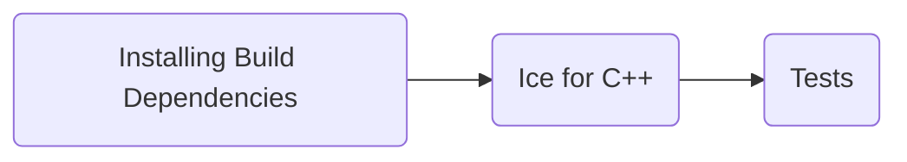

# Building Ice for C++ from Source

This document describes how to build and install Ice for C++ from source.

ZeroC provides [Ice binary distributions] for many platforms, including Linux, macOS and Windows, so building Ice from
source is usually unnecessary.

## Table of Contents

- [Build roadmap](#build-roadmap)
- [Building Ice for C++ on Linux](#building-ice-for-c-on-linux)
  - [Installing build dependencies](#installing-build-dependencies)
  - [Building](#building)
  - [Testing](#testing)
  - [Installation](#installation)
- [Building Ice for C++ on macOS](#building-ice-for-c-on-macos)
  - [Installing build dependencies](#installing-build-dependencies-1)
  - [Building](#building-1)
  - [Testing](#testing-1)
    - [macOS testing](#macos-testing)
    - [iOS testing](#ios-testing)
  - [Installation](#installation-1)
- [Building Ice for C++ on AIX](#building-ice-for-c-on-aix)
  - [Installing build dependencies](#installing-build-dependencies-2)
  - [Building](#building-2)
  - [Testing](#testing-2)
  - [Installation](#installation-2)
- [Building Ice for C++ on Windows](#building-ice-for-c-on-windows)
  - [Installing build dependencies](#installing-build-dependencies-3)
  - [Building](#building-3)
  - [Testing](#testing-3)
  - [Creating NuGet packages](#creating-nuget-packages)

## Build roadmap



## Building Ice for C++ on Linux

### Installing build dependencies

Ice has dependencies on a number of third-party libraries ([bzip2], [expat], [libedit], [LMDB], [mcpp] and [OpenSSL]).

Bzip, Expat, Libedit and OpenSSL are included with most Linux distributions.

ZeroC supplies binary packages for LMDB and mcpp for several Linux distributions that do not include them.

#### On Ubuntu and other Debian-based systems

```shell
sudo apt-get install libbz2-dev libexpat1-dev libedit-dev liblmdb-dev libmcpp-dev libssl-dev
```

In addition, on Ubuntu and Debian distributions where the Ice for Bluetooth plug-in is supported, you need to install
the following packages in order to build the IceBT transport plug-in:

```shell
sudo apt-get install pkg-config libdbus-1-dev libbluetooth-dev
```

#### On RHEL 9

```shell
sudo dnf install https://download.zeroc.com/ice/3.7/el9/ice-repo-3.7.el9.noarch.rpm
sudo dnf install bzip2-devel expat-devel libedit-devel lmdb-devel mcpp-devel openssl-devel
```

#### On RHEL 10

```shell
sudo dnf install https://download.zeroc.com/ice/3.7/el10/ice-repo-3.7.el10.noarch.rpm
sudo dnf install bzip2-devel expat-devel libedit-devel lmdb-devel mcpp-devel openssl-devel
```

### Building

Review the top-level [config/Make.rules](../config/Make.rules) in your build tree and update the configuration if
needed. The comments in the file provide more information.

Change to the `cpp` subdirectory and run `make` to build the Ice C++ libraries, services and test suite:

```shell
cd cpp
make -j8
```

Set `V=1` to get a more detailed build output. You can build only the libraries and services with the `srcs` target,
or only the tests with the `tests` target:

```shell
make V=1 -j8 srcs
```

#### Build configurations and platforms

The C++ source tree supports multiple build configurations and platforms. To see the supported configurations and
platforms:

```shell
make print V=supported-configs
make print V=supported-platforms
```

To build all the supported configurations and platforms:

```shell
make CONFIGS=all PLATFORMS=all -j8
```

#### C++11 mapping

The C++ source tree supports two different language mappings (C++98 and C++11). The default build uses the C++98
mapping. The C++11 mapping is a new mapping that uses new language features.

To build the C++11 mapping, use build configurations that are prefixed with `cpp11`, for example:

```shell
make CONFIGS=cpp11-shared -j8
```

#### Building with a binary distribution

To build the test suite using a binary distribution use:

```shell
make ICE_BIN_DIST=all
```

If the binary distribution you are using is not installed in a system wide location where the C++ compiler can
automatically find the header and library files, you also need to set `ICE_HOME`:

```shell
make ICE_HOME=/opt/Ice-3.7.11 ICE_BIN_DIST=all
```

### Testing

Python is required to run the test suite. Additionally, the Glacier2 tests require the Python module `passlib`, which
you can install with the command:

```shell
pip install passlib
```

After a successful source build, you can run the tests as follows:

```shell
python allTests.py
```

This runs the tests with the default config (C++98) and platform.

For the C++11 mapping, you need to specify a C++11 config:

```shell
python allTests.py --config=cpp11-shared
```

If everything worked out, you should see lots of `ok` messages. In case of a failure, the tests abort with `failed`.

### Installation

Run `make install` to install Ice for C++. This will install Ice in the directory specified by the `prefix` variable
in `../config/Make.rules`.

```shell
make install
```

After installation, make sure that the `<prefix>/bin` directory is in your `PATH`.

If you choose to not embed a `runpath` into executables at build time (see your build settings in
`../config/Make.rules`) or did not create a symbolic link from the `runpath` directory to the installation directory,
you also need to add the library directory to your `LD_LIBRARY_PATH`:

- `<prefix>/lib64` (RHEL, SLES, Amazon)
- `<prefix>/lib/x86_64-linux-gnu` (Debian, Ubuntu)

When compiling Ice programs, you must pass the location of the `<prefix>/include` directory to the compiler with the
`-I` option, and the location of the library directory with the `-L` option.

If building a C++11 program, you must define the `ICE_CPP11_MAPPING` macro during compilation with the `-D` option
(`c++ -DICE_CPP11_MAPPING`) and add the `++11` suffix to the library name when linking (such as `-lIce++11`).

#### Cleaning the source build

Running `make clean` will remove the binaries created for the default configuration and platform.

To clean the binaries produced for a specific configuration or platform, you need to specify the `CONFIGS` or
`PLATFORMS` variable. For example, `make CONFIGS=cpp11-shared clean` will clean the C++11 mapping build.

To clean the build for all the supported configurations and platforms, run `make CONFIGS=all PLATFORMS=all clean`.

Running `make distclean` will also clean the build for all the configurations and platforms. In addition, it will also
remove the generated files created by the Slice compilers.

## Building Ice for C++ on macOS

### Installing build dependencies

Ice has dependencies on a number of third-party libraries ([bzip2], [expat], [libedit], [LMDB] and [mcpp]).

bzip, expat and libedit are included with your system.

You can install LMDB and mcpp using Homebrew:

```shell
brew install lmdb mcpp
```

### Building

Review the top-level [config/Make.rules](../config/Make.rules) in your build tree and update the configuration if
needed. The comments in the file provide more information.

Change to the `cpp` subdirectory and run `make` to build the Ice C++ libraries, services and test suite:

```shell
cd cpp
make -j8
```

Set `V=1` to get a more detailed build output. You can build only the libraries and services with the `srcs` target,
or only the tests with the `tests` target:

```shell
make V=1 -j8 srcs
```

#### Build configurations and platforms

The C++ source tree supports multiple build configurations and platforms. To see the supported configurations and
platforms:

```shell
make print V=supported-configs
make print V=supported-platforms
```

To build all the supported configurations and platforms:

```shell
make CONFIGS=all PLATFORMS=all -j8
```

#### C++11 mapping

The C++ source tree supports two different language mappings (C++98 and C++11). The default build uses the C++98
mapping. The C++11 mapping is a new mapping that uses new language features.

To build the C++11 mapping, use build configurations that are prefixed with `cpp11`, for example:

```shell
make CONFIGS=cpp11-shared -j8
```

#### Ice Xcode SDK

The build system supports building Xcode SDKs for Ice. These SDKs allow you to easily develop Ice applications with
Xcode. To build Xcode SDKs, use the `xcodesdk` configurations. The [Ice Builder for Xcode] must be installed before
building the SDKs:

Build the C++98 mapping Xcode SDK:

```shell
make CONFIGS=xcodesdk -j8 srcs
```

Build the C++11 mapping Xcode SDK:

```shell
make CONFIGS=cpp11-xcodesdk -j8 srcs
```

The Xcode SDKs are built into `ice/sdk`.

### Testing

Python is required to run the test suite. Additionally, the Glacier2 tests require the Python module `passlib`, which
you can install with the command:

```shell
pip install passlib
```

#### macOS testing

After a successful source build, you can run the tests as follows:

```shell
python allTests.py
```

This runs the tests with the default config (C++98) and platform.

For the C++11 mapping, you need to specify a C++11 config:

```shell
python allTests.py --config=cpp11-shared
```

If everything worked out, you should see lots of `ok` messages. In case of a failure, the tests abort with `failed`.

#### iOS testing

The test scripts require Ice for Python. You can build Ice for Python from the [python](../python) folder of this
source distribution, or install the Python module `zeroc-ice`, using the following command:

```shell
pip install zeroc-ice
```

In order to run the test suite on `iphoneos`, you need to build the C++98 Test Controller app or C++11 Test Controller
app from Xcode:

- Build the test suite with `make` for the `xcodesdk` or `cpp11-xcodesdk` configuration, and the `iphoneos` platform.
- Open the C++ Test Controller project located in the `cpp/test/ios/controller` directory.
- Build the `C++98 Test Controller` or the `C++11 Test Controller` app (it must match the configuration(s) selected
  when building the test suite).

**iOS Simulator:**

- C++98 controller

```shell
python allTests.py --config=xcodesdk --platform=iphonesimulator --controller-app
```

- C++11 controller

```shell
python allTests.py --config=cpp11-xcodesdk --platform=iphonesimulator --controller-app
```

**iOS Device:**

- Start the `C++98 Test Controller` or the `C++11 Test Controller` app on your iOS device, from Xcode.

- Start the C++98 controller on your Mac:

```shell
python allTests.py --config=xcodesdk --platform=iphoneos
```

- Start the C++11 controller on your Mac:

```shell
python allTests.py --config=cpp11-xcodesdk --platform=iphoneos
```

All the test clients and servers run on the iOS device, not on your Mac computer.

### Installation

Run `make install` to install Ice for C++. This will install Ice in the directory specified by the `prefix` variable
in `../config/Make.rules`.

```shell
make install
```

After installation, make sure that the `<prefix>/bin` directory is in your `PATH`.

If you choose to not embed a `runpath` into executables at build time (see your build settings in
`../config/Make.rules`) or did not create a symbolic link from the `runpath` directory to the installation directory,
you also need to add the library directory to your `DYLD_LIBRARY_PATH`:

- `<prefix>/lib`

When compiling Ice programs, you must pass the location of the `<prefix>/include` directory to the compiler with the
`-I` option, and the location of the library directory with the `-L` option.

If building a C++11 program, you must define the `ICE_CPP11_MAPPING` macro during compilation with the `-D` option
(`c++ -DICE_CPP11_MAPPING`) and add the `++11` suffix to the library name when linking (such as `-lIce++11`).

#### Cleaning the source build

Running `make clean` will remove the binaries created for the default configuration and platform.

To clean the binaries produced for a specific configuration or platform, you need to specify the `CONFIGS` or
`PLATFORMS` variable. For example, `make CONFIGS=cpp11-shared clean` will clean the C++11 mapping build.

To clean the build for all the supported configurations and platforms, run `make CONFIGS=all PLATFORMS=all clean`.

Running `make distclean` will also clean the build for all the configurations and platforms. In addition, it will also
remove the generated files created by the Slice compilers.

## Building Ice for C++ on AIX

### Installing build dependencies

Ice has dependencies on a number of third-party libraries ([bzip2], [expat], [LMDB], [mcpp] and [OpenSSL]).

OpenSSL (openssl.base) is provided by AIX. bzip2 and bzip2-devel are included in the [IBM AIX Toolbox for Linux
Applications].

ZeroC provides RPM packages for expat, LMDB and mcpp. You can install these packages as shown below:

```shell
sudo yum install https://download.zeroc.com/ice/3.7/aix7.2/ice-repo-3.7.aix7.2.noarch.rpm
sudo yum install expat-devel lmdb-devel mcpp-devel
```

The expat-devel package contains the static library libexpat-static.a built with xlc_r, together with header files and
other development files.

### Building

Review the top-level [config/Make.rules](../config/Make.rules) in your build tree and update the configuration if
needed. The comments in the file provide more information.

Add /opt/freeware/bin as the first element of your PATH:

```shell
export PATH=/opt/freeware/bin:$PATH
```

Change to the `cpp` subdirectory and run `make` to build the Ice C++ libraries, services and test suite:

```shell
cd cpp
make -j8
```

Set `V=1` to get a more detailed build output. You can build only the libraries and services with the `srcs` target,
or only the tests with the `tests` target:

```shell
make V=1 -j8 srcs
```

#### Build configurations and platforms

The C++ source tree supports multiple build configurations and platforms. To see the supported configurations and
platforms:

```shell
make print V=supported-configs
make print V=supported-platforms
```

To build all the supported configurations and platforms:

```shell
make CONFIGS=all PLATFORMS=all -j8
```

#### C++11 mapping

The C++ source tree supports two different language mappings (C++98 and C++11). The default build uses the C++98
mapping. The C++11 mapping is a new mapping that uses new language features.

To build the C++11 mapping, use build configurations that are prefixed with `cpp11`, for example:

```shell
make CONFIGS=cpp11-shared -j8
```

### Testing

Python is required to run the test suite. Additionally, the Glacier2 tests require the Python module `passlib`, which
you can install with the command:

```shell
pip install passlib
```

After a successful source build, you can run the tests as follows:

```shell
python allTests.py
```

This runs the tests with the default config (C++98) and platform.

For the C++11 mapping, you need to specify a C++11 config:

```shell
python allTests.py --config=cpp11-shared
```

If everything worked out, you should see lots of `ok` messages. In case of a failure, the tests abort with `failed`.

### Installation

Run `make install` to install Ice for C++. This will install Ice in the directory specified by the `prefix` variable
in `../config/Make.rules`.

```shell
make install
```

After installation, make sure that the `<prefix>/bin` directory is in your `PATH`.

If you choose to not embed a `runpath` into executables at build time (see your build settings in
`../config/Make.rules`) or did not create a symbolic link from the `runpath` directory to the installation directory,
you also need to add the library directory to your `LD_LIBRARY_PATH`:

- `<prefix>/lib`

When compiling Ice programs, you must pass the location of the `<prefix>/include` directory to the compiler with the
`-I` option, and the location of the library directory with the `-L` option.

If building a C++11 program, you must define the `ICE_CPP11_MAPPING` macro during compilation with the `-D` option
(`c++ -DICE_CPP11_MAPPING`) and add the `++11` suffix to the library name when linking (such as `-lIce++11`).

#### Cleaning the source build

Running `make clean` will remove the binaries created for the default configuration and platform.

To clean the binaries produced for a specific configuration or platform, you need to specify the `CONFIGS` or
`PLATFORMS` variable. For example, `make CONFIGS=cpp11-shared clean` will clean the C++11 mapping build.

To clean the build for all the supported configurations and platforms, run `make CONFIGS=all PLATFORMS=all clean`.

Running `make distclean` will also clean the build for all the configurations and platforms. In addition, it will also
remove the generated files created by the Slice compilers.

## Building Ice for C++ on Windows

The build requires Visual Studio 2019 or Visual Studio 2022. The resulting binaries are compatible with later versions
of Visual Studio but the build requires one of the versions mentioned above.

### Installing build dependencies

ZeroC provides NuGet packages for all third-party dependencies.

The Ice build system for Windows downloads and installs the NuGet command-line executable and the required NuGet
packages when you build Ice for C++. The third-party packages are installed in the `ice/cpp/msbuild/packages` folder.

### Building

Open a Visual Studio command prompt. For example, with Visual Studio 2022, you can open one of:

- VS2022 x86 Native Tools Command Prompt
- VS2022 x64 Native Tools Command Prompt

Using the first Command Prompt produces `Win32` binaries by default, while the second Command Prompt produces `x64`
binaries by default.

In the Command Prompt, change to the `cpp` subdirectory:

```shell
cd cpp
```

Now you're ready to build Ice:

```shell
msbuild /m msbuild\ice.proj
```

This builds the Ice C++ libraries, services and test suite, with Release binaries for the default platform.

Set the MSBuild `Configuration` property to `Debug` to build debug binaries instead:

```shell
msbuild /m msbuild\ice.proj /p:Configuration=Debug
```

The `Configuration` property may be set to `Debug` or `Release`.

Set the MSBuild `Platform` property to `Win32` or `x64` to build binaries for a specific platform, for example:

```shell
msbuild /m msbuild\ice.proj /p:Configuration=Debug /p:Platform=x64
```

You can also skip the build of the test suite with the `BuildDist` target:

```shell
msbuild /m msbuild\ice.proj /t:BuildDist /p:Platform=x64
```

#### Building with a binary distribution

To build the test suite using the NuGet binary distribution use:

```shell
msbuild /m msbuild\ice.proj /p:ICE_BIN_DIST=all
```

#### Build using Visual Studio

Open the Visual Studio solution [msbuild/ice.sln](./msbuild/ice.sln).

Restore the solution NuGet packages using the NuGet package manager, if the automatic download of packages during build
is not enabled.

Using the configuration manager choose the platform and configuration you want to build.

The solution provides a project for each Ice component and each component can be built separately. When you build a
component its dependencies are built automatically.

The solutions organize the projects in two solution folders, C++11 and C++98, which correspond to the C++11 and C++98
mappings. If you want to build all the C++11 mapping components, build the C++11 solution folder; likewise if you want
to build all the C++98 mapping components, build the C++98 solution folder.

The test suite is built using a separate Visual Studio solution [msbuild/ice.test.sln](./msbuild/ice.test.sln).

The solution provides a separate project for each test component, the `Cpp11-Release` and `Cpp11-Debug` build
configurations are setup to use the C++11 mapping in release and debug mode respectively. The `Release` and `Debug`
build configurations are setup to use the C++98 mapping in release and debug mode respectively.

The building of the test uses by default the local source build, and you must have built the Ice source with the same
platform and configuration than you are attempting to build the tests.

For example to build the `Cpp11-Release/x64` tests you must have built first the C++11 mapping using `Release/x64`.

It is also possible to build the tests using a C++ binary distribution, to do that you must set the `ICE_BIN_DIST`
environment variable to `all` before starting Visual Studio.

Then launch Visual Studio and open the desired test solution, you must now use NuGet package manager to restore the
NuGet packages, and the build will use Ice NuGet packages instead of your local source build.

### Testing

Python is required to run the test suite. Additionally, the Glacier2 tests require the Python module `passlib`, which
you can install with the command:

```shell
pip install passlib
```

After a successful source build, you can run the tests as follows:

```shell
python allTests.py
```

This runs the tests with the default config (C++98) and platform.

- Windows C++11 debug builds

```shell
python allTests.py --config Cpp11-Debug
```

- Windows C++11 release builds

```shell
python allTests.py --config Cpp11-Release
```

If everything worked out, you should see lots of `ok` messages. In case of a failure, the tests abort with `failed`.

### Creating NuGet packages

First build all the required configurations and platforms:

```shell
msbuild msbuild\ice.proj /p:Configuration=Release /p:Platform=x64 /t:BuildDist
msbuild msbuild\ice.proj /p:Configuration=Debug /p:Platform=x64 /t:BuildDist
msbuild msbuild\ice.proj /p:Configuration=Release /p:Platform=Win32 /t:BuildDist
msbuild msbuild\ice.proj /p:Configuration=Debug /p:Platform=Win32 /t:BuildDist
```

Then you can create the NuGet package with the following command:

```shell
msbuild msbuild\ice.proj /t:NuGetPack
```

This creates `zeroc.ice.v142\zeroc.ice.v142.nupkg` or `zeroc.ice.v143\zeroc.ice.v143.nupkg` depending on the
compiler you are using.

[bzip2]: https://github.com/zeroc-ice/bzip2
[expat]: https://libexpat.github.io
[IBM AIX Toolbox for Linux Applications]: https://www.ibm.com/support/pages/aix-toolbox-linux-applications-overview
[Ice binary distributions]: https://zeroc.com/ice/downloads/3.7
[Ice Builder for Xcode]: https://github.com/zeroc-ice/ice-builder-xcode
[libedit]: https://thrysoee.dk/editline/
[LMDB]: https://www.symas.com/symas-embedded-database-lmdb
[mcpp]: https://github.com/zeroc-ice/mcpp
[OpenSSL]: https://www.openssl.org/
[supported platforms]: https://archive.zeroc.com/ice/3.7/release-notes/supported-platforms-for-ice-3-7-11
