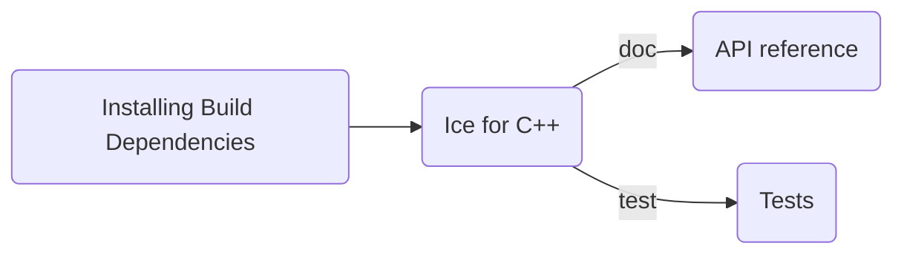

# Building Ice for C++ from Source

## Table of Contents

- [Build roadmap](#build-roadmap)
- [Prerequisites](#prerequisites)
- [Building Ice for C++ on Linux](#building-ice-for-c-on-linux)
  - [Installing Build Dependencies](#installing-build-dependencies)
    - [On Ubuntu and other Debian-based systems](#on-ubuntu-and-other-debian-based-systems)
    - [On RHEL](#on-rhel)
    - [On Amazon Linux 2023](#on-amazon-linux-2023)
  - [Building](#building)
  - [Testing](#testing)
  - [Installation](#installation)
- [Building Ice for C++ on macOS](#building-ice-for-c-on-macos)
  - [Installing Build Dependencies](#installing-build-dependencies-1)
  - [Building](#building-1)
  - [Testing](#testing-1)
    - [macOS Testing](#macos-testing)
    - [iOS Testing](#ios-testing)
      - [Using Xcode](#using-xcode)
      - [From the Terminal](#from-the-terminal)
  - [Installation](#installation-1)
- [Building Ice for C++ on Windows](#building-ice-for-c-on-windows)
  - [Installing Build Dependencies](#installing-build-dependencies-2)
  - [Building](#building-2)
  - [Testing](#testing-2)
  - [Creating NuGet packages](#creating-nuget-packages)

## Build roadmap



## Prerequisites

- A C++ compiler with support for the C++17 standard.
  - GCC on Linux
  - Clang on macOS
  - Visual Studio 2022 on Windows

## Building Ice for C++ on Linux

### Installing Build Dependencies

#### On Ubuntu and other Debian-based systems

Install the required third-party libraries:

```shell
sudo apt-get install libedit-dev libexpat1-dev liblmdb-dev libmcpp-dev libssl-dev libsystemd-dev
```

#### On RHEL

First add the ZeroC repository:

##### RHEL 9

```shell
dnf install https://zeroc.com/download/ice/3.8/el9/ice-repo-3.8-1.0.0-1.el9.noarch.rpm
```

##### RHEL 10

```shell
dnf install https://zeroc.com/download/ice/3.8/el10/ice-repo-3.8-1.0.0-1.el10.noarch.rpm
```

> The ZeroC repository provides the `lmdb-devel` and `mcpp-devel` packages, which are not available in the standard
> RHEL repositories.

Then install the required third-party libraries:

```shell
dnf install bzip2-devel expat-devel libedit-devel libsystemd-devel lmdb-devel mcpp-devel openssl-devel
```

#### On Amazon Linux 2023

Install the required third-party libraries:

```shell
dnf install bzip2-devel expat-devel libedit-devel systemd-devel lmdb-devel libmcpp-devel openssl-devel
```

### Building

Once you have installed the required libraries, you can build Ice for C++ by running:

```shell
make -j10
```

By default, this builds all the Slice compilers, the C++ shared libraries, and all the Ice for C++ services.

To build the static libraries, use the `static` configuration:

```shell
make -j10 CONFIGS=static
```

Or build both shared and static libraries by running:

```shell
make -j10 CONFIGS=all
```

After the build completes, the libraries are placed in the `lib` subdirectory, and the executables are placed in the
`bin` subdirectory.

### Testing

You can run the tests with:

```shell
python allTests.py --all
```

### Installation

You can install Ice for C++ by running:

```shell
make install
```

By default, Ice for C++ is installed to `/opt/Ice-3.8a0`. To change the installation location, set the `prefix`
Makefile variable:

```shell
make install prefix=$HOME/ice
```

## Building Ice for C++ on macOS

### Installing Build Dependencies

You can install the required third-party libraries using brew

```shell
brew install mcpp lmdb
```

### Building

On macOS, you can build Ice for C++ for macOS, iOS devices, and iOS simulators using the `macosx`, `iphoneos`, and
`iphonesimulator` platforms, respectively.

There are two build configurations: `shared` and `static`. The `static` configuration is used to build the test suite
against the static libraries and is also required for building the iOS test suite.

To build Ice for C++ for the default platform (i.e., macOS):

```shell
make -j10
```

By default, this builds all the Slice compilers, the C++ shared and static libraries, and all the Ice for C++ services.

To build for the iOS simulator:

```shell
make -j10 PLATFORMS=iphonesimulator CONFIGS=all
```

To build for multiple platforms at once, list them in the `PLATFORMS` Makefile variable:

```shell
make -j10 PLATFORMS="macosx iphonesimulator" CONFIGS=all
```

After the build completes, the libraries are placed in the `lib` subdirectory, and the executables are placed in the
`bin` subdirectory.

The build also produces XCFrameworks for `Ice`, `IceDiscovery`, and `IceLocatorDiscovery` under `lib/XCFrameworks`.
These XCFrameworks contain static libraries for all platforms specified in the `PLATFORMS` Makefile variable.

### Testing

#### macOS Testing

You can run the macOS tests with:

```shell
python allTests.py --all
```

#### iOS Testing

The iOS tests use the `test/ios/controller` application along with Ice for Python to drive the tests on an iOS device
or simulator from the development machine.

##### Using Xcode

Open the **C++ Test Controller** Xcode project located in the `tests/ios/controller` directory using Xcode, and deploy
it to your target device or simulator.

Then, from the command line, start the tests by running:

```shell
python allTests.py --all --platform iphoneos
```

or

```shell
python allTests.py --all --platform iphonesimulator
```

depending on whether you deployed the controller to an iOS device or an iOS simulator.

##### From the Terminal

You can also run the tests on the iOS simulator directly from the terminal without using Xcode:

```shell
python allTests.py --all --platform iphonesimulator --controller-app
```

### Installation

You can install Ice for C++ by running:

```shell
make -j10 install
```

By default, Ice for C++ is installed to `/opt/Ice-3.8a0`. To change the installation location, set the `prefix` Makefile
variable:

```shell
make -j10 install prefix=$HOME/ice
```

## Building Ice for C++ on Windows

### Installing Build Dependencies

The Windows MSBuild build downloads all dependencies as NuGet packages during the build process, so there is no need to
install additional dependencies manually.

### Building

Open a Visual Studio Developer Command Prompt, change to the `cpp` subdirectory, and run the following command:

```shell
MSBuild /m msbuild\ice.proj
```

This builds the Ice for C++ executables, libraries, and test suite for the default platform and configuration (i.e., `x64/Release`).

You can select a different platform and configuration by setting the MSBuild `Platform` and `Configuration` properties. For example, to build `x64/Debug` binaries:

```shell
MSBuild /m msbuild\ice.proj /p:Platform=x64 /p:Configuration=Debug
```

The supported platforms are `x64` and `Win32`.
The supported configurations are `Debug` and `Release`.

### Testing

You can run the test suite with:

```shell
python allTests.py --all
```

Use the `--platform` and `--configuration` options to run the tests for a specific platform/configuration combination:

```shell
python allTests.py --platform x64 --config Debug
```

### Creating NuGet Packages

You can create the `ZeroC.Ice.Cpp` NuGet package using the following command:

```shell
MSBuild /m msbuild\ice.proj /t:Pack
```

By default, the package includes only the binaries for the current platform and configuration.
To build a package that includes **all supported platforms and configurations**, use:

```shell
MSBuild /m msbuild\ice.proj /t:Pack /p:BuildAllConfigurations=yes
```
