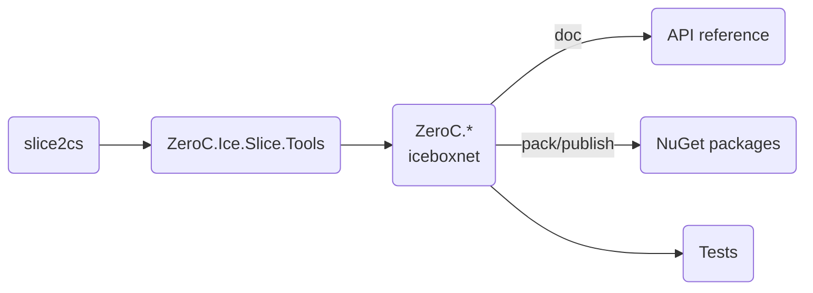

# Building Ice for C# from source

## Table of contents

- [Prerequisites](#prerequisites)
- [Build roadmap](#build-roadmap)
- [Building Ice for C#](#building-ice-for-c)
- [Running the tests](#running-the-tests)
- [Creating and publishing NuGet packages](#creating-and-publishing-nuget-packages)
  - [Slice tools](#slice-tools)
- [Generating the API reference](#generating-the-api-reference)
- [Shutting down background MSBuild servers](#shutting-down-background-msbuild-servers)

## Prerequisites

1. .NET SDK 8.0 \
   Download the .NET SDK from [dotnet.microsoft.com](https://dotnet.microsoft.com/en-us/download/dotnet).

2. The Slice to C# compiler (slice2cs) from the C++ source distribution.

3. Python 3.12 is required for running the tests. The Glacier2 test also require the `passlib` Python package.

4. docfx (optional)
   The API reference is generated by docfx. You can install docfx as follows:

   ```shell
   dotnet tool update -g docfx
   ```

## Build roadmap



## Building Ice for C\#

Before building Ice for C#, you must first build the slice2cs Slice compiler from the Ice C++ source distribution.
Refer to the [build instructions](../cpp/BUILDING.md) in the `cpp` subdirectory for details on how to build the C++
source distribution.

Once `slice2cs` is available, open a command prompt and navigate to the `csharp` subdirectory.
To build the Slice tools, all Ice for C# assemblies, and the test suite, run the following command:

```shell
dotnet msbuild msbuild/ice.proj
```

## Running the Tests

To run the tests, open a command prompt and change to the `csharp` subdirectory. At the command prompt, execute:

```shell
python allTests.py --all
```

If everything worked out, you should see lots of `ok` messages. In case of a failure, the tests abort with `failed`.

## Creating and publishing NuGet packages

To create the NuGet packages, open a command prompt and run the following command:

```shell
dotnet msbuild msbuild/ice.proj /t:Pack
```

This command creates all the NuGet packages.

You can publish these packages to your local `global-packages` source with the following command:

```shell
dotnet msbuild msbuild/ice.proj /t:Publish
```

### Slice tools

By default, the NuGet package `ZeroC.Ice.Slice.Tools` includes only the `slice2cs` compiler created by the local build.

If you set the MSBuild property `SLICE2CS_STAGING_PATH`, `ZeroC.Ice.Slice.Tools` includes the slice2cs compiler for all
supported platforms. The expected layout of the staging directory is `<os-name>-<os-arch>/<compiler-executable>`, with
the following subdirectories:

- `linux-x64`: Linux x86_64
- `linux-arm64`: Linux ARM64
- `macos-arm64`: macOS Apple silicon
- `windows-x64`: Windows x64

Make sure that all these compilers are available when you set `SLICE2CS_STAGING_PATH`.

## Generating the API reference

The API reference can be generated by running the following command in the docfx subdirectory:

```shell
docfx metadata --property Configuration=Release
docfx build
```

This command generates the API reference into the `docfx\_site` directory. Start a local web server to view this API reference:

```shell
docfx serve docfx/_site
```

## Shutting down background MSBuild servers

You may occasionally encounter errors when cleaning and building because background MSBuild servers use/lock the
`ZeroC.Ice.Slice.Tools` assembly. When this happens, you can shutdown these MSBuild servers with:

```shell
dotnet build-server shutdown
```
