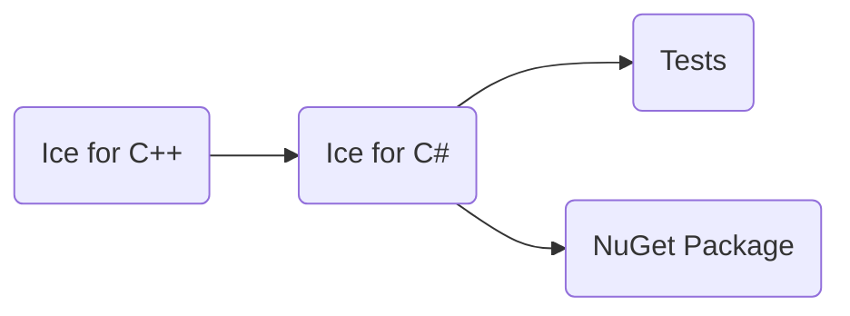

# Building Ice for C# from Source

This document describes how to build and install Ice for C# from source.

ZeroC provides [Ice binary distributions] for many platforms, including the [zeroc.ice.net] NuGet package, so building
Ice for C# from source is usually unnecessary.

## Table of Contents

- [Build roadmap](#build-roadmap)
- [Prerequisites](#prerequisites)
- [Building Ice for C#](#building-ice-for-c)
  - [Strong Name Signatures](#strong-name-signatures)
  - [Building only the Test Suite](#building-only-the-test-suite)
- [Running the Tests](#running-the-tests)
- [Creating NuGet Packages](#creating-nuget-packages)

## Build roadmap



## Prerequisites

You need the following to build Ice for C# from source:

- [.NET 10.0 SDK]
- [.NET 8.0 Runtime] (required to run tests and iceboxnet, since they target net8.0 by default)
- The Slice to C# compiler (`slice2cs`). Build `slice2cs` from source by following the [C++ build instructions].
- Python 3 is required to run the tests. The Glacier2 tests also require the `passlib` Python package.

## Building Ice for C#

Before building Ice for C#, you must first build the Ice for C++ source distribution to obtain the `slice2cs`
compiler. Refer to the [C++ build instructions] for details.

The build produces assemblies that target [.NET Standard 2.0].

Once Ice for C++ is built, open a command prompt and change to the `csharp` subdirectory:

```shell
cd csharp
```

To build all Ice assemblies and the associated test suite, run:

```shell
dotnet msbuild msbuild/ice.proj
```

Upon completion, the Ice assemblies for .NET Standard 2.0 are placed in the `lib/netstandard2.0` directory.

You can skip the build of the test suite with the `BuildDist` target:

```shell
dotnet msbuild msbuild/ice.proj /t:BuildDist
```

The iceboxnet application and test applications target `net8.0` by default. You can change the target framework by
setting the `AppTargetFramework` property to a different Target Framework Moniker value, for example:

```shell
dotnet msbuild msbuild/ice.proj /p:"AppTargetFramework=net472"
```

The target framework you specify must implement .NET Standard 2.0.

### Strong Name Signatures

The Ice assemblies in official releases are signed with strong name signatures to maintain compatibility with previous
versions and allow them to be installed in the Global Assembly Cache (GAC).

Strong name signing is automatically applied during the release build process via GitHub Actions, using keys stored as
GitHub secrets. For regular development builds, strong name signing is not required and assemblies are built unsigned.

### Building only the Test Suite

You can build only the test suite with this command:

```shell
dotnet msbuild msbuild/ice.proj /p:ICE_BIN_DIST=all
```

This build retrieves and installs the `zeroc.ice.net` NuGet package if necessary.

## Running the Tests

To run the tests, open a command window and change to the top-level directory. At the command prompt, execute:

```shell
python allTests.py
```

If everything worked out, you should see lots of `ok` messages. In case of a failure, the tests abort with `failed`.

`allTests.py` executes by default the tests for .NET 8.0. If you want to run the tests with a different .NET version,
you must use the `--framework` option.

For example, to run .NET Framework 4.7.2 tests (Windows only):

```shell
python allTests.py --framework=net472
```

## Creating NuGet Packages

The `zeroc.ice.net` NuGet package includes:

- Ice assemblies for .NET Standard 2.0
- Slice files for Glacier2, Ice, IceBox, IceGrid, IcePatch2, IceStorm
- The `iceboxnet` host application for .NET 8.0 (and .NET Framework 4.7.2 on Windows)
- The `slice2cs` compiler for compiling Slice files to C#

To automatically compile Slice files during your build, use the [zeroc.icebuilder.msbuild] package, which invokes
`slice2cs` from the `IceToolsPath` provided by this package.

### Slice Compiler (slice2cs)

The NuGet package includes platform-specific `slice2cs` compilers for Windows (x64), Linux (x64 and ARM64), and macOS
(ARM64). The package sets `IceToolsPath` to the appropriate platform-specific directory.

When building a local NuGet package:

- **CI/Release builds**: Set the `SLICE2CS_STAGING_PATH` environment variable to a directory containing pre-built
  compilers for all platforms. The staging directory should have subdirectories `windows-x64`, `linux-x64`,
  `linux-arm64`, and `macos-arm64`, each containing the `slice2cs` executable.

- **Development builds**: If `SLICE2CS_STAGING_PATH` is not set, the build uses the `slice2cs` compiler from your local
  C++ build (`cpp/bin` directory). This creates a package with only the compiler for your current platform.

### Windows-Specific Content

On Windows, the NuGet package build includes additional content:

- The `iceboxnet` application for .NET Framework 4.7.2
- The `bzip2.dll` native library (required for Ice protocol compression support)

### Creating the Package

To create a NuGet package, open a command prompt and run the following command:

```shell
dotnet msbuild msbuild/ice.proj /t:NuGetPack
```

This creates the `zeroc.ice.net` NuGet package in the `msbuild/zeroc.ice.net` directory.

[.NET 8.0 Runtime]: https://dotnet.microsoft.com/en-us/download/dotnet/8.0
[.NET 10.0 SDK]: https://dotnet.microsoft.com/en-us/download/dotnet/10.0
[.NET Standard 2.0]: https://docs.microsoft.com/en-us/dotnet/standard/net-standard
[C++ build instructions]: ../cpp/BUILDING.md
[Enhanced Strong Naming]: https://docs.microsoft.com/en-us/dotnet/framework/app-domains/enhanced-strong-naming
[Ice binary distributions]: https://zeroc.com/downloads/ice
[zeroc.ice.net]: https://www.nuget.org/packages/ZeroC.Ice.Net/
[zeroc.icebuilder.msbuild]: https://www.nuget.org/packages/zeroc.icebuilder.msbuild/
