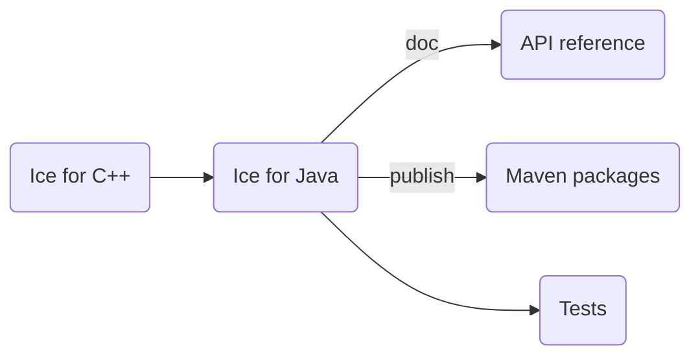

# Building Ice for Java from Source

## Table of Contents

- [Build roadmap](#build-roadmap)
- [Prerequisites](#prerequisites)
- [Building Ice for Java](#building-ice-for-java)
  - [Slice tools for Java](#slice-tools-for-java)
- [Running the tests](#running-the-tests)
- [Running the tests on Android](#running-the-tests-on-android)
  - [Using Android Command Line Tools](#using-android-command-line-tools)
  - [Using Android Studio](#using-android-studio)
- [Generating the API reference](#generating-the-api-reference)
- [Publishing Maven packages](#publishing-maven-packages)

## Build roadmap



## Prerequisites

1. JDK 17 or higher.
2. The Slice-to-Java compiler (`slice2java`).
3. Android Studio (optional) "Android Studio Meerkat Feature Drop" release is required to build the Android test
   controller.
4. The Ice for C++ distribution, for running service tests.
5. Python 3.12 is required to run the tests. The Glacier2 test also requires the `passlib` Python package.
6. Ice for Python is required for running the Android tests.

## Building Ice for Java

Before building Ice for Java, you must first build the Ice for C++ source distribution.
Refer to the [build instructions](../cpp/BUILDING.md) in the `cpp` subdirectory for details.

Once Ice for C++ is built, open a command prompt and navigate to the `java` subdirectory.
To build Ice for Java, run the following commands:

```shell
./gradlew build
```

> On Windows, if you’re not using the default C++ build configuration (i.e., x64/Release), you need to ensure that the
> Java build process can locate the correct `slice2java` compiler. To do this, set the `--cppPlatform` and
> `--cppConfiguration` Gradle properties to match your C++ platform and configuration settings.

For example, when using a C++ `Debug` build for `Win32`, you can run:

```shell
./gradlew build -PcppPlatform=Win32 -PcppConfiguration=Debug
```

### Slice Tools for Java

By default, the Slice Tools for Java package `com.zeroc.ice.slice-tools` includes only the `slice2java` compiler created
by the local C++ build. Refer to [Building Slice Tools for Ice](./tools/slice-tools/BUILDING.md) for instructions on
including the `slice2java` compilers for all supported platforms.

## Running the tests

To run the Java test suite, open a command prompt and change to the `java` subdirectory. Then run:

```shell
python allTests.py --all
```

## Running the tests on Android

The `java/test/android/controller` directory contains an Android Studio project for the Ice test suite controller.

To build and run the Android test controller, install the following:

- Android SDK 34
- Android Command Line Tools (optional, for command-line builds)
- Android Studio Meerkat Feature Drop (optional, for IDE-based builds)

### Using Android Command Line Tools

To build the Android test controller from the command line:

- Ensure that the `ANDROID_HOME` environment variable points to your Android SDK installation.
- Add the following tools to your PATH environment variable:
  - Android Command Line Tools
  - Android SDK platform tools
  - Android SDK emulator

  **On Linux and macOS:**

  ```shell
  export PATH=$ANDROID_HOME/cmdline-tools/latest/bin:$ANDROID_HOME/emulator:$ANDROID_HOME/platform-tools:$PATH
  ```

  **On Windows:**

  ```shell
  set PATH=%ANDROID_HOME%\cmdline-tools\latest\bin;%ANDROID_HOME%\emulator;%ANDROID_HOME%\platform-tools;%PATH%
  ```

- Open a command prompt, navigate to the `java/test/android/controller` directory, and build the project:

  ```shell
  ./gradlew build
  ```

- Once the controller is built, change to the `java` subdirectory and use the following command to run the Android
  tests:

  ```shell
  python allTests.py --android --all --controller-app
  ```

### Using Android Studio

- Launch Android Studio and import the `test/android/controller` project.
- Use the Run menu to deploy and start the test controller on your preferred device or emulator.
- Once the test controller is running, open a terminal, change to the java subdirectory, and execute:

  ```shell
  python allTests --android --all
  ```

## Generating the API reference

To generate the API reference documentation, run the following command from the `java` subdirectory:

```shell
./gradlew :alljavadoc
```

## Publishing Maven packages

To publish the Ice for Java packages to your local Maven repository (`~/.m2/repository`), run:

```shell
./gradlew publishToMavenLocal
```
