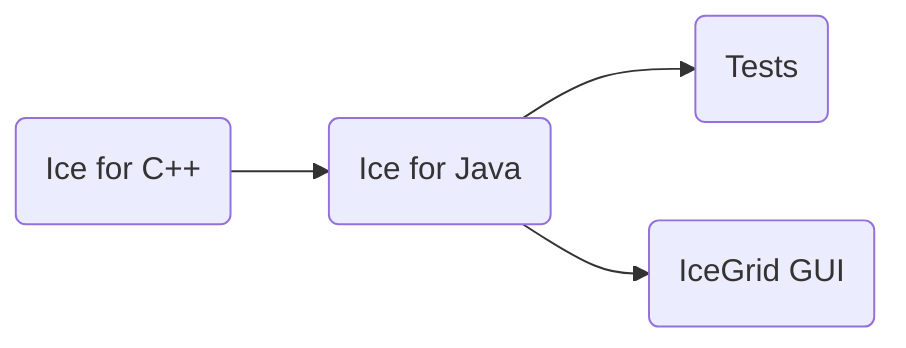

# Building Ice for Java from Source

This document describes how to build and install Ice for Java from source.

ZeroC provides [Ice binary distributions] for many platforms, so building Ice for Java from source is usually
unnecessary.

## Table of Contents

- [Build roadmap](#build-roadmap)
- [Prerequisites](#prerequisites)
- [Building Ice for Java](#building-ice-for-java)
- [Running the tests](#running-the-tests)
- [Running the tests on Android](#running-the-tests-on-android)
  - [Using Android Studio](#using-android-studio)
- [IceGrid GUI tool](#icegrid-gui-tool)

## Build roadmap



## Prerequisites

1. **JDK 8, JDK 11, JDK 17, or JDK 21.** Make sure that the `javac` and `java` commands are present in your PATH. The
   build produces bytecode in the Java 8 class file format.

2. **The Slice-to-Java compiler (`slice2java`).** You can build the Slice to Java compiler from source, or install an
   Ice [binary distribution][Ice binary distributions] that includes this compiler.

3. **Ice for C++ distribution** (for running service tests).

4. **Python 3** is required to run the tests. The Glacier2 tests also require the `passlib` Python package.

5. **Ice for Python** is required for running the Android tests.

6. **Android Studio** (optional). Android Studio Otter 2 Feature Drop | 2025.2.2 Patch 1 is required to build the
   Android test controller.

The IceGrid GUI tool's Metrics Graph feature requires JavaFX support. If you build the source with a JVM that lacks
JavaFX support, this feature will be unavailable.

## Building Ice for Java

Before building Ice for Java, you must first build the Ice for C++ source distribution. Refer to the
[C++ build instructions](../cpp/BUILDING.md) for details.

Once Ice for C++ is built, open a command prompt and navigate to the `java` subdirectory. To build Ice for Java, run:

```shell
./gradlew build
```

On Windows, if you're not using the default C++ build configuration (i.e., x64/Release), set the `cppPlatform` and
`cppConfiguration` Gradle properties to match your C++ build:

```shell
gradlew build -PcppPlatform=Win32 -PcppConfiguration=Debug
```

Upon completion, the Ice JAR and POM files are placed in the `lib` subdirectory.

### Using an Ice binary distribution

If you have not built Ice for C++ from source, you must set the `ICE_BIN_DIST` environment variable to `cpp` and the
`ICE_HOME` environment variable with the path name of your Ice installation.

On Linux with an RPM installation:

```shell
export ICE_BIN_DIST=cpp
export ICE_HOME=/usr
```

On macOS with a Homebrew installation:

```shell
export ICE_BIN_DIST=cpp
export ICE_HOME=$(brew --prefix)
```

On Windows with an MSI installation:

```shell
set ICE_BIN_DIST=cpp
set ICE_HOME=C:\Program Files\ZeroC\Ice-3.7.11
```

### Installing Ice for Java

To install Ice for Java in the directory specified by the `prefix` variable in `gradle.properties`, run:

```shell
./gradlew install
```

The following JAR files will be installed to `<prefix>/lib`:

- glacier2-3.7.11.jar
- ice-3.7.11.jar
- icebox-3.7.11.jar
- icebt-3.7.11.jar
- icediscovery-3.7.11.jar
- icegrid-3.7.11.jar
- icegridgui.jar
- icelocatordiscovery-3.7.11.jar
- icepatch2-3.7.11.jar
- icessl-3.7.11.jar
- icestorm-3.7.11.jar

POM files are also installed for ease of deployment to a Maven-based distribution system.

## Running the tests

To run the Java test suite, open a command prompt and change to the `java` subdirectory. Then run:

```shell
python allTests.py
```

If everything worked out, you should see lots of `ok` messages. In case of a failure, the tests abort with `failed`.

## Running the tests on Android

The `test/android/controller` directory contains an Android Studio project for the Ice test suite controller.

To build and run the Android test controller, install the following:

- Android SDK 36
- Android Studio Otter 2 Feature Drop | 2025.2.2 Patch 1

To use Ice's Java mapping with Java 8, you need at least API level 24 (Android 7).

### Using Android Studio

You must first build Ice for Java (see [Building Ice for Java](#building-ice-for-java)), then follow these steps:

1. Start Android Studio
2. Select "Open an existing Android Studio project"
3. Navigate to and select the `java/test/android/controller` subdirectory
4. Click OK and wait for the project to open and build

To build the tests against the Ice binary distribution, set the `ICE_BIN_DIST` environment variable to `all` before
starting Android Studio.

Once the test controller is running, open a terminal, change to the `java` subdirectory, and execute:

```shell
python allTests.py --android --controller-app
```

To run the tests on an Android device connected through USB:

```shell
python allTests.py --android --device=usb --controller-app
```

To connect to an Android device that is running adb:

```shell
python allTests.py --android --device=<ip-address> --controller-app
```

To run the tests against a controller application started from Android Studio, omit the `--controller-app` option.

You also need to add the Android SDK tools to your PATH:

On macOS:

```shell
export PATH=~/Library/Android/sdk/cmdline-tools/latest/bin:$PATH
export PATH=~/Library/Android/sdk/platform-tools:$PATH
export PATH=~/Library/Android/sdk/emulator:$PATH
```

On Windows:

```shell
set PATH=%LOCALAPPDATA%\Android\sdk\cmdline-tools\latest\bin;%PATH%
set PATH=%LOCALAPPDATA%\Android\sdk\platform-tools;%PATH%
set PATH=%LOCALAPPDATA%\Android\sdk\emulator;%PATH%
```

## IceGrid GUI tool

Ice for Java includes the IceGrid GUI tool. It can be found in the file `lib/icegridgui.jar`.

When built with ProGuard enabled (the default, see `gradle.properties`), this JAR file is completely self-contained
and has no external dependencies. You can start the tool with:

```shell
java -jar icegridgui.jar
```

On macOS, the build also creates an application bundle named IceGrid GUI. You can start the IceGrid GUI tool by
double-clicking the IceGrid GUI icon in Finder.

[Ice binary distributions]: https://zeroc.com/ice/downloads/3.7
