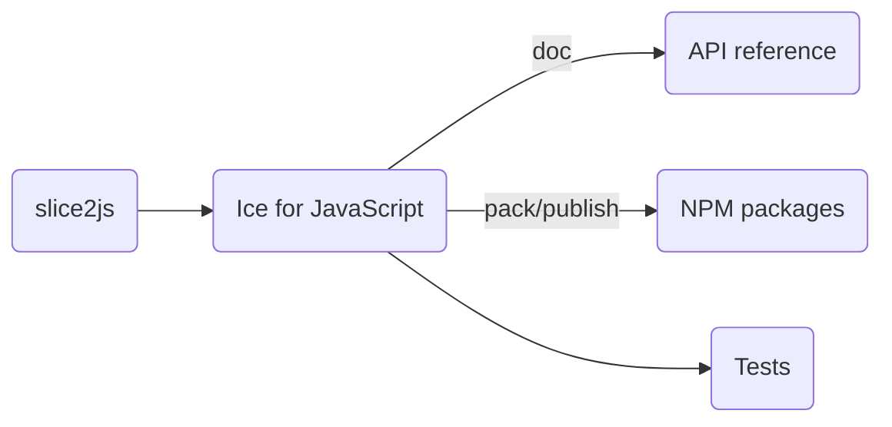

# Building Ice for JavaScript from source

## Table of contents

- [Building Ice for JavaScript from source](#building-ice-for-javascript-from-source)
  - [Table of contents](#table-of-contents)
  - [Prerequisites](#prerequisites)
  - [Build roadmap](#build-roadmap)
  - [Building Ice for JavaScript](#building-ice-for-javascript)
  - [Running the tests](#running-the-tests)
  - [Creating the NPM package](#creating-the-npm-package)
    - [Slice compilers](#slice-compilers)
  - [Generating the API reference](#generating-the-api-reference)

## Prerequisites

1. Node.js 22 or later.

2. The Slice to JavaScript compiler (slice2js) from the C++ source distribution. \
   Refer to the [build instructions](../cpp/BUILDING.md) in the `cpp` folder for details on how to build the C++ source
   distribution.

3. Python 3.12 is required for running the tests. The Glacier2 test also require the `passlib` Python package.

4. Ice for Python is required for running the JavaScript in a web browser.\
   Refer to the [build instructions](../python/BUILDING.md) in the `python` folder for details on how to build the
   Python source distribution.

## Build roadmap



## Building Ice for JavaScript

Open a command prompt and change to the `js` subdirectory. You can build the Ice for JavaScript source distribution
using the following command:

```shell
npm install
npm run build
```

> On Windows, if you’re not using the default C++ build configuration (e.g., x64/Release), you need to ensure that the
> JavaScript build process can locate the correct slice2js compiler. To do this, set the `CPP_PLATFORM` and
> `CPP_CONFIGURATION` environment variables, or pass the `--cppPlatform` and `--cppConfiguration` arguments to the
> `npm run build command` to match your C++ platform and configuration settings.

For example, when using a C++ **Debug** build for **Win32**, you can run:

```shell
set CPP_CONFIGURATION=Debug
set CPP_PLATFORM=Win32
npm run build
```

or

```shell
npm run build -- --cppPlatform=Win32 --cppConfiguration=Debug
```

## Running the Tests

To run the JavaScript test suite with Node.js, open a command prompt and change to the `js` subdirectory. At the
command prompt, execute:

```shell
python allTests.py --all
```

If everything worked out, you should see lots of `ok` messages. In case of a failure, the tests abort with `failed`.

To run the JavaScript test suite with a Web Browser you must add the `--browser Manual` and follow the instructions
to load the provided URL in the browser.

```shell
python allTests.py --all --browser
```

## Creating the NPM package

To create the `@zeroc/ice` NPM package, open a command prompt and run the following command:

```shell
npm pack
```

### Slice compilers

By default, the NPM package `@zeroc\ice` includes only the `slice2js` compiler created by the local C++ build.

If you set the environment variable `SLICE2JS_STAGING_PATH`, `@zeroc/ice` instead includes the `slice2js` compiler
for all supported platforms. The expected layout of the staging directory is `<os-name>-<os-arch>/<compiler-executable>`,
with the following subdirectories:

- `linux-x64`: Linux x86_64
- `linux-arm64`: Linux ARM64
- `macos-arm64`: macOS Apple silicon
- `windows-x64`: Windows x64

Make sure that all these compilers are available when you set `SLICE2JS_STAGING_PATH`.

## Generating the API reference

The API reference can be generated running the following command:

```shell
npn run build-doc
```

This command generates the API reference into the `docs` directory. Start a local web server to view this API reference:

```shell
npx http-server docs
```
