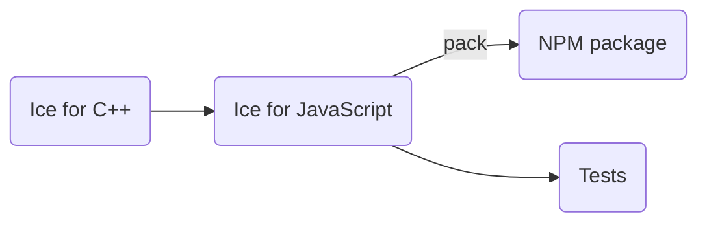

# Building Ice for JavaScript from source

## Table of Contents

- [Table of Contents](#table-of-contents)
- [Prerequisites](#prerequisites)
- [Build Roadmap](#build-roadmap)
- [Building Ice for JavaScript](#building-ice-for-javascript)
- [Running the Tests](#running-the-tests)
  - [Browser Tests](#browser-tests)
  - [Secure WebSocket Tests](#secure-websocket-tests)
- [Creating the NPM Package](#creating-the-npm-package)

## Prerequisites

1. [Node.js] 20 or later.
2. The Slice-to-JavaScript compiler (`slice2js`). Build `slice2js` from source by following the
   [C++ build instructions].
3. The Ice for C++ test suite, for running JavaScript client tests against the C++ servers.
4. Python is required to run the test suite. Additionally, the Glacier2 tests require the Python module `passlib`,
   which you can install with the command:

   ```shell
   pip install passlib
   ```
5. [Ice for Python][python build instructions] is required for running the JavaScript tests in a web browser.

## Build Roadmap



## Building Ice for JavaScript

Before building Ice for JavaScript, you must first build the Ice for C++ source distribution.
Refer to the [C++ build instructions] for details.

Once Ice for C++ is built, open a command prompt and navigate to the `js` subdirectory.
To build Ice for JavaScript, run the following commands:

```shell
npm install
npm run build
```

> On Windows, if you're not using the default C++ build configuration (i.e., x64/Release), you need to ensure that the
> JavaScript build process can locate the correct `slice2js` compiler. To do this, set the `CPP_PLATFORM` and
> `CPP_CONFIGURATION` environment variables, or pass the `--cppPlatform` and `--cppConfiguration` arguments to the
> `npm run build` command to match your C++ platform and configuration settings.

For example, when using a C++ **Debug** build for **x64**, you can run:

```shell
set CPP_CONFIGURATION=Debug
set CPP_PLATFORM=x64
npm run build
```

or

```shell
npm run build -- --cppPlatform=x64 --cppConfiguration=Debug
```

Upon successful completion, the build generates libraries in the `lib` subdirectory, including compressed and minified
versions.

## Running the Tests

To run the JavaScript tests with Node.js, open a command prompt and change to the `js` subdirectory. At the command
prompt, execute:

```shell
python allTests.py
```

If everything worked out, you should see lots of `ok` messages. In case of a failure, the tests abort with `failed`.

### Browser Tests

To run the JavaScript tests in a web browser, use the `--browser Manual` option and follow the instructions
to load the provided URL in the browser:

```shell
python allTests.py --browser Manual
```

Then open the test page http://127.0.0.1:8080/start using a web browser with ES6 support, such as a recent version of
Chrome, Firefox, Microsoft Edge, or Safari.

### Secure WebSocket Tests

To run browser tests over secure WebSocket (WSS), you need to trust the test server certificate from the
[certs](../certs) directory.

## Creating the NPM Package

To create the `ice` NPM package, open a command prompt and change to the `js` subdirectory. Then run the
following command:

```shell
npm pack
```

This will generate the file `ice-3.7.110.tgz`, which can be installed by running:

```shell
npm install ice-3.7.110.tgz
```

To use Ice for JavaScript with a browser, copy the appropriate JavaScript library files located in the `lib` directory
to your web server.

Alternatively, you can download and install the [ice] npm package.

[C++ build instructions]: ../cpp/BUILDING.md
[ice]: https://www.npmjs.com/package/ice
[Node.js]: https://nodejs.org/
[python build instructions]: ../python/BUILDING.md
