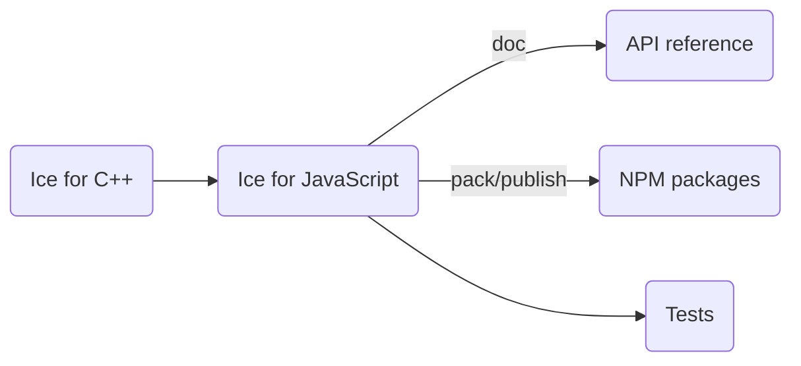

# Building Ice for JavaScript from source

## Table of Contents

- [Table of contents](#table-of-contents)
- [Prerequisites](#prerequisites)
- [Build roadmap](#build-roadmap)
- [Workspace layout](#workspace-layout)
- [Building Ice for JavaScript](#building-ice-for-javascript)
- [Running the tests](#running-the-tests)
- [Creating the NPM packages](#creating-the-npm-packages)
  - [Slice Compilers](#slice-compilers)
- [Generating the API Reference](#generating-the-api-reference)

## Prerequisites

1. Node.js 22 or later.
2. The Slice-to-JavaScript compiler (`slice2js`).
3. The Ice for C++ test suite, for running JavaScript client tests against the C++ servers.
4. Python 3.12 is required for running the tests. The Glacier2 test also requires the `passlib` Python package.
5. Ice for Python is required for running the JavaScript tests in a web browser.

## Build Roadmap



## Workspace Layout

The `js/` directory is an npm workspace with three packages:

| Package | Path | Description |
|---------|------|-------------|
| `@zeroc/ice` | `packages/ice/` | Ice for JavaScript runtime (published) |
| `@zeroc/slice2js` | `packages/slice2js/` | Slice-to-JavaScript compiler plugin for bundlers (published) |
| `@zeroc/ice-test` | `packages/test/` | Test suite (private, not published) |

Build tooling (gulpfile, eslint, prettier configs) lives at the `js/` workspace root.

## Building Ice for JavaScript

Before building Ice for JavaScript, you must first build the Ice for C++ source distribution.
Refer to the [build instructions](../cpp/BUILDING.md) in the `cpp` subdirectory for details.

Once Ice for C++ is built, open a command prompt and navigate to the `js` subdirectory.
To build Ice for JavaScript, run the following commands:

```shell
npm install
npm run build
```

> On Windows, if you're not using the default C++ build configuration (i.e., x64/Release), you need to ensure that the
> JavaScript build process can locate the correct `slice2js` compiler. To do this, set the `CPP_PLATFORM` and
> `CPP_CONFIGURATION` environment variables, or pass the `--cppPlatform` and `--cppConfiguration` arguments to the
> `npm run build` command to match your C++ platform and configuration settings.

For example, when using a C++ **Debug** build for **Win32**, you can run:

```shell
set CPP_CONFIGURATION=Debug
set CPP_PLATFORM=Win32
npm run build
```

or

```shell
npm run build -- --cppPlatform=Win32 --cppConfiguration=Debug
```

## Running the Tests

To run the JavaScript tests with Node.js, open a command prompt and change to the `js` subdirectory. At the command
prompt, execute:

```shell
python allTests.py --all
```

To run the JavaScript tests in a web browser, use the `--browser Manual` and follow the instructions
to load the provided URL in the browser.

```shell
python allTests.py --all --browser Manual
```

## Creating the NPM Packages

To create the `@zeroc/ice` NPM package, run:

```shell
cd packages/ice
npm pack
```

To create the `@zeroc/slice2js` NPM package, run:

```shell
cd packages/slice2js
npm pack
```

### Slice Compilers

By default, the NPM packages include only the `slice2js` compiler created by the local C++ build.

If you set the environment variable `SLICE2JS_STAGING_PATH`, the packages include the `slice2js` compiler for all
supported platforms. The expected layout of the staging directory is `<os-name>-<os-arch>/<compiler-executable>`,
with the following subdirectories:

- `linux-x64`: Linux x86_64
- `linux-arm64`: Linux ARM64
- `macos-arm64`: macOS Apple silicon
- `windows-x64`: Windows x64

Make sure that all these compilers are available when you set `SLICE2JS_STAGING_PATH`.

## Generating the API Reference

The API reference can be generated by running the following command:

```shell
npm run build-doc
```

This command generates the API reference into the `docs` directory. Start a local web server to view this API reference:

```shell
npx http-server docs
```
