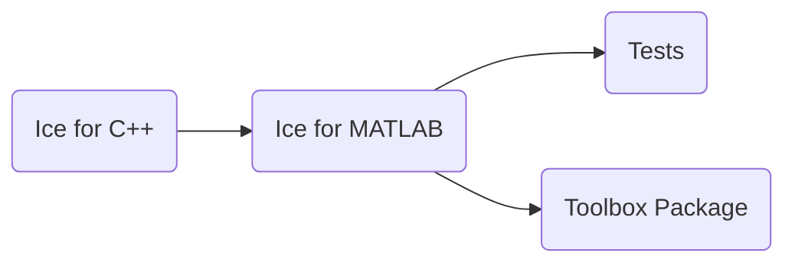

# Building Ice for MATLAB from Source

This document describes how to build and install Ice for MATLAB from source.

ZeroC provides Ice for MATLAB [toolboxes] for MATLAB on Windows and Linux, so building Ice for MATLAB from source is
usually unnecessary.

## Table of Contents

- [Build roadmap](#build-roadmap)
- [Building Ice for MATLAB on Windows](#building-ice-for-matlab-on-windows)
  - [Prerequisites](#prerequisites)
  - [Build instructions](#build-instructions)
  - [Packaging the Ice toolbox](#packaging-the-ice-toolbox)
- [Building Ice for MATLAB on Linux](#building-ice-for-matlab-on-linux)
  - [Prerequisites](#prerequisites-1)
  - [Build instructions](#build-instructions-1)
- [Using Ice for MATLAB](#using-ice-for-matlab)
  - [Search path](#search-path)
  - [Slice files](#slice-files)
  - [Loading the library](#loading-the-library)
  - [Running the tests](#running-the-tests)

## Build roadmap



## Building Ice for MATLAB on Windows

### Prerequisites

1. **MATLAB R2025b or later**

2. **Visual Studio 2022**

3. **Perl**

### Build instructions

Open a Visual Studio x64 command prompt, `VS2022 x64 Native Tools Command Prompt`. In this command prompt, change to
the `matlab` subdirectory:

```shell
cd matlab
```

Now you're ready to build Ice for MATLAB:

```shell
msbuild msbuild\ice.proj
```

To build in debug mode instead:

```shell
msbuild msbuild\ice.proj /p:Configuration=Debug
```

Upon completion, a build in release mode generates the following components:

- Ice for C++11 libraries, located in `cpp\bin\x64\Release`
- slice2matlab executable, located in `cpp\bin\x64\Release`
- ice.mexw64 MEX file, located in `matlab\lib\x64\Release`
- Prototype and thunk files, located in `matlab\lib\x64\Release`
- MATLAB code for core Slice files, located in `matlab\lib\generated`
- MATLAB code for test Slice files, located in `matlab\test\**\generated`

The MATLAB extension depends on Ice for C++ components from the `cpp` subdirectory, and those are built if required.
It is also possible to build the MATLAB extension using Ice C++ NuGet packages by setting the `ICE_BIN_DIST` MSBuild
property to `cpp`:

```shell
msbuild msbuild\ice.proj /p:ICE_BIN_DIST=cpp
```

### Packaging the Ice toolbox

Use the following command to build the Ice toolbox package:

```shell
msbuild msbuild\ice.proj /t:Package
```

This creates the toolbox package `toolbox\ice-<Ice Version>-<MATLAB Version>-win.mltbx`.

You can install the toolbox from within MATLAB by double-clicking on the file.

## Building Ice for MATLAB on Linux

### Prerequisites

1. **MATLAB R2025b or later**

2. **Ubuntu 24.04** with the default C++ compiler

3. **Ice for C++ source build** (using the `cpp11-shared` configuration)

4. **Perl**

### libstdc++ Compatibility

While GCC 13.x is officially supported by MathWorks, MATLAB bundles its own older libstdc++ runtime
library that only supports up to GLIBCXX_3.4.30. Code compiled with Ubuntu 24.04's default GCC (13.3.0)
links against GLIBCXX_3.4.32 symbols, causing `GLIBCXX_X.X.XX not found` errors at runtime when MATLAB
loads its bundled library first.

To work around this issue, set the `LD_PRELOAD` environment variable to use the system's libstdc++:

```shell
export LD_PRELOAD=/lib/x86_64-linux-gnu/libstdc++.so.6
```

### Build instructions

Before building Ice for MATLAB, you must first build the Ice for C++ source distribution using the `cpp11-shared`
configuration. Refer to the [build instructions](../cpp/BUILDING.md) in the `cpp` subdirectory for details.

In a terminal, change to the `matlab` subdirectory:

```shell
cd matlab
```

Review the [matlab/config/Make.rules](config/Make.rules) in your build tree and update the configuration if needed.
The comments in the file provide more information.

Run `make` to build the Ice for MATLAB toolbox and the MATLAB tests. Set `V=1` to get a more detailed build output.

```shell
make
```

This creates the toolbox package `toolbox/ice-<Ice Version>-<MATLAB Version>-linux.mltbx`. You can install the toolbox
from within MATLAB by double-clicking on the file.

## Using Ice for MATLAB

### Search path

To use a source build, add the following directories to your MATLAB path:

- `matlab\lib`
- `matlab\lib\generated`
- `matlab\lib\x64\Release` (only on Windows)
- `matlab\lib\x86_64-linux-gnu` (only on Linux)

### Slice files

Use `slice2matlab` to compile your Slice files. Run `slice2matlab -h` for a description of its command-line options.
You can place the generated `*.m` files anywhere you like, but the enclosing directory must be in your MATLAB path.

### Loading the library

The Ice for MATLAB library can be loaded with this command:

```matlab
loadlibrary('ice', @iceproto)
```

### Running the tests

The Ice for MATLAB tests are located in `matlab\test`.

Since Ice for MATLAB only supports client functionality, you need test servers from a different language mapping.

Assuming you've installed Ice for Python, run `allTests.py`:

```shell
python allTests.py
```

This script automatically starts a Python server for each MATLAB client. MATLAB clients are executed using a minimized
MATLAB interpreter and the test output is copied to the command prompt window.

[toolboxes]: https://zeroc.com/ice/downloads/3.7
