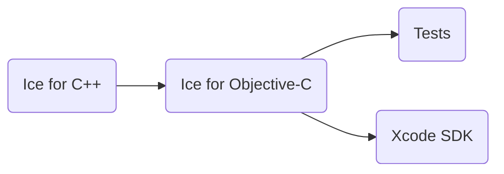

# Building Ice for Objective-C from Source

This document describes how to build and install Ice for Objective-C from source on macOS.

ZeroC provides Ice for Objective-C as a [Homebrew] package, so building Ice for Objective-C from source is usually
unnecessary.

## Table of Contents

- [Building Ice for Objective-C from Source](#building-ice-for-objective-c-from-source)
  - [Table of Contents](#table-of-contents)
  - [Build roadmap](#build-roadmap)
  - [Building Ice for Objective-C](#building-ice-for-objective-c)
    - [Prerequisites](#prerequisites)
    - [Build instructions](#build-instructions)
    - [Build configurations and platforms](#build-configurations-and-platforms)
    - [Ice Xcode SDK](#ice-xcode-sdk)
    - [Installing Ice for Objective-C](#installing-ice-for-objective-c)
  - [Running the tests](#running-the-tests)
    - [macOS](#macos)
    - [iOS Simulator](#ios-simulator)
    - [iOS](#ios)

## Build roadmap



## Building Ice for Objective-C

### Prerequisites

1. **macOS** with Xcode

2. **Ice for C++ source build**

3. **Python** (required to run the tests)

4. **[Ice for Python](../python/BUILDING.md)** (required for iOS and iOS Simulator tests)

### Build instructions

Before building Ice for Objective-C, you must first build the Ice for C++ source distribution for the same
configuration(s) and platform(s). Refer to the [build instructions](../cpp/BUILDING.md) in the `cpp` subdirectory for
details.

Review the top-level [config/Make.rules](../config/Make.rules) in your build tree and update the configuration if
needed. The comments in the file provide more information.

Change to the Ice for Objective-C source subdirectory:

```shell
cd objective-c
```

Run `make` to build the Ice Objective-C libraries and test suite. Set `V=1` to get a more detailed build output. You
can build only the libraries with the `srcs` target, or only the tests with the `tests` target:

```shell
make V=1 -j8 srcs
```

### Build configurations and platforms

The Objective-C source tree supports multiple build configurations and platforms. To see the supported configurations
and platforms:

```shell
make print V=supported-configs
make print V=supported-platforms
```

To build all the supported configurations and platforms:

```shell
make CONFIGS=all PLATFORMS=all -j8
```

The `arc-` configurations (for [Automatic Reference Counting]) apply only to the test suite; the Ice libraries don't
use these configurations, and the same Ice for Objective-C library can be used with and without ARC.

### Ice Xcode SDK

The build system supports building Xcode SDKs for Ice. These SDKs allow you to easily develop Ice applications with
Xcode. To build Xcode SDKs, use the `xcodesdk` configurations.

Build the Objective-C mapping Xcode SDK for the default platform:

```shell
make CONFIGS=xcodesdk -j8 srcs
```

The Xcode SDKs are built into `ice/sdk`.

### Installing Ice for Objective-C

Run `make install` to install Ice for Objective-C. This will install Ice in the directory specified by the `prefix`
variable in `../config/Make.rules`.

When compiling Ice programs, you must pass the location of the `<prefix>/include` directory to the compiler with the
`-I` option, and the location of the library directory with the `-L` option.

## Running the tests

Python is required to run the test suite.

### macOS

After a successful build, you can run the tests as follows:

```shell
python allTests.py
```

To use a specific config and platform:

```shell
python allTests.py --config=<config> --platform=<platform>
```

If everything worked out, you should see lots of `ok` messages. In case of a failure, the tests abort with `failed`.

### iOS Simulator

```shell
python allTests.py --config=xcodesdk --platform=iphonesimulator --controller-app
```

### iOS

To run the test suite on `iphoneos`, you need to build the Objective-C Controller app from Xcode:

1. Open the Objective-C Test Controller project located in the `objective-c/test/ios/controller` directory.
2. Build the `Objective-C Controller` or `Objective-C ARC Controller` app.
3. Start the app on your iOS device from Xcode.

Then on your Mac, run:****

```shell
python allTests.py --config=xcodesdk --platform=iphoneos
```

or

```shell
python allTests.py --config=arc-xcodesdk --platform=iphoneos
```

All the test clients and servers run on the iOS device, not on your Mac computer.

[Automatic Reference Counting]: https://en.wikipedia.org/wiki/Automatic_Reference_Counting
[Homebrew]: https://archive.zeroc.com/ice/3.7/release-notes/using-the-macos-binary-distribution
