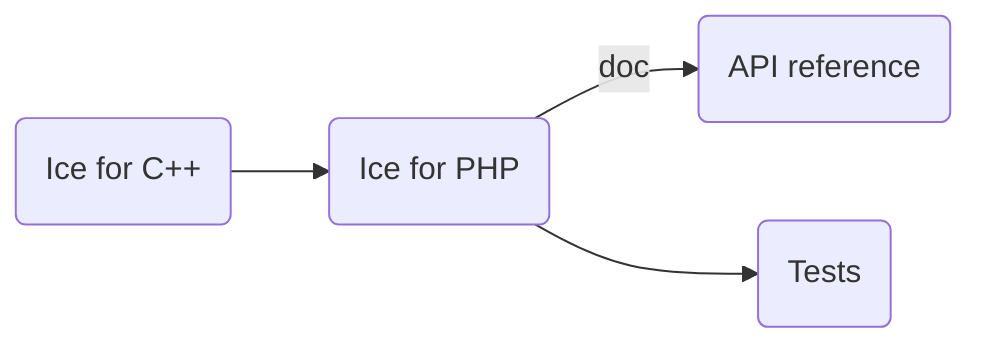

# Building Ice for PHP from Source

## Table of Contents

- [Build roadmap](#build-roadmap)
- [Prerequisites](#prerequisites)
- [Building Ice for PHP](#building-ice-for-php)
- [Generating the API reference](#generating-the-api-reference)
- [Configuring the Ice for PHP extension](#configuring-the-ice-for-php-extension)

## Build roadmap



## Prerequisites

1. PHP 8.0 or higher.
2. The Slice-to-PHP compiler (`slice2php`).
3. The Ice for C++ test suite, for running PHP client tests against the C++ servers.
4. Python 3.12 is required to run the tests.
5. [phpDocumentor] is required to build the API reference.

## Building Ice for PHP

Before building Ice for PHP, you must first build the Ice for C++ source distribution.
Refer to the [build instructions](../cpp/BUILDING.md) in the `cpp` subdirectory for details.

Once Ice for C++ is built, open a command prompt and navigate to the `php` subdirectory.
To build Ice for PHP, run the following commands:

```shell
make
```

## Running the Tests

To run the PHP tests, open a command prompt and change to the `php` subdirectory. At the command prompt, execute:

```shell
python allTests.py --all
```

## Generating the API reference

To generate the PHP API reference, open a command prompt and change to the `php` subdirectory. At the command prompt,
execute:

```
phpDocumentor --config ./phpdoc.dist.xml
```

## Installing Ice for PHP

You can install Ice for PHP by running:

```shell
make install
```

By default, Ice for PHP is installed to `/opt/Ice-3.8a0`. To change the installation location, set the `prefix` Makefile
variable:

```shell
make install prefix=$HOME/ice
```

## Configuring the Ice for PHP Extension

To use Ice for PHP, you must first copy the `ice.so` file from the `php` installation directory to your PHP extensions
directory. You can determine the correct extension directory by running:

```shell
php-config --extension-dir
```

Next, enable the extension in your PHP configuration. Create an `ice.ini` file containing:

```ini
; Load Ice for PHP extension
extension=ice

; Add the Ice for PHP sources to the PHP include_path
include_path=${include_path}":/opt/Ice-3.8a0/php"
```

Place this file in your PHP configuration file directory, often called `conf.d`.
You can inspect your PHP configuration with:

```shell
php --ini
```

Example output:

```shell
Configuration File (php.ini) Path: /opt/homebrew/etc/php/8.4
Loaded Configuration File:         /opt/homebrew/etc/php/8.4/php.ini
Scan for additional .ini files in: /opt/homebrew/etc/php/8.4/conf.d
Additional .ini files parsed:      /opt/homebrew/etc/php/8.4/conf.d/ext-opcache.ini
```

For PHP to successfully load the `ice.so` extension, the Ice shared libraries (`libIce`, `libIceDiscovery`, and
`libIceLocatorDiscovery`) must also be accessible via your system's dynamic linker path. If they are not, you need to:

- On **macOS**, add the Ice `lib` directory to your `DYLD_LIBRARY_PATH`.
- On **Linux**, add the Ice `lib` directory to your `LD_LIBRARY_PATH`.

[phpDocumentor]: https://phpdoc.org/
