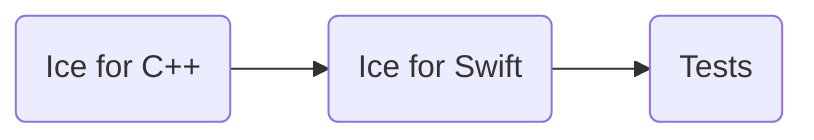

# Building Ice for Swift from Source

This document describes how to build and install Ice for Swift from source.

ZeroC provides Ice for Swift as a [binary distribution], so building Ice for Swift from source is usually unnecessary.

## Table of Contents

- [Build roadmap](#build-roadmap)
- [Building Ice for Swift](#building-ice-for-swift)
  - [Prerequisites](#prerequisites)
  - [Build instructions](#build-instructions)
- [Running the tests](#running-the-tests)
  - [macOS](#macos)
  - [iOS](#ios)

## Build roadmap



## Building Ice for Swift

### Prerequisites

1. **macOS** with Xcode

2. **Swift 5 or later**

3. **Slice to Swift compiler**

   You need the Slice to Swift compiler (`slice2swift`) to build Ice for Swift. You can build it from source by
   building Ice for C++ from the `cpp` subdirectory, or install an Ice [binary distribution] that includes this
   compiler.

4. **[Ice for Python](../python/BUILDING.md)** (required for iOS and iOS Simulator tests)

### Build instructions

Open `ice.xcodeproj` with Xcode and build the `Ice macOS` or `Ice iOS` targets. The PromiseKit dependency will be
automatically fetched via Swift Package Manager.

The test programs for macOS and iOS can be built using `TestDriver macOS` and `TestDriver iOS` respectively.

Building the `TestDriver iOS` application to deploy to an iOS device requires signing the application with a developer
certificate. You need to update the Xcode projects to use your Apple development certificates by setting the
`DEVELOPMENT_TEAM` environment variable to the ID of your development team and regenerate the projects with `rake`:

```shell
export DEVELOPMENT_TEAM=U4TBVKNQ7F
rake
```

## Running the tests

Python is required to run the test suite.

### macOS

After a successful build, you can run the tests as follows:

```shell
python allTests.py --config Debug
```

If everything worked out, you should see lots of `ok` messages. In case of a failure, the tests abort with `failed`.

### iOS

Start the `TestDriver iOS` application on your iOS device or simulator, from Xcode.

Then on your Mac, run:

```shell
python allTests.py --config Debug --platform iphoneos
```

or

```shell
python allTests.py --config Debug --platform iphonesimulator
```

depending on your target.

[binary distribution]: https://zeroc.com/ice/downloads/3.7
